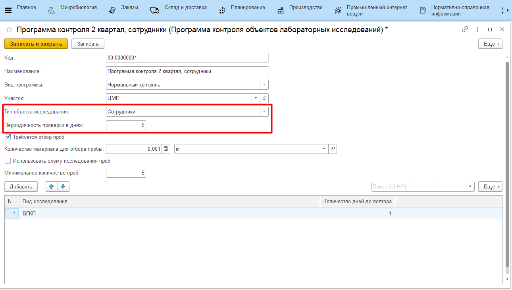
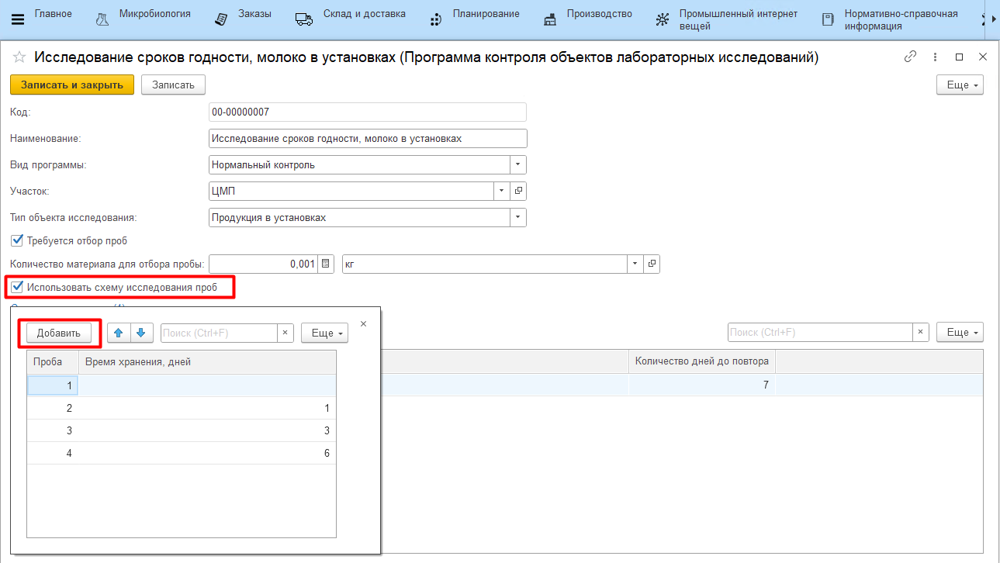

# Программы микробиологического контроля

После того, как заведены необходимые виды исследований, они собираются в программы контроля. Для каждого типа объектов исследования назначается перечень анализов.

Программа контроля - единица справочника **"Программы контроля объектов лабораторных исследований"**, поэтому изменение уже существующей программы контроля повлечет за собой ошибки учета. Если набор анализов изменился на уровне нормативной документации, рекомендуется завести новую программу исследования.

## Создание стандартной программы контроля

Для создания новой программы необходимо указать:

- наименование;
- вид программы контроля:
    - нормальный контроль - указанный набор анализов берется регулярно;
    - усиленный контроль - указанный набор анализов берется, если на производстве решено ввести усиленный микробиологический контроль;
- участок;
- тип объекта исследования;
- периодичность проверки в днях (для типа объекта *"Сотрудники"*) - периодичность, с которой должен быть проверен каждый сотрудник (например, руки каждого сотрудника на участке должны быть исследованы по выбранным видам хотя бы один раз в 5 дней);

- опция *"Требуется отбор проб"* - включается, если для проведения исследования по объекту лаборанты отбирают пробы и фиксируют факт их взятия;
- количество материала для отбора пробы - объем материала для исследования (указывается справочно);
- минимальное количество проб - количество проб, которые нужно взять каждого вида исследования (регламентируется нормативной документацией);
- табличная часть:
    - виды исследований - перечень анализов, которые берутся для данного типа объекта исследования;
    - количество дней до повтора - периодичность проведения конкретного вида исследования (например, "3" = раз в три дня).

## Исследование сроков годности

За создание программы по исследованию сроков годности отвечает опция *"Использовать схему исследования проб"*.

В табличной части задается количество проб, которые нужно взять для исследования, и время их отправки на анализ. Например: первая из четырех взятых проб должна быть отправлена на анализ днем взятия, следующая - через сутки, третья - через трое и т.д.

