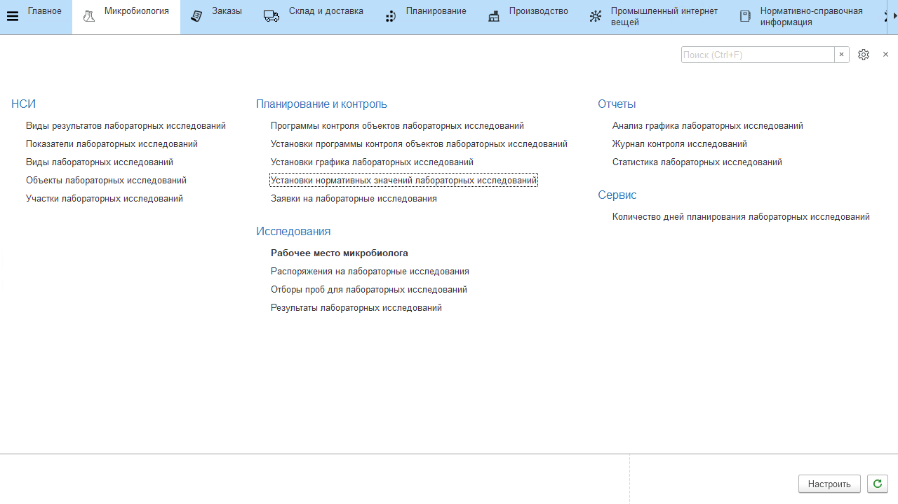

# Установка нормативных значений показателей

Каждому из показателей конкретного вида исследования можно задать нормативное значение, для этого нужно создать новый документ **"Установка нормативных значений лабораторных исследований"**.

При создании указать:

- дата, с которой норматив вступает в силу;
- тип объекта исследования;
- объект исследования;
- вид исследования;
- показатель;
- норматив - может задаваться:
    - одним значением;
    - диапазоном значений (интервал);
    - списком значений;
    - списком диапазонов значений (несколько интервалов).

Нажать **"Записать и закрыть"**.

