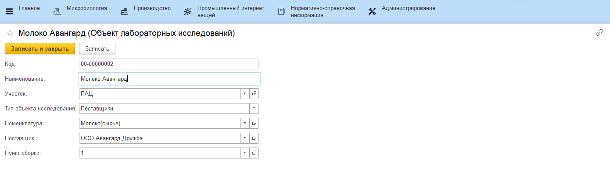

# Объекты лаборатоных исследований

Справочник **"Объекты лабораторных исследований"** содержит перечень объектов, которые подлежат регулярным исследованиям.

Объект может относиться к одну из восьми типов:

- *поставщики* - исследуется продукция от поставщиков молочного сырья; объекты проверяются в день приезда поставщика;
- *продукция без привязки* - исследуются полуфабрикаты или готовая продукция (нахождение продукции в рамках участка не важно);
- *продукция на складах* - исследуются полуфабрикаты, находящиеся в танках и резервуарах;
- *продукция в установках* - исследуется продукция в установках (например, молоко в пастеризаторе);
- *сотрудники* - исследуются объекты, находящиеся в непосредственном пользовании конкретного сотрудника (халаты, черпаки, поверхности рук);
- *оборудование* - исследуются элементы оборудования (краны, стенки, крышки резервуаров);
- *склады* - исследуются склады;
- *общие объекты* - исследуется окружающая среда (вода, воздух).

Для каждого из типов при создании элемента заполняется следующая информация:

Для типа **Сотрудники**:

- участок.

Для типа **Склады**:

- участок;
- склад, можно выбрать только тех складов, которые относятся к выбранному участку.

Для типа **Поставщики**:

- участок;
- принимаемая номенклатура (из справочника **"Номенклатура"**);
- поставщик (из справочника **"Контрагенты"**);
- пункт сборки.

Для типа **Оборудование**:

- участок;
- оборудование - деталь оборудования; 

  - деталь оборудования выбирается из справочника **"Список оборудования"**; для каждой детали указывается основной объект, например:
      - создается оборудование "Пастеризатор", поле "основной объект" не заполняется;
      - создается оборудование "Дно пастеризатора", в поле "основной объект" указывается "Пастеризатор".

Для типа **Продукция на складах**:

- участок;
- номенклатура/характеристика;
- склады - список складов на участке, в которых может находиться указанная номенклатура.

Для типа **Продукция без привязки**:

- участок;
- номенклатура/характеристика.

Для типа **Продукция в установках**:

- участок;
- номенклатура/характеристика;
- оборудование - список установок на участке, в которых может находиться указанная номенклатура.

Для типа **Общие объекты**:

- участок.

