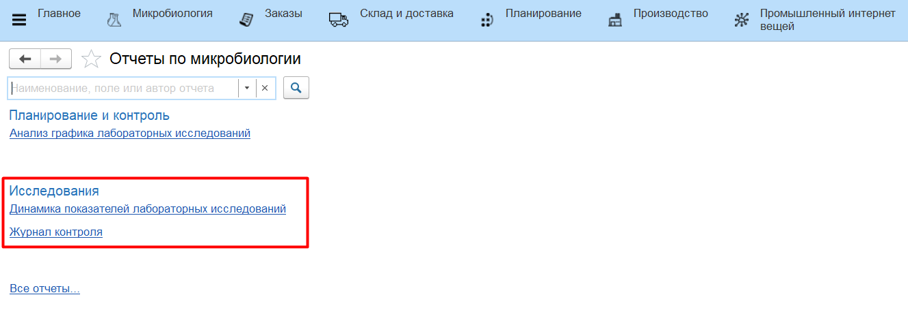
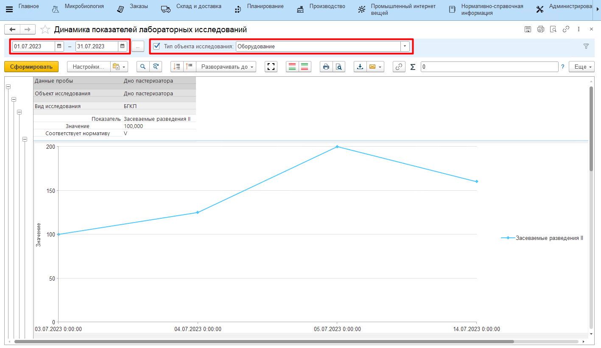
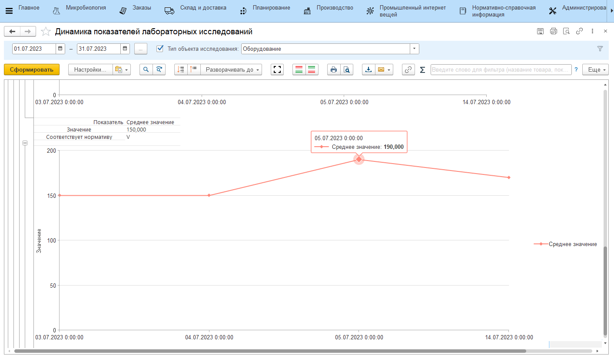
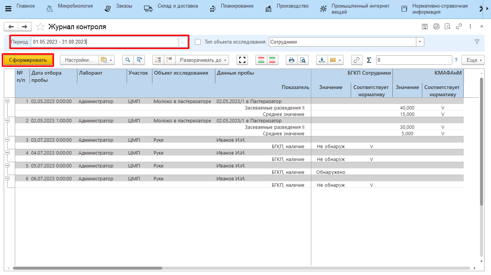

# Динамика показателей лабораторных исследований

Отчет **"Динамика показателей лабораторных исследований"** находится в подсистеме "Исследования" 

Отчет показывает аналитику по результатам проведенных исследований.

## Динамика показателей лабораторных исследований

Вариант отчета **"Динамика показателей лабораторных исследований"** отражает, как меняются результаты исследований по конкретному объекту исследований со временем. Такой вариант отчета подходит для аналитики по показателям, имеющим числовой вид результата.

Необходимо указать: 

- дату начала периода аналитики;
- дату окончания периода;
- тип объекта исследования (не обязательно);
- нажать **"Сформировать"**.

## Журнал контроля

Вариант отчета **"Журнал контроля"** отражает всю собранную статистику по результатам исследований за выбранный период.

Указать:

- дату начала периода аналитики;
- дату окончания периода;
- тип объекта исследования (не обязательно);
- нажать **"Сформировать"**.

