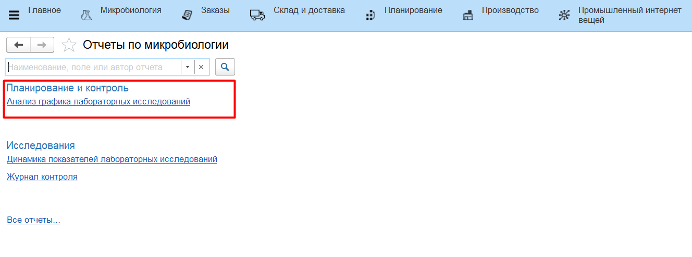
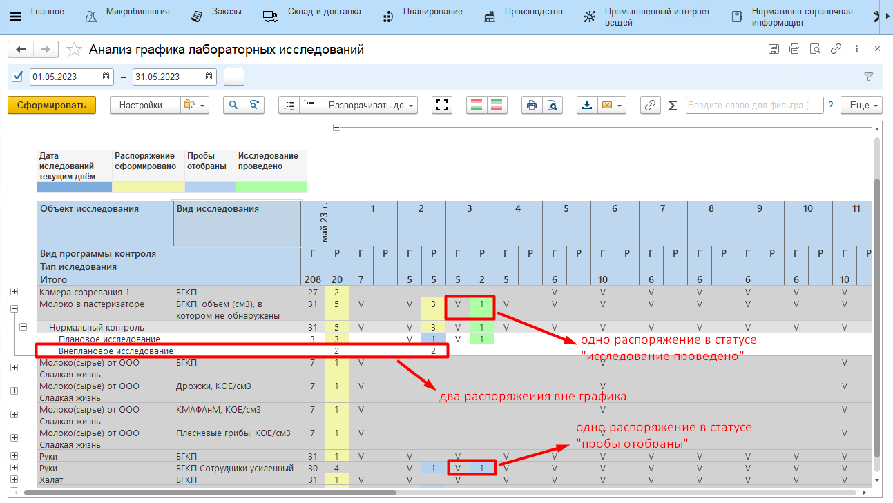

# Анализ графика лабораторных исследований

Отчет **"Анализ графика лабораторных исследований"** находится в разделе "Планирование и контроль".

Отчет показывает отклонение фактически проводимых работ по исследованию от графика. 

Для формирования отчета:

- указать дату начала периода аналитики;
- указать дату окончания периода;
- нажать **"Сформировать"**.

В колонке *"График"* ("Г") галочкой отмечены те даты, которые присутствуют в расписании по документам **"Установки графика лабораторных исследований"**.

В колонке *"Распоряжения"* ("Р") указывается количество распоряжений, сформированных в соответствующий день как планово (по графику), так и внепланово.

Колонка распоряжений отмечается:

- желтым, если исследование находится в статусе *"Распоряжение сформировано"*;
- синим, если исследование находится в статусе *"Пробы отобраны"*;
- зеленым, если исследование находится в статусе *"Исследование проведено"*.

Если распоряжений было сформировано несколько, то для колонки устанавливается цвет "минимального" статуса по этим распоряжениям.

