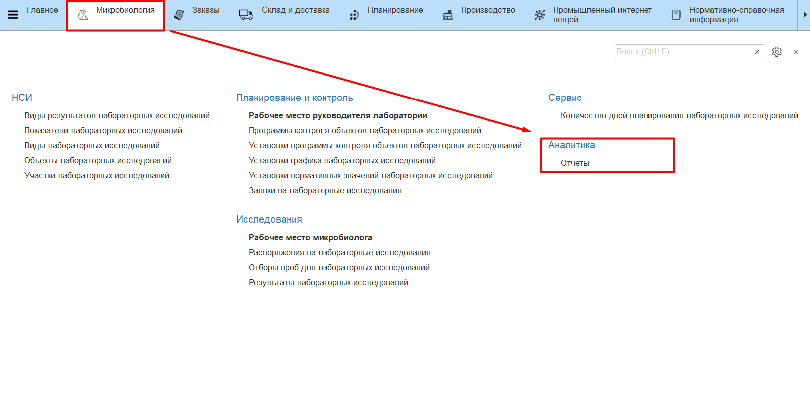

# Контроль выполнения лабораторных исследований через отчеты

Все отчеты находятся в подсистеме **"Микробиология"** -\> "Отчеты".

- [Анализ графика лабораторных исследований](ScheduleAnalysis/ScheduleAnalysis.md)
- [Динамика показателей лабораторных исследований](JournalOfLabResearch/JournalOfLabResearch.md)

