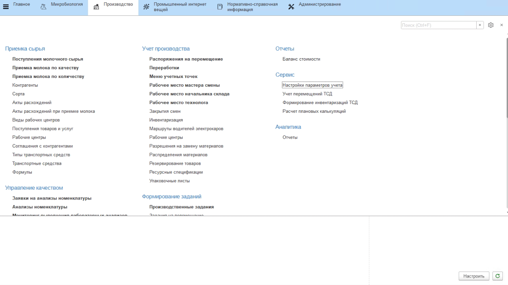

# Настройки параметров учета

Для учета показателей микробиологических исследований при приемке молока по качеству, необходимо:

- перейти в раздел **"Производство"** -> *"Настройки параметров учета"*;
- выбрать опцию **"Регистрировать показатели поставщиков по результатам лабораторных исследований"**;
- перейти по гиперссылке *"Показатели"* в регистр **"Показатели лабораторных исследований для приемки сырья"**;
- указать виды исследований и показатели, которые должны проверяться у поставщика при приемке;
- нажать **"Записать и закрыть"**.

