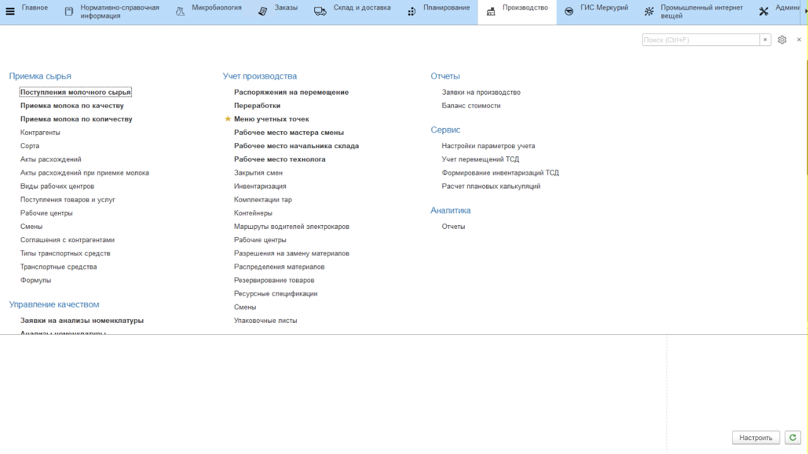
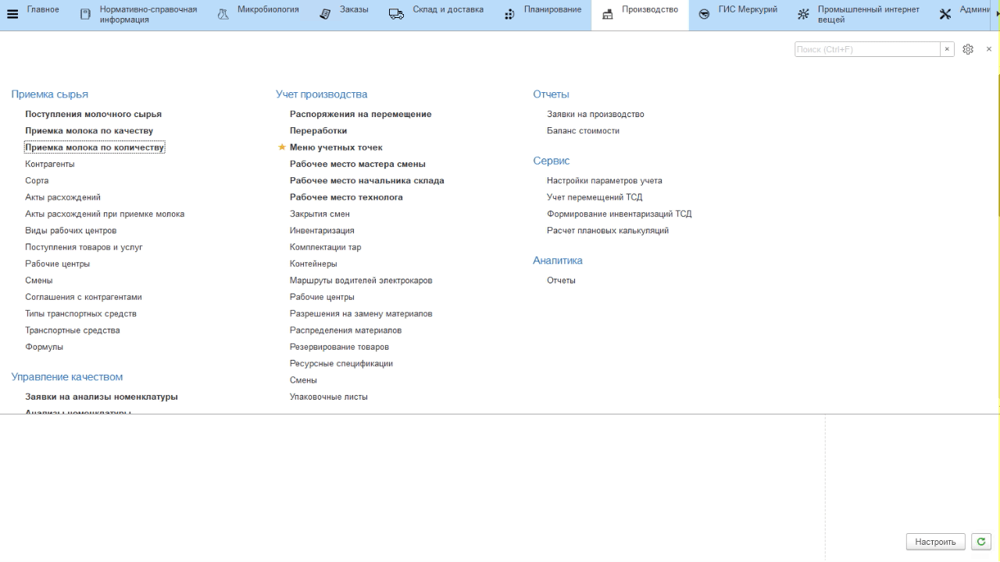
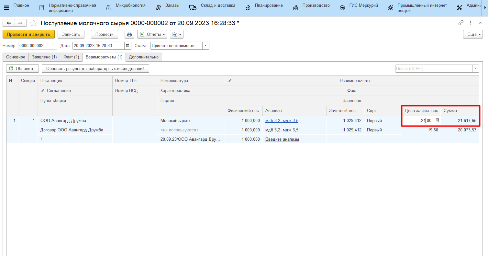

# Расчет стоимости поступившего молока

Расчет стоимости поступающего молока происходит автоматически в документах **"Поступление молочного сырья"**, на основании заранее [заведенной информации](../DataFilling/readme.md) в системе.

Открыв любой документ в статусе *"Принято по стоимости"*, можно посмотреть полученную стоимость принятого молока на вкладке *"Взаиморасчеты"*, столбец *"Стоимость"*.

Если документ **"Поступление молочного сырья"** после приемки по количеству находится в статусе *"Принято по количеству"*, значит, на этапе приемки молока по качеству из-за отсутствия лабораторных результатов не был определен сорт, и в документе не были проведены взаиморасчеты. 

Чтобы отразить в документе результаты проведенных лабораторных исследований нужно:

- перейти на вкладку *"Взаиморасчеты"*;
- нажать **"Обновить результаты лабораторных исследований"**.

Сорт определится автоматически. 

При этом в обоих случаях цена, получившаяся на основании информации, учтенной в системе, и цена, по которой будут произведены взаиморасчеты, могут отличаться. Автоматически эти цены ставятся одинаковыми, но цену взаиморасчетов можно изменить вручную, тогда итоговая сумма также будет пересчитана:

