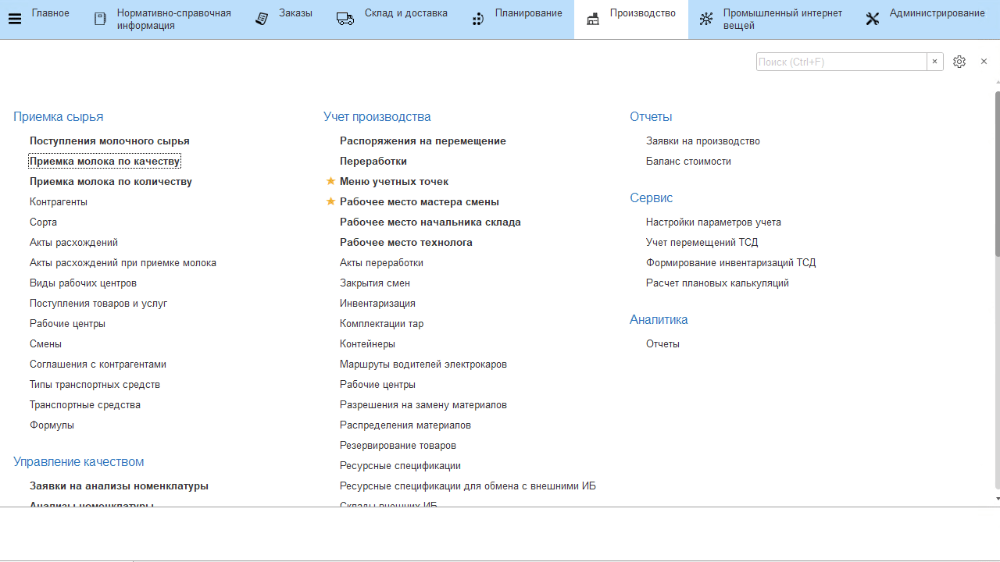
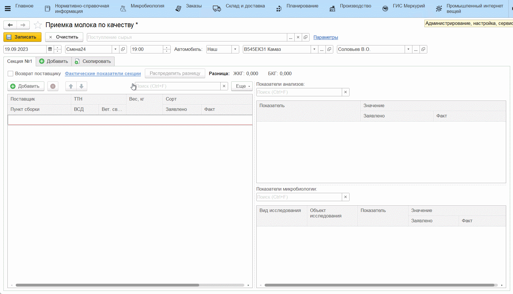
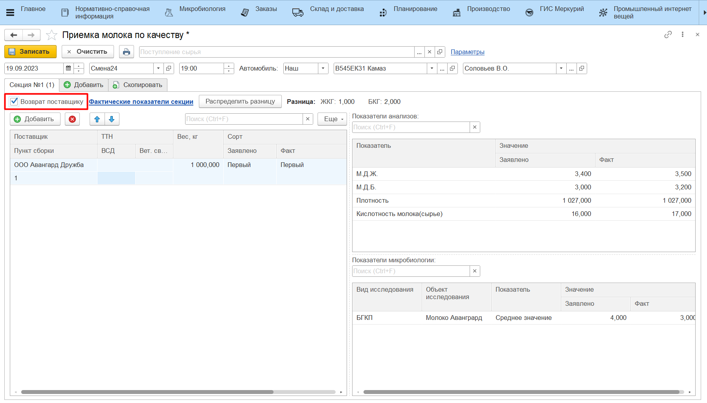
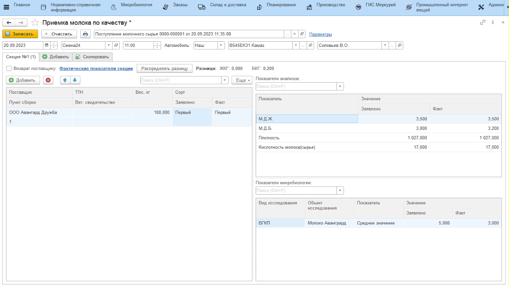

# Учет поступления молочного сырья по показателям лабораторных (микробиологических) исследований

Учет анализов принимаемого молока происходит через обработку **"Приемка молока по качеству"**.

- Открыть обработку **"Приемка молока по качеству"**;
- По гиперссылке *"Параметры"* указать, какой вид анализа (см. раздел ["Лабораторные анализы принимаемого молока"](../../../Manufacture/Milk/MilkReceiving/DataFilling/MilkAnalysis/MilkAnalysis.md)) в системе включает в себя все показатели принимаемого молока, на основании которых определяется его сорт (если он еще не указан);
- Также необходимо указать номенклатуру, отвечающую за принимаемое сырье и участок, на котором происходит приемка молока;  
- На основной вкладке заполнить информацию о текущей смене, указав дату и смену, и о принимаемой машине с молоком, указав номер и водителя;

- Заполнить информацию по первой секции (добавить всех поставщиков, чье молоко находится в ней, их ТТН, вет.свидетельства и заявленный вес каждого);
- Внести значения показателей принятого молока с данной секции, нажав **"Фактические показатели секции"**. Заполнить значение каждого из показателей в открывшейся форме;
- При этом, если по сырью поставщика недавно проводились лабораторные исследования, самый свежий результат подтянется в колонку *"Значение"* таблицы *"Показатели микробиологии"*;
- Нажать **"ОК"**;
 
Автоматически определяется сорт молока.  
    

-   При необходимости внести заявленные показатели по каждому поставщику
    в секции, нажав в поле **"Заявлено"** и заполнив схожую с предыдущим
    пунктом форму;
-   Если заявленные и полученные показатели разнятся, можно распределить
    эту разницу между поставщиками, нажав **"Распределить разницу"**;

Аналогично заполнить информацию по остальным секциям в машине.  

!!! info "Важно"

    Если поставщик молока приезжает в первый раз и для него в системе не существует документов **"Результат лабораторных исследований"**, то принять такого поставщика можно без указания фактических результатов по микробиологии и определения сорта. Взаиморасчеты можно будет провести, когда придут результаты лабораторных исследований (см. раздел [Расчет стоимости поступившего молока](../MilkRecievingCost/MilkRecievingCost.md)).

В случае обнаружения некачественного молока в какой-либо из секций машины, при заполнении информации по этой секции установить галочку **"Возврат поставщику"**:

Если вся информация заполнена и проверена, нажать **"Записать"**.

При необходимости можно распечатать **"Акт о расхождениях"**, куда подтянется разница по заявленным и фактическим показателям по секциям. Расхождение по заявленным и фактическим анализам микробиологии так же попадет в документ:

