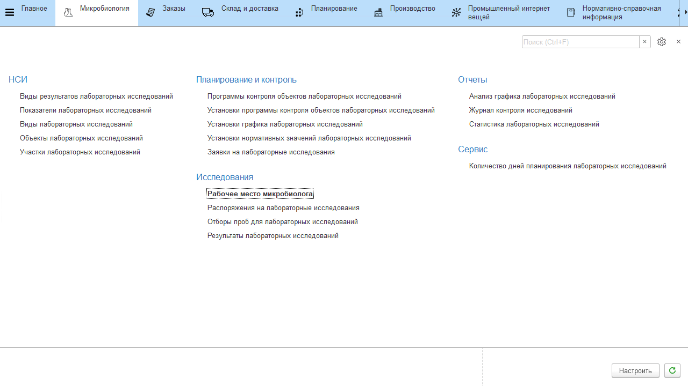
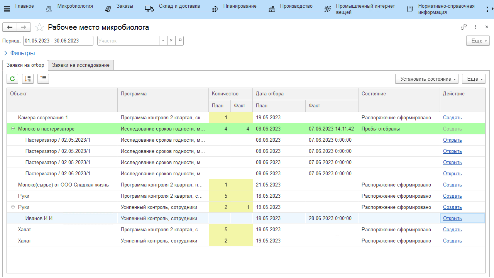
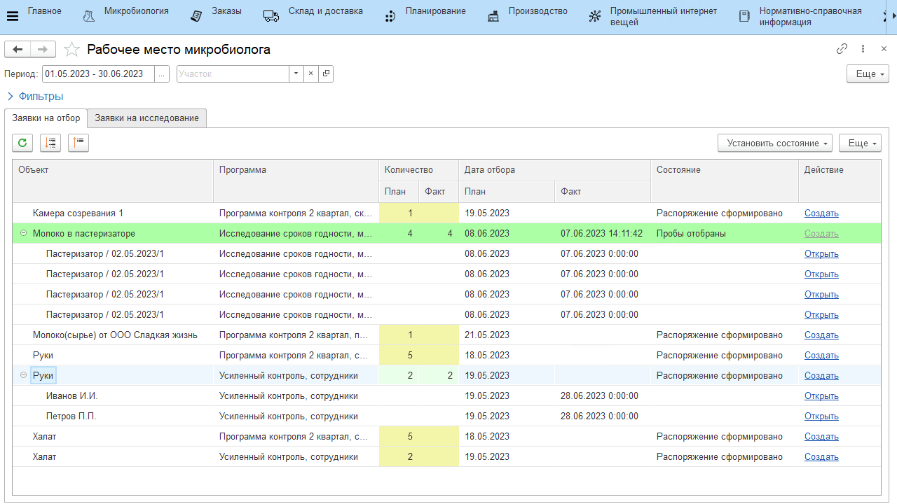
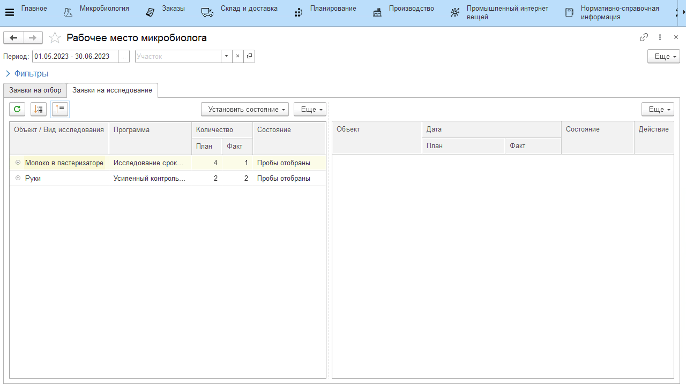
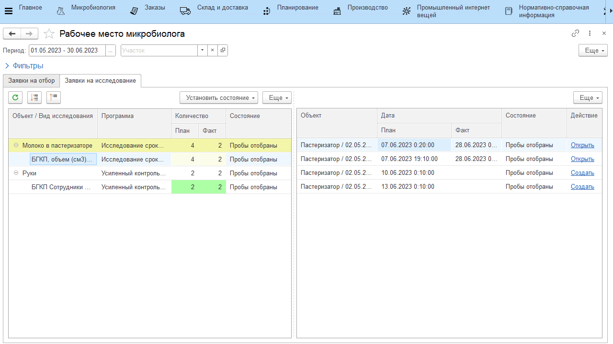

# Рабочее место микробиолога

Работники лаборатории отвечают за внесение информации по взятым пробам и внесение результатов исследований в систему. Для упрощения ведения учета, а также контроля выполнения исследований используется АРМ **"Рабочее место микробиолога"**.

## Заявки на отбор проб

В табличной части на вкладке **"Заявки на отбор"** отображается список всех распоряжений на исследования за выбранный период.

Распоряжения, подсвеченные желтым и имеющие состояние **"Распоряжение сформировано"**, еще не взяты в работу и должны быть выполнены в плановую дату по графику. 

После того, как по распоряжению взято необходимое количество проб, нужно:

1. в строке распоряжения нажать **"Создать"**;
2. в открывшейся форме заполнить информацию по взятой пробе;
    - дата отбора пробы (рекомендательно - с точностью до минут);
    - лаборант;
    - в зависимости от типа объекта исследования заполняются дополнительные поля (склад, оборудование, сотрудник, партия и т.д.);
3. нажать **"Провести и закрыть"**.

После этого информация по пробе появится на вкладке с заявками. Проделать то же самое для всех взятых проб.

Когда все пробы оформлены, нажать **"Установить состояние"**, выбрать состояние **"Пробы отобраны"**.

Строка окрасилась зеленой, а по отобранным пробам теперь можно занести результаты. Распоряжения, по которым не взяты пробы, хотя плановая дата уже прошла, останутся "висеть" в рабочем месте, пока не будут отменены или выполнены.

## Заявки на исследование

Каждая проба должна быть исследована согласно плановым срокам, результат исследования заносится на вкладке **"Заявки на исследования"**.

В правой табличной части видно все распоряжения, по которым ведется работа, плановое и фактическое количество результатов исследования.

Чтобы учесть результат исследования, необходимо:

1. в левой таблице выбрать распоряжение;
2. выбрать вид исследования, которое проводится для пробы;
3. в правой таблице выбрать пробу, по которой заносится результат;
4. нажать **"Создать"**;
5. в открывшейся форме заполнить информацию по результатам исследования:
    - дата выполнения анализа;
    - лаборант;
    - значения показателей;
6. нажать **"Провести и закрыть"**.

Когда результаты по **всем** пробам выбранного исследования внесены, нужно нажать **"Установить состояние"** и выбрать состояние **"Исследование проведено"**.

