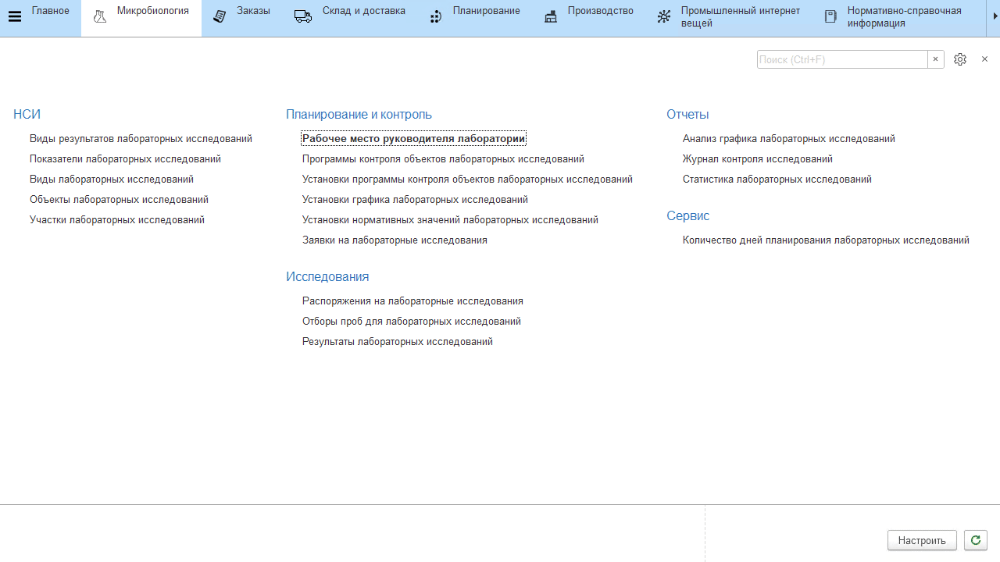
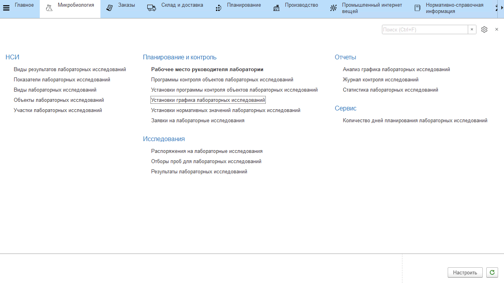
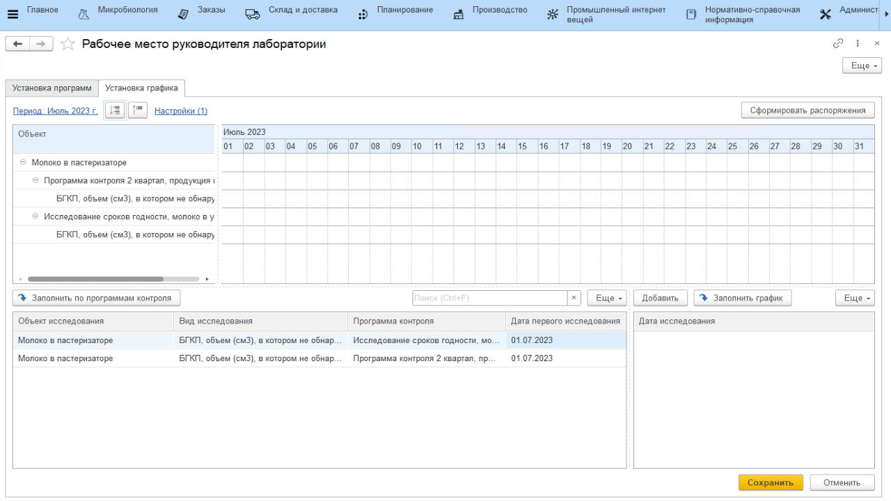
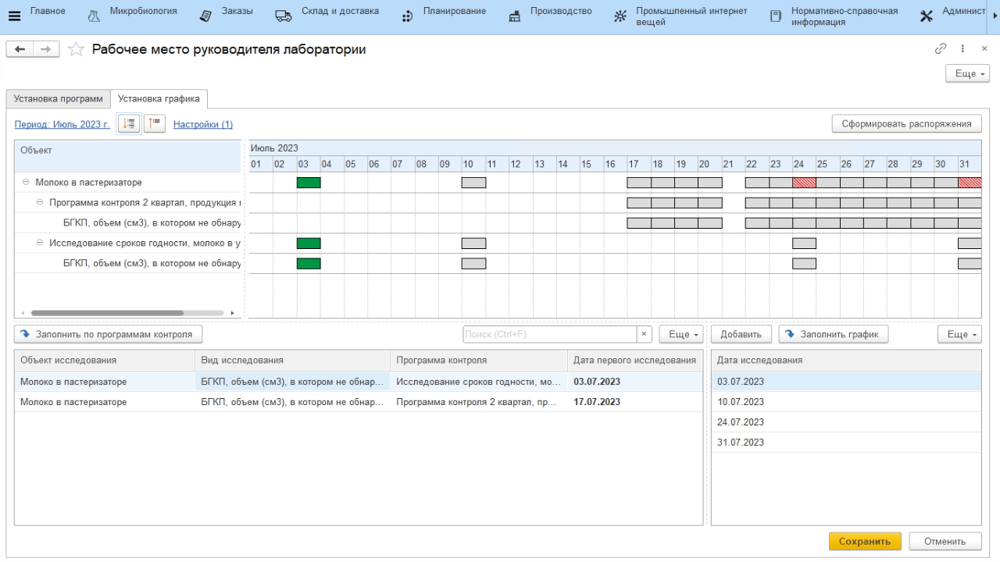
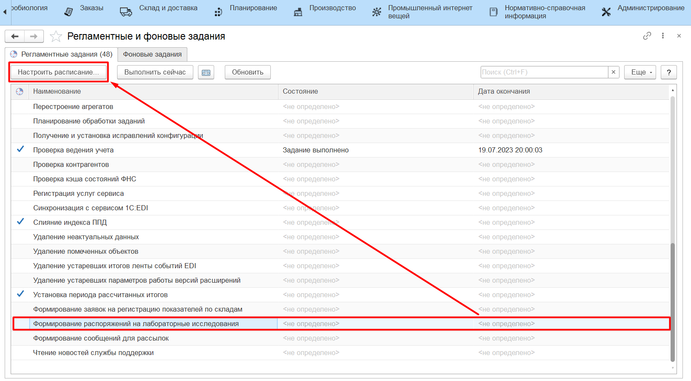
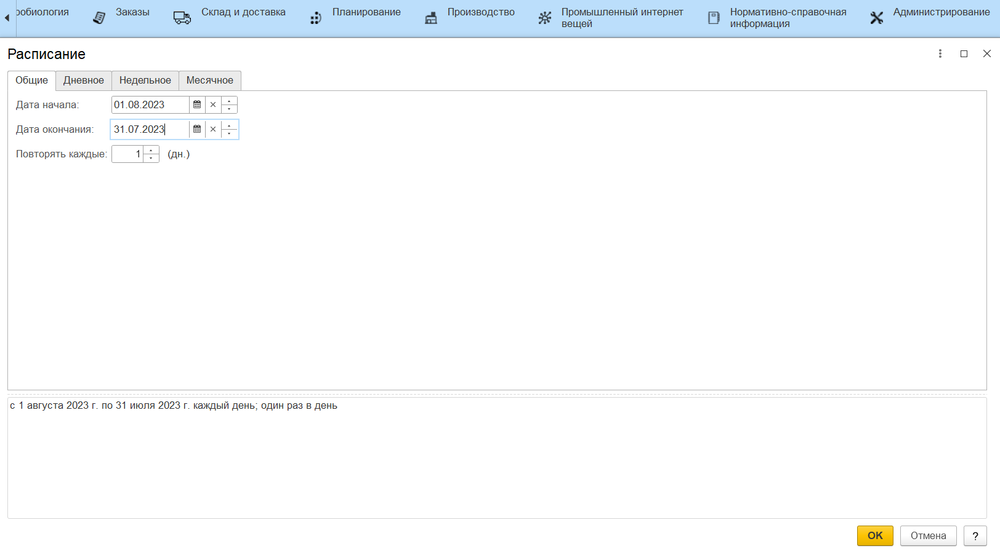
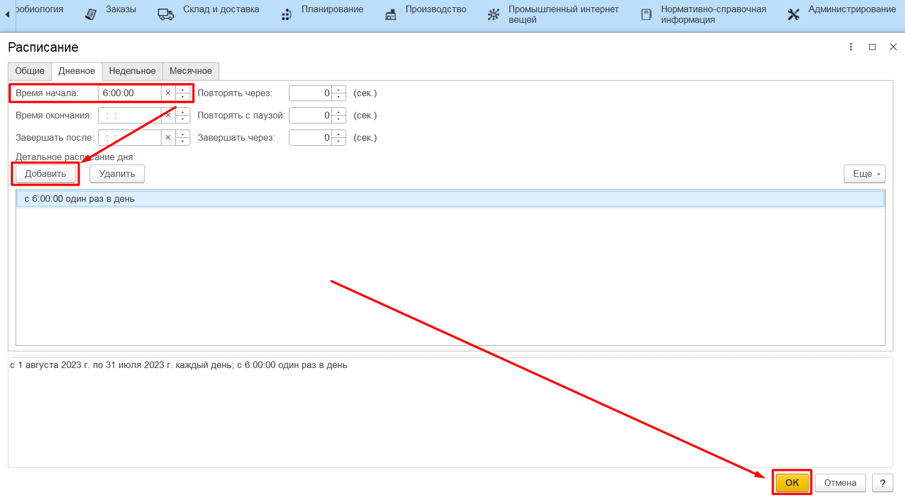

# Рабочее место руководителя лаборатории

Для планирования проведения исследований используется АРМ **"Рабочее место руководителя лаборатории"**.

## Установка программ контроля

Созданные программы контроля необходимо назначить действующими на период, чтобы в последствии перечень исследований из программы попал в график исследований. 

Для этого на вкладке **"Установка программ"** нужно:

1. в левой таблице выбрать программу из числа существующих;
2. нажать **"Установить"**;
3. в открывшейся форме выбрать период действия программы;
4. добавить объекты, которые исследуются по выбранной программе;
5. нажать **"Сохранить"**.

Открыть и отредактировать **"Установку программы"** можно двойным кликом по нужному периоду в правой таблице.

!!! info ""
    Редактировать период действия установленных программ, по которым уже ведутся исследования, **не рекомендуется**. Для продления действия программы следует создать новую установку на следующий период.

## Установка графика лабораторных исследований

Все действующие программы попадают в график проведения исследований. Для создания графика нужно перейти на вкладку **"Установка графика"**.

Далее:

- выбрать период планирования, который будет видно на диаграмме;
- настроить фильтры при необходимости;

На диаграмме Ганта отобразится дерево объектов исследования, программ и видов исследования, которые назначены документами **"Установки программ лабораторных исследований"** на выбранный период планирования.

- нажать **"Заполнить по программам контроля"**;
- выбрать вид программы контроля;
- выбрать период, на который задается график - может быть в рамках выбранного периода планирования или полностью повторять его; например, график усиленного контроля задается не на весь месяц, а на одну неделю.

В левой табличной части отобразятся исследования, которые, согласно **"Установкам программ"** должны быть проведены в указанный период. Поле *"Дата первого исследования"* заполняется автоматически первым днем выбранного периода, но может быть изменено. 

**Дата первого исследования** - день, начиная с которого ведется работа по конкретному виду исследования.

- нажать **"Заполнить график"**;

Правая табличная часть заполнится датами исследований, которые формируют график. При необходимости даты из графика можно удалить по кнопке "Del" или добавить по кнопке **"Добавить"**.

- нажать **"Сохранить"**.

!!! info ""
    На месяц создается только **один** график для каждого вида контроля.

# Формирование распоряжений на исследования

Распоряжения формируются на каждый микробиологический участок и включают в себя те объекты, которые запланировано исследовать в следующую дату по графику.

Для формирования распоряжений можно вопользоваться кнопкой **"Сформировать распоряжения"** в АРМе Руководителя лаборатории:

Или настроить регламентное задание:

- перейти в раздел **Администрирование** -\> *"Обслуживание"* -\> **"Регламентные и фоновые задания"**;
- выбрать регламентное задание **"Формирование распоряжений на лабораторные исследования"**;
- нажать **"Настроить расписание"**;

- настроить расписание в соответствии с расписанием работы лаборатории;
- нажать **"Ок"**.

!!! info ""
    Рекомендуется настроить формирование распоряжений **на утро каждого дня** перед рабочей сменой. Таким образом к началу рабочего дня лаборатории всегда будут сформированы распоряжения на день.

