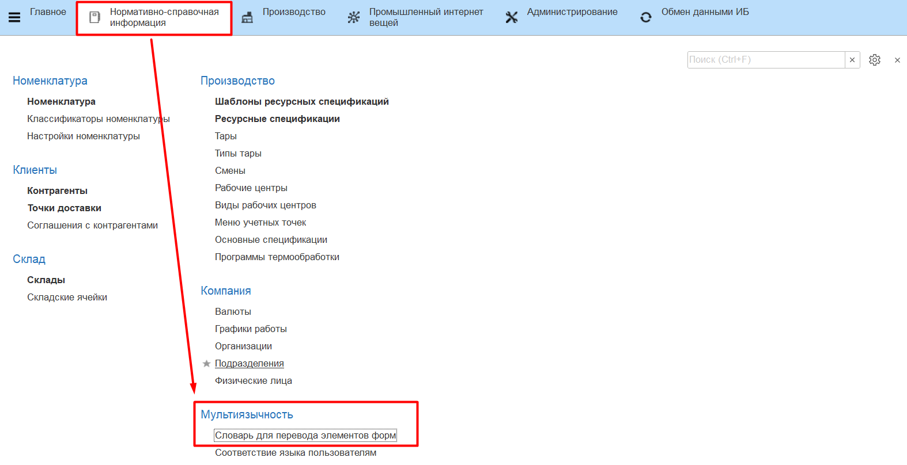
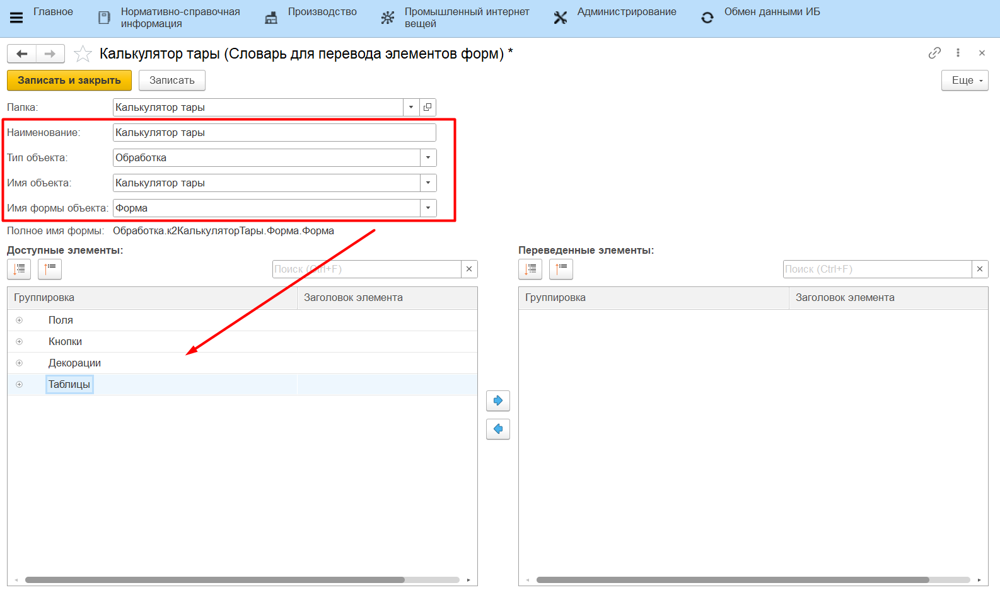
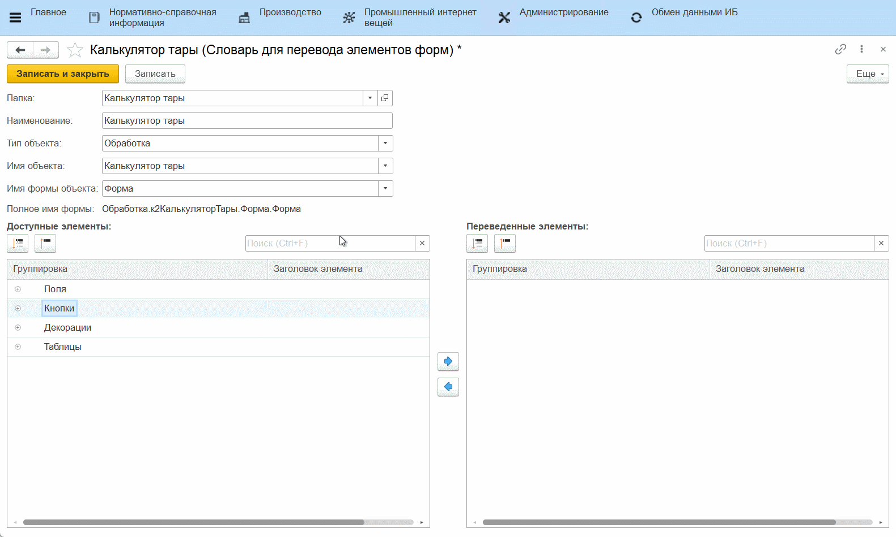

# Перевод обработок

Формы, доступные для перевода:

- Меню учетных точек;
- Работа с заданиями;
- Работа с заданиями (мясо);
- Оперативный учет на рабочем центре;
- Наборка по рецептуре;
- Приемка и передача;
- Калькулятор тары;
- Подбор партий по остаткам.

### Справочник "Словарь для перевода элементов форм"

Переводы для сенсорных форм хранятся в справочнике **"Словарь для перевода элементов форм"**. Для того, чтобы подготовить к переводу обработку необходимо:

- перейти в справочник;
- перейти к созданию нового элемента;
- указать наименование элемента словаря;
- выбрать тип объекта (справочник или обработка);
- выбрать имя объекта из конфигуратора (перечень доступных для перевода обработок);
- выбрать имя формы объекта;

В таблице *"Доступные элементы"* откроется перечень всех элементов выбранной формы. 

- выбрать элемент для перевода;
- перенести в таблицу *"Переведенные элементы"*;
- открыть элемент;
- указать наименование на другом языке;
- указать переведенные наименования для всех необходимых элементов;
- нажать **"Записать и закрыть"**.

