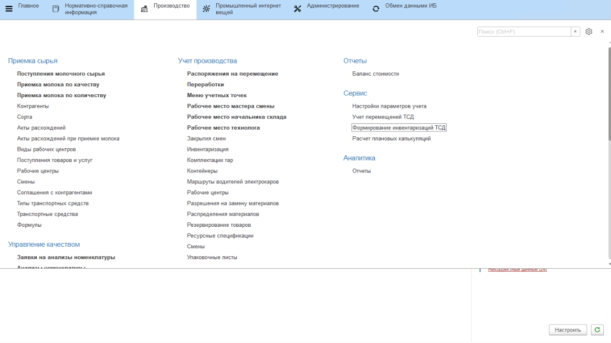

# Перевод учетной точки на дополнительный язык

В системе реализована возможность моментального переключения на другой язык во время работы оператора на киоске. Для этого на каждой форме из подключенных обработок в левом верхнем углу есть соответствующая кнопка с кодом языка, которая сообщает, на каком языке пользователь работает сейчас. 

При необходимости переключиться на другой язык (если оператор на точке сменился в рамках сеанса одного пользователя, например, подошел мастер смены), необходимо:

- нажать на кнопку перевода;
- выбрать нужный язык;
- нажать **"Подтвердить"**.

Элементы формы будут переведены в соответствии с заданными наименованиями [объектов](../ObjectsToBeTranslated/ObjectsToBeTranslated.md) и [элементов формы в словаре](../FormsToBeTranslated/FormsToBeTranslated.md).