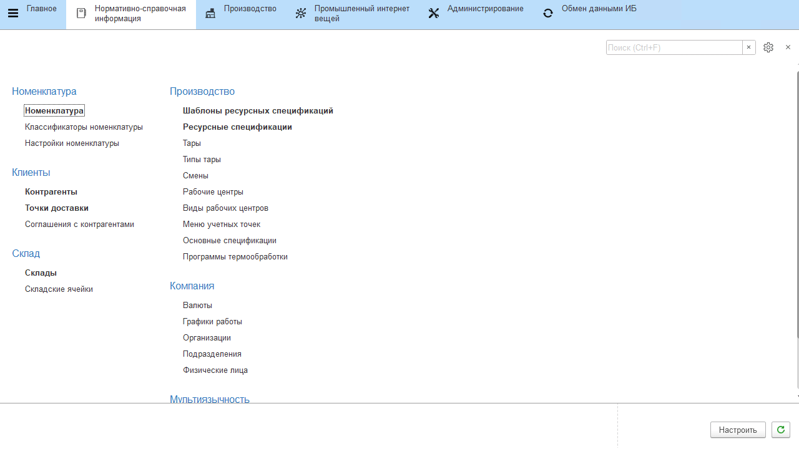

# Перевод объектов системы

Объекты, доступные для перевода:

- Справочник **"Номенклатура"**;
- Справочник **"Характеристики номенклатуры"**;
- Справочник **"Учетные точки"**;
- Справочник **"Кнопки учетных точек"**;
- Справочник **"Смены"**;
- Справочник **"Склады"**;
- Справочник **"Рабочие центры"**;
- Справочник **"Ресурсные спецификации"**;
- Справочник **"Показатели анализов"**;
- Справочник **"Упаковки, единицы измерения"**;
- Справочник **"Наборы упаковок"**;
- Справочник **"Типы тары"**.

Для того, чтобы указать наименование объекта на другом языке, необходимо:

- перейти к элементу справочника из числа доступных для перевода;
- в поле *"Наименование"* развернуть форму по кнопке **"Открыть"**;
- в поле дополнительного языка указать наименование объекта на дополнительном языке;
- нажать **"Ок"**;
- сохранить изменения в объекте.

