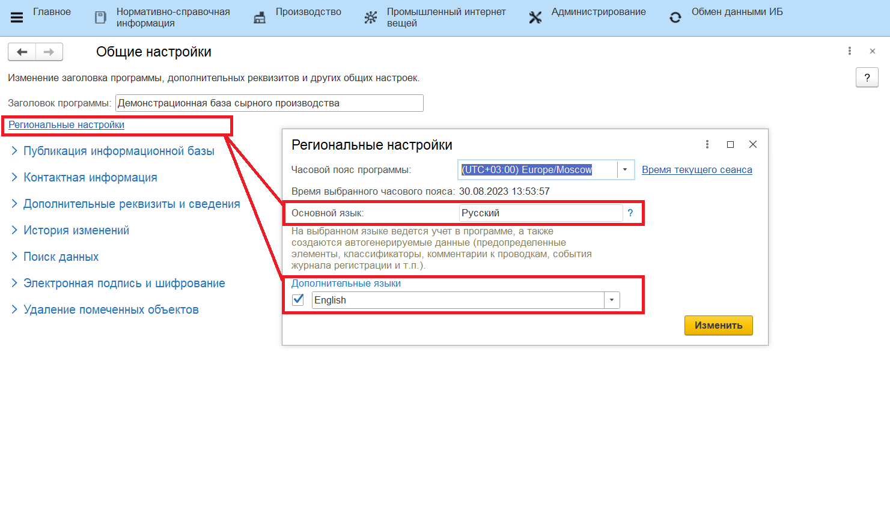

# Подключение и настройка

Русский язык является основным в системе MES, но для удобства работы на производстве добавлена возможность подключить два дополнительных языка. В текущей реализации на дополнительные языке переводятся обработки, подключенные к учетным точкам (киоскам). 

### Настройка

- Перейти в раздел **"Администрирование"** - *"Общие настройки"*;
- Открыть гиперссылку *"Региональные настройки"*;
- Включить использование дополнительного языка в системе и выбрать, какой язык используется.

