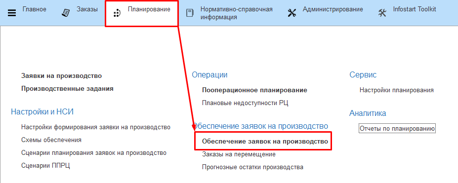
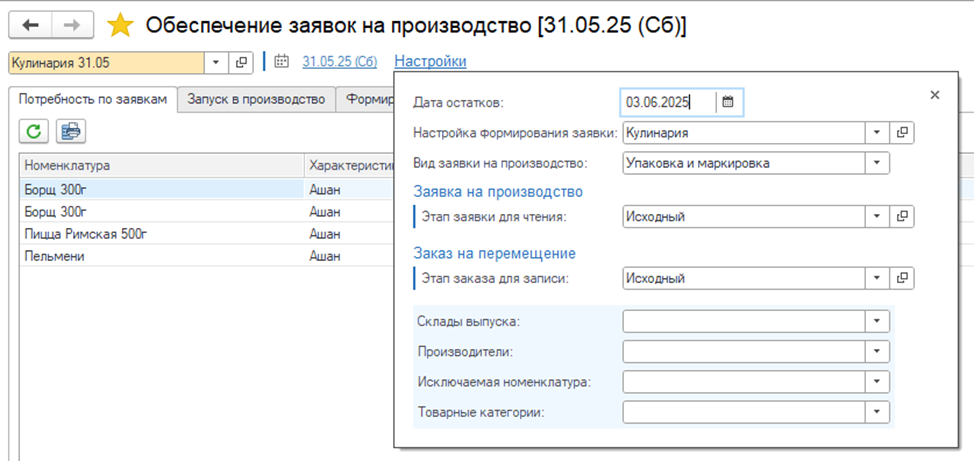
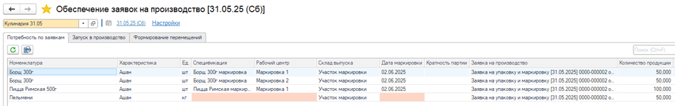
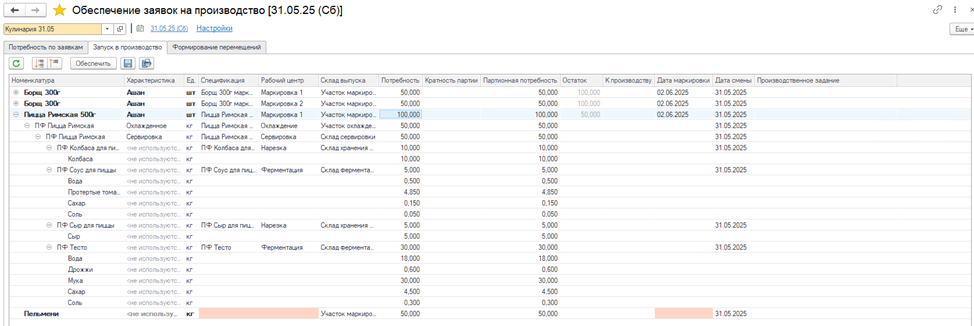
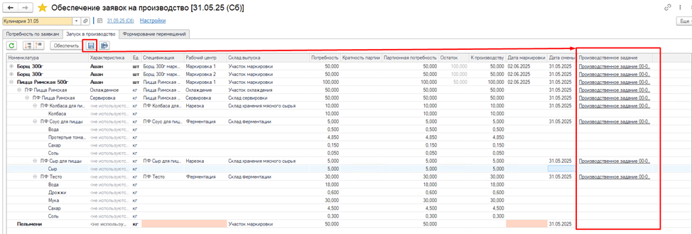
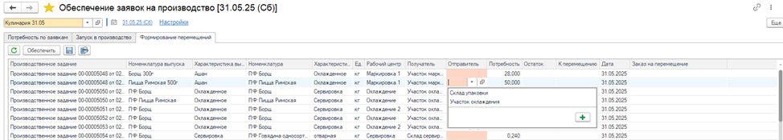
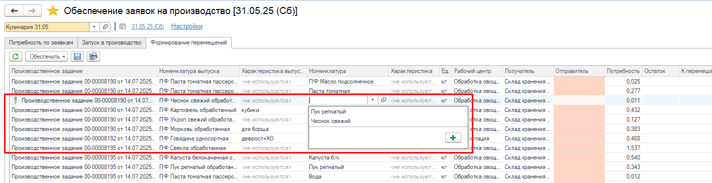
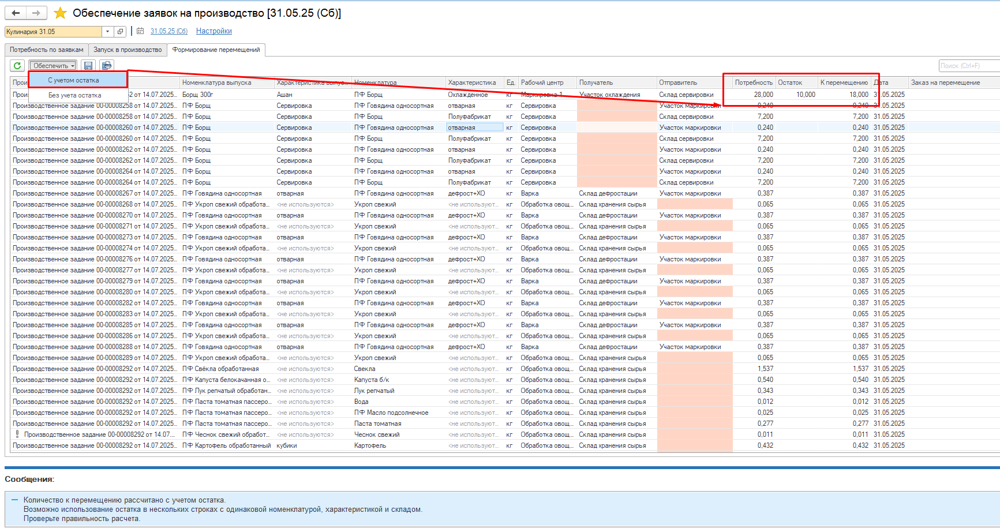
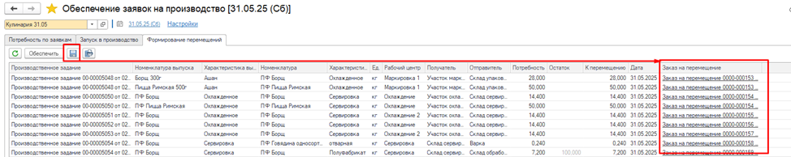

# АРМ «Обеспечение заявок на производство»

Для планирования потребностей на период используется АРМ **«Обеспечение заявок на производство»**, который включает функционал разузлования потребностей по заявкам на производство, формирования производственных заданий и заказов на перемещение. 

При разузловании используются данные из основных спецификаций, что позволяет не вводить дополнительную информацию в систему. А прослеживаемость данных обеспечивает вывод результатов разузлования в виде дерева от ГП до сырья.

АРМ находится в подсистеме **Планирование** в блоке **Обеспечение заявок на производство**.

  

Для заполнения настроек АРМа используются [настройки обеспечения заявок на производство](../SettingsApplicationsForProduction/SettingsApplicationsForProduction.md).

  

На вкладке **Потребность по заявкам** по настройкам подбираются [заявки на производство](../../../Marking/FormorovanieZadaniyNaProizvodstvo.md), для которых не были созданы производственные задания.

Номенклатура с характеристикой, спецификация, склад выпуска, дата маркировки, кратность партии, количество продукции заполняются из заявки на производство.  

[Рабочий центр](../../../CommonInformation/WorkCenter.md) подбирается из этапа выходного изделия спецификации.  
Если указано несколько РЦ, то все они попадут в АРМ, а количество продукции распределится пропорционально количеству РЦ (доступно для редактирования).

  

На вкладке **Запуск в производство** происходит разузлование по всему процессу производства готовой продукции до сырья.  

Склад выпуска заполняется из рабочего центра.  

Количество потребности рассчитывается исходя из коэффициента выхода основной спецификации и также распределяется по количеству рабочих центров, которые указаны в производственном этапе.

Кратность партии заполняется из выходного изделия по спецификации. Если она указана, то Партионная потребность округляется по кратности, иначе 1 к 1 с Потребностью.  

  

По кнопке **Обеспечить** заполняется колонка К производству по Партионной потребности 1 к 1 (доступно для редактирования). 

Дата маркировки доступна для заполнения, если она не была указана в заявке на производство.  

Дата смены доступна для редактирования у производимой продукции. 

По кнопке **Сохранить** происходит создание производственных заданий. Верхнее производственное задание создается на основании заявки на производство. Дочерние производственные задания создаются на основании родительских.

 

На вкладке **Формирование перемещений** по сформированным производственным заданиям выводится список номенклатур, по которым требуется сформировать заказ на перемещение (у РЦ включен флаг «Требуется обеспечение по заказам»).  

Склад получатель заполняется из склада основных или вспомогательных материалов рабочего центра производственного задания, склад отправитель - склад выпуска из карточки номенклатуры.

   

Если для Номенклатуры доступен выбор аналога из Разрешение на замену материалов, тогда Потребность пересчитается по коэффициенту замены. Строки с номенклатурой, доступной для замены выделены, восклицательным знаком.

    

По кнопке **Обеспечить** - **С учетом остатка** заполняем колонку К перемещению как разность Потребность - Остаток, появляется информационное сообщение. Дата и К перемещению доступны для редактирования.   

   

По кнопке **Обеспечить** - **Без учета остатка** заполняем колонку К перемещению по Потребности 1 к 1. Дата и К перемещению доступны для редактирования.     

По кнопке **Сохранить** происходит создание заказов на перемещение на основании производственного задания

  