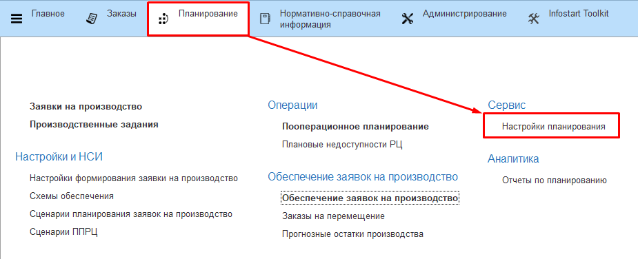
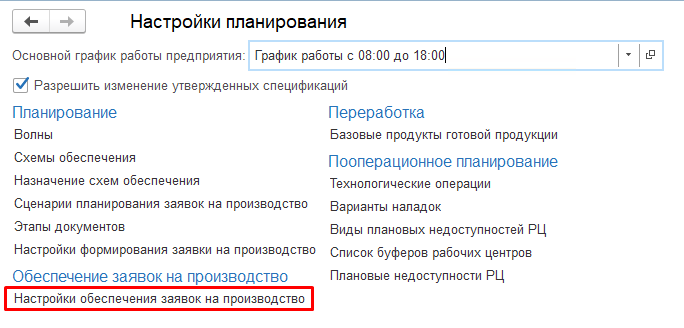
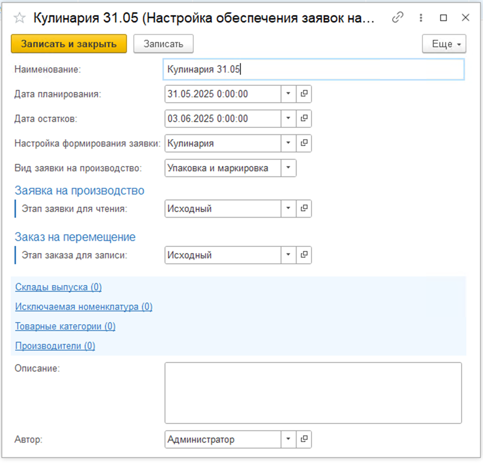

# Настройки обеспечения заявок на производство

Для заполнения настроек АРМа [«Обеспечение заявок на производство»](../ARMApplicationsForProduction/ARMApplicationsForProduction.md) используются настройки обеспечения заявок на производство.  
Справочник с настройками находится в подсистеме Планирование в блоке **Сервис** – **Настройки планирования**.
 
  

 

Для настройки указываются :  
- Наименование  
- Дата планирования (по ней подбираются заявки на производство)  
- Дата остатков (по ней подбираются остатки на складе)  
- Настройка формирования заявки на производство  
- Вид заявки на производство (Производство, Упаковка и маркировка)  
- Этап заявки на производство для чтения (по этому этапу подбирается количество продукции)  
- Этап заявки на перемещение для записи (заказы на перемещения будут создаваться в этом этапе)  
- Отбор по складу выпуска  
- Отбор по исключаемой номенклатуре  
- Отбор по товарной категории  
- Отбор по производителю  
- Описание  
- Автор  

 