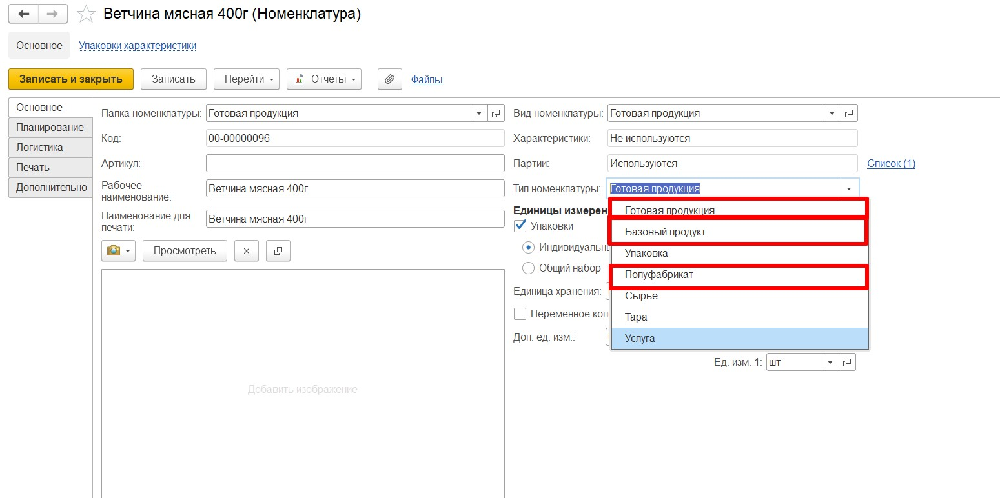

# Номенклатура

## Указание типа продукции

!!! info "Важно"
    Для корректного отображения номенклатурных позиций в дереве плана необходимо в самой номенклатуре правильно указать **тип номенклатуры**.  

В ППРЦ выделяют три основных типа номенклатуры, по которым будет осуществляться разделение в дереве разузлования:  

**Готовая продукция** - это та номенклатура, которую остается только промаркировать либо она уже является промаркированной и готовой к отгрузке. Это та номенклатура, которую оформляют в заказах покупателя.  

**Базовый продукт** - промежуточный продукт.

**Полуфабрикат** - номенклатура, которая прошла хотя бы один производственный передел. Например, измельченый, сваренный, инъектироанный или массированный полуфабрикат, мясные комплекты и фарши - в мясном производстве, или сыворотки, творог на созревании - в молочном производстве.  

Тип номенклатуры заполняется в справочнике **"Номенклатура"** на вкладке `Основное`.

  

