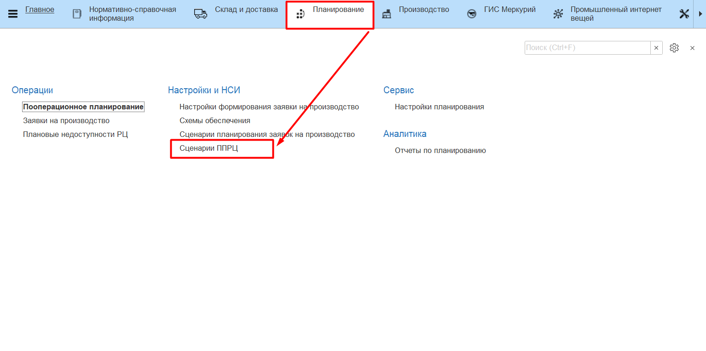
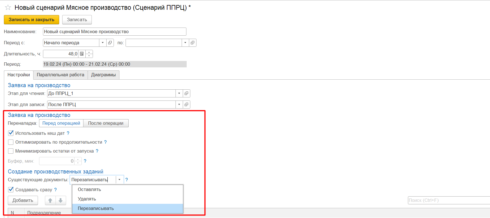
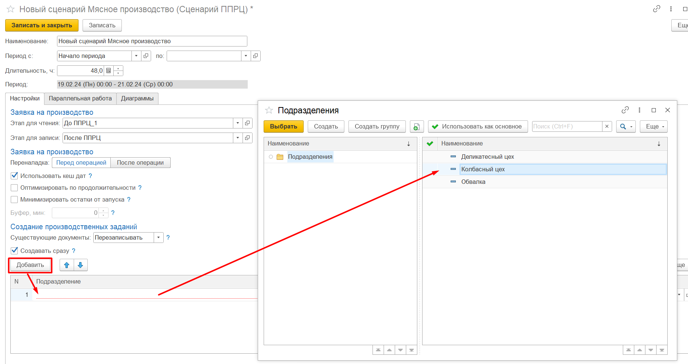
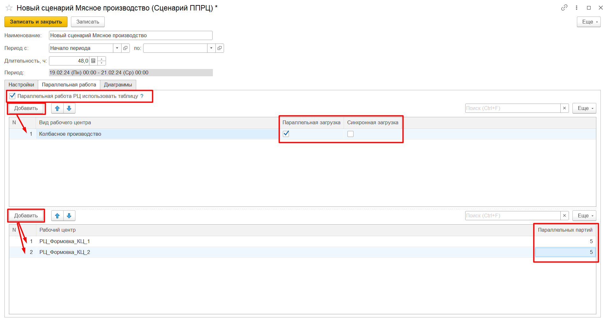
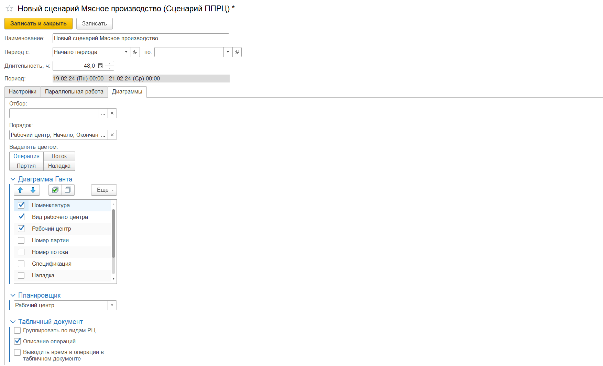

# Сценарии ППРЦ

Сценарий ППРЦ используются для заполнения настроек в [**АРМе "Пооперационное планирование"**](../WorkWithPP/Settings.md). 

Предполагается, что сценарии ППРЦ не должны меняться после создания (или могут меняться незначительно), поскольку являются универсальным шаблоном, при выборе котрого планирование пойдет по заданным условиям. Если нужно внести временные изменения в сценарий, для этого непосредственно в АРМе используются [Настройки планирования](../WorkWithPP/Settings.md).

Создать новый сценарий планирования можно из справочника **"Сценарии ППРЦ"** (Планирование -/> Сценарии ППРЦ).

### Основные

Для сценария ППРЦ заполняются следующие данные:

- Наименование сценария;
- Период планирования - дата начала и дата окончания периода, в рамках которого рассматривается создание производственных заданий;
- Длительность - продолжительность периода планирования, может использоваться в связке с "датой начала" периода планирования.

Период можно установить:

- с варианта начала периода по вариант начала периода со сдвигом (выбираются из справочника **"Варианты начала периода"**);

- с варианта начала периода без даты окончания; при этом период планирования будет длиться столько, сколько указано в поле **"Длительность"**.

### Вкладка **"Настройки"**

- Этап для чтения - этап документа, по которому будет прочитан план производства. Если не указан, будут прочитаны текущие значения из документа;
- Этап для записи - этап, с которым будет записан план производства. Если не указан, значения будут записаны в текущий этап.

Этапы выбираются из справочника **"Этапы документов"** (Планирование -/> Настройки планирования -/> Этапы документов), подробнее о заполнении справочника указано в разделе [Создание заявки на производство](../Handbooks/ProductionRequest.md).

- Переналадка (перед операцией или после операции) - смена наладки на рабочем центре будет проводиться непосредственно перед выполнением следующей операции или сразу после выполнения предыдущей операции;
- Использовать кеш дат - ускоряет процесс планирования за счет кеширования дат у удачных размещений операций, но иногда это может приводить к ухудшению плана;
- Оптимизировать по продолжительности - после размещения задания в расписании в нем могут оказаться большие промежутки по ожиданию. Оптимизация по продолжительности перепланирует это задание "с конца", тем самым уменьшая продолжительность задания;
- Минимизировать остатки от запуска - при планировании объемов производства, если используется НЗП, его количество будут скорректировано таким образом, чтобы не оставалось остатка от запуска;
- Варианты создания производственных заданий: 
    - Существующие документы: 
        - **Оставлять** - существующие документы останутся, будут созданы новые; 
        - **Удалять** - существующие документы будут помечены на удаление и создадутся новые;
        - **Перезаписывать** - последние созданные документы будут перезаписаны новыми данными.
    - Создавать сразу - при активном флаге будут создаваться **"Производственные задания"** без открытия предварительной [формы создания документов](../WorkWithPP/CreateWorkTasks.md).

- Подразделения - в табличную часть добавляются подразделения, по которым нужно ограничить планирование. Например, планирование заданий нужно осуществлять только в рамках цеха производства колбас, не строя план на цех маркировки готовой продукции.

### Вкладка **"Параллельная работа"**

- **"Паралельная работа РЦ использовать таблицу"** - при активном флаге используются условия параллельной работы РЦ из таблиц ниже. Иначе будут использованы данные со справочника **"Виды рабочих центров"**;
- В верхней табличной части отражаются условия выполнения параллельной работы по **"Видам рабочих центров"**: 

    - **Параллельная загрузка** - выполнение нескольких операций в один промежуток времени;
    - **Синхронная загрузка** - совпадают начала и окончания операций. Например, печь, когда разные партии одновременно ставят и одновременно вынимают.

- В нижней табличной части отражется количество параллельных партий по **"Рабочим центрам"**:

    - **Параллельные партии** - количество допустимых партий при параллельной загрузке. 0 - не ограничено.

### Вкладка **"Диаграммы"**

На вкладке **"Диаграммы"** заполняются предварительные настройки формирования диаграмм. 

