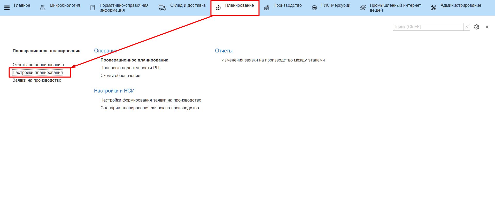
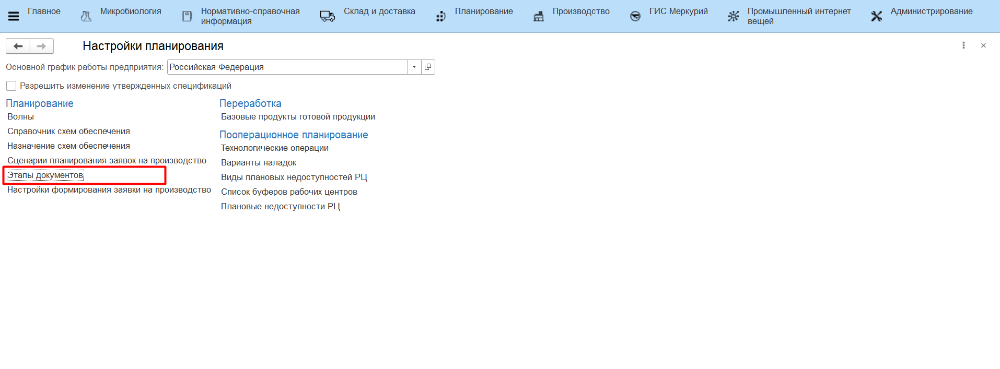
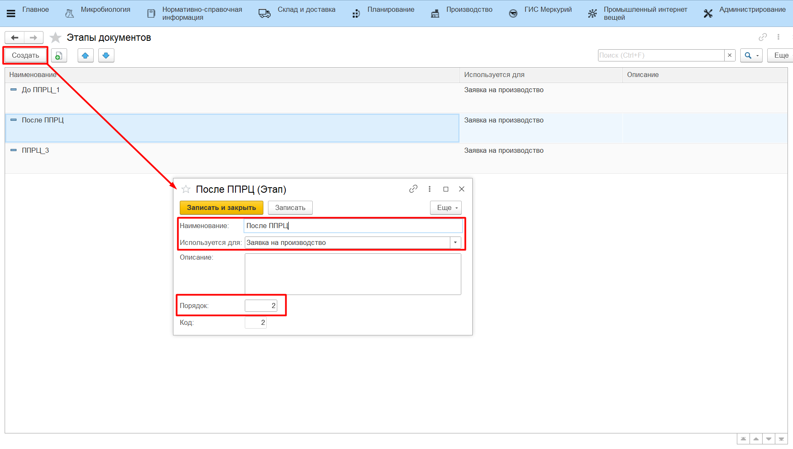
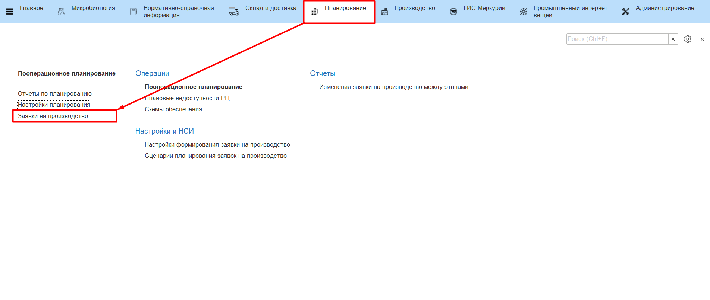
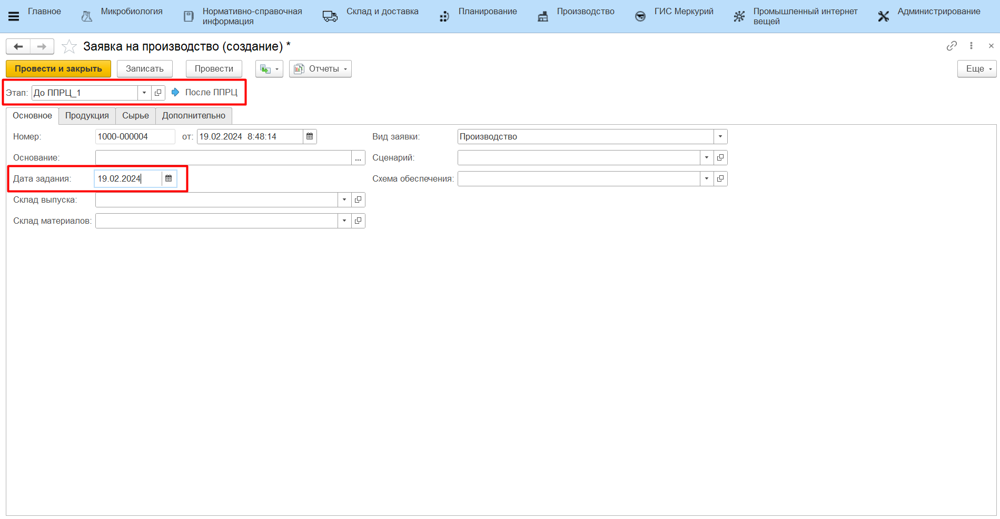
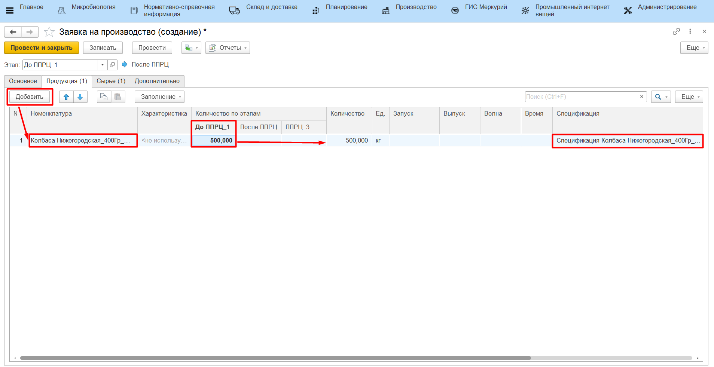

# Создание заявки на производство

Готовые заявки на производство могут поступать в систему MES после обмена данными с системой планирования. Если интеграция между системами не настроена, заявку на производство можно сформировать вручную. 

## Этапы документа

Создание этапов для документа **"Заявка на производство"** выполняется, если необходимо хранить историю изменений количеств по заявке до и после внесения каких-либо корректировок.

Необходимо:

- Перейти в раздел Планирование -> Настройки планирования, открыть справочник **"Этапы документов"**;
- Приступить к созданию нового этапа;
- Заполнить: 
    - Наименование;
    - Используется для - Заявка на производство;
    - Порядок;
- Нажать **"Записать и закрыть"**.

Созданные этапы автоматически подтягиваются в документы **"Заявка на производство"**.

## Заявка на производство

- Перейти в раздел Планирование, открыть справочник **"Заявки на производство"**;
- Приступить к созданию новой заявки;

На вкладке "Основное" заполняются:

- Дата задания - дата, на которую выдается заявка;

На вкладке "Продукция" заполняются:

- Номенклатура;
- Характеристика;
- Количество по этапам - заполняется количество на том этапе, в котором сейчас находится документ. Например, количество на этапе "До внесения корректировок" может отражать заявленные к производству данные, а количество на этапе "После внесения корректировок" - утвержденные объемы;
- Количество - заполняется автоматически. Значение становится равным значению, соответствующему актуальному этапу документу;
- Спецификация - подбирается автоматически основная спецификация выбранной номенклатуры из справочника **"Ресурсные спецификации"**.

После заполнения нажать **"Записать и закрыть"**.

