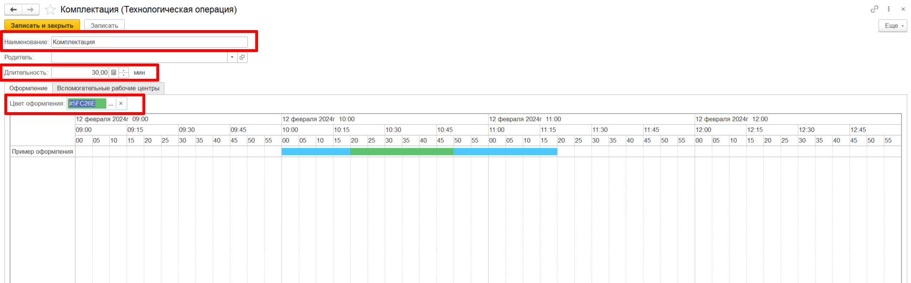

# Ресурсные спецификации

!!! info "Важно"
    На данный момент ППРЦ работает только по основным ресурсным спецификациям. Поэтому важно следить за тем, чтобы каждый продукт, участвующий в планировании, на каждом переделе имел одну основную спецификацию.   

 

## Важные настройки ресурсной спецификации для успешного планирования  

### Настройка этапов    

В справочник **"Этапы"** можно попосать через стандартную форму ресурсной спецификации.  

 

В этапах можно выделить три основные настройки, которые важны для ППРЦ:  
- `Операции` - это те технологические операции, которые будут выполняться на этапе.  

- `Типы связи` - варианты связи между соседними операциями.  

- `Наладки` - задаются операции переналадки оборудования между выпусками разных номенклатур.

#### Операции   

В справочнике **"Технологические операции"** необходимо заполнить следующую информацию:  

- `Наименование операции`. Это наименование потом можно будет видеть в построенном расписании в АРМе ППРЦ; 

- `Длительность операции`. Именно от этого значения в АРМе ППРЦ будет рассчитываться время, необходимое на выпуск конкретного объема продукта на этапе. Это время, которое необходимо на произодство того объема продукта, который указан в спецификации на вкладке Выходные изделия; 

- `Цвет оформления`. Выбранным цветом операция будет отображаться в графиках расписания в АРМе ППРЦ.    

  

В этапе, в табличной части `Операции` фиксируют список операций, которые могут выполняться на одном производственном этапе. Именно из этой таблицы АРМ ППРЦ будет получать информацию об операциях текущего этапа.  

  

#### Последняя операция  

Для каждого этапа, если он не первый в производственной цепочки, необходимо заполнять реквизит `Последняя операция`. В нем указывается операция предыдущего этапа производственной цепочки. Данный реквизит используется для связи между операциями.  

Например, в колбасном производстве, для этапа "Формовка", последней операцией будет "Фаршеприготовление", а для этапа "Упаковка" последней операцией будет "Охлаждение".

#### Типы связи    
Связь между операциями смежных этапов имеет 5 различных типов: 

- `Начало-начало` - этот тип связи устанавливается для тех операций, у которых начало совпадает, т.е. две операции должны выполняться параллельно.  
- `Окончание-начало` - этот тип связи устанавливается для тех операций, которые могут идти только последовательно, т.е. следующая операция начинается после окончания предыдущей.  
- `Начало-начало(мягкий)` - то же самое, что и Начало-начало, только время начала двух операций могут строго не совпадать друг с другом, а одна из них начинаться чуть раньше или чуть позже.  

- `Окончание-начало(мягкий)` - то же самое, что и Окончание-начало, только время окончания одной операции может строго не совпадать со временем начала второй операции.  
- `Окончание-начало (несколько операций)` - используется в том случае, если перед текущей операцией идут параллельно две другие операции, т.е. текущая операция потребляет результат двух других операций. Например, выпуск фарша. Перед выпуском фарша есть операция наборки мясного комплекта и наборка комплекта специй. Результаты обеих операций потребляются при операции выпуска фарша. Выпуск фарша начинается только после того, когда будут выполнены две предыдущие операции.  

  

#### Наладки  

Наладки используются для того, чтобы заложить время на возможные переналадки оборудования между выпуском разных продуктов.   

Например, операция формовки. Для формовки колбас разных диаметров используется разная оболочка и разные насадки на формовочную линию. Соответственно, перед началом формовки Колбасы №1 производится операция установки, закладывается время ее выполнения. После окончания формовки колбасы №1 производится операция снятия насадки и операция установки новой насадки перед началом формовки колбасы №2.   

 

Если после формовки колбасы №2 больше ничего формоваться не будет, то операция снятия насадок не закладывается в расписание. При этом перед началом планирования на следующий день в настройках ППРЦ задается информация о том, какая насадка(наладка) сейчас установлена на рабочем центре/оборудовании. При построении расписания система начнет с операции "Снятие насадки", а только после начнется операции установка новой насадки.    (Подробнее в разделе [**"Настройки ППРЦ"**](../WorkWithPP/Settings.md))

При этом, если текущая насадка совпадает с насадкой, которая необходима для выпуска первой в расписании продукции, то операция снятия и установки в расписание закладываться не будет.   

### Настройка оптимальной партии запуска  

Оптимальная партия запуска необходима в тех случаях, когда на переделе не используется оборудование.  
Оптимальная партия запуска - это тот запуск / тот объем продукции, после производства которого будет стартовать следующий этап.  

Например, ручная резка. Есть задание на нарезку: необходимо произвести 6 000 кг нарезанного окорока. Далее этот окорок по производственному процессу может пойти на массирование. При построении расписания нам не обязательно ждать, когда выпустятся все 6000 кг окорока для того, чтобы начать процесс массирования, достаточно какой-то части. Для того, чтобы система понимала, сколько необходимо времени, чтобы выпустить окорок, который можно отправить на массирование, в системе задается оптимальный объем этого окорока и рассчитывается время производства этого оптимального объема.  

Оптимальная партия настраивается в стандартной форме ресурсной спецификации на вкладке `Выходные изделия`.

  