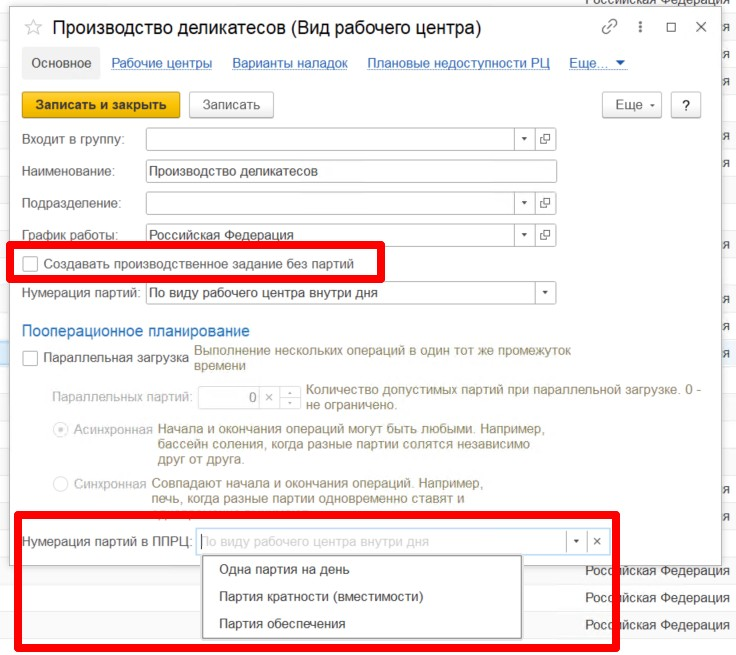

# Настройка видов рабочих центров и рабочих центров

## Настройка вида рабочего центра(ВРЦ)    

### Вариант формирования партии  

Для корректного формирования расписания и производственного задания необходимо учитывать вариант формирования партии на каждом из переделов производства.  

В ППРЦ выделяют 4 основных сценария формирования партии: 

- **Без партии**  - когда производственное задание формируется без партии.(Для номенклатур, которые попадают в производственное задание, не указываются партии)  

- **Партия на день**  - в производственном задании будет одна строчка для каждой номенклатуры, с партией, кратной дню.    
- **Партия кратности** - в производственном задании будет столько строчек, сколько планируется запусков. Например, при фаршесоставлении необходимо соблюдать правило, что одна партия - это один запуск куттера.  
Например, за день необходимо выпустить 1000 кг фарша. Вместимость куттера = 100 кг. Тогда за день будет выполнено 10 запусков по 100кг, и каждому запуску будет присвоена своя партия.  
- **Партия обеспечения**  -  под каждый запуск следующего этапа будет формироваться своя партия на текущем этапе. Например, под каждый замес фарша отдельно набирается комплект специй и мясной комплект. В результате, сколько запусков будет на этапе фаршеприготовления, столько же партий будет и на этапе составления мясного комплекта и на этапе составления комплекта специй.   

## Настройка Рабочего центра(РЦ)  

### Подразделения  

АРМ ППРЦ умеет автоматически останавливать разузлование заявки в рамках одного подразделения/цеха/участка. При планировании в ППРЦ есть возможность задать отбор по подразделению. Если он задан, то разузлование будет происходить только по тем РЦ, подразделение которых совпадает с подразделением, выбранным в сценарии.  
Если в РЦ подразделение не заполнено, то он в разузлование не попадает.   

!!! info "Пример"  
    Производство мясных деликатесов состоит из большого количества переделов, которые выпоняются на разных цехах с разными ответственными.  
    Маркировку выполняет один цех, охлаждение, термообработку, осадку, формовку - второй цех, а инъектирование, массирование, нарезку - третий цех.   
    Предполагается, что в рамках планирования на каждый цех будет сформирована своя заявка.  
    Мастер участа термообработки получает заявку, загружает ее в АРМ ППРЦ. Чтобы данная заявка не разузловалась до начального сырья, а остановилась только на переделах его цеха(Охлаждение--формовка), в системе у каждого РЦ задается подразделение, к которому этот РЦ относится.   

 