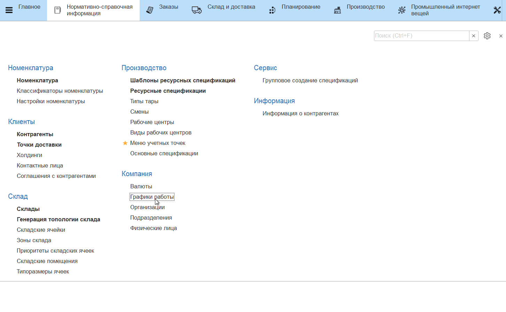
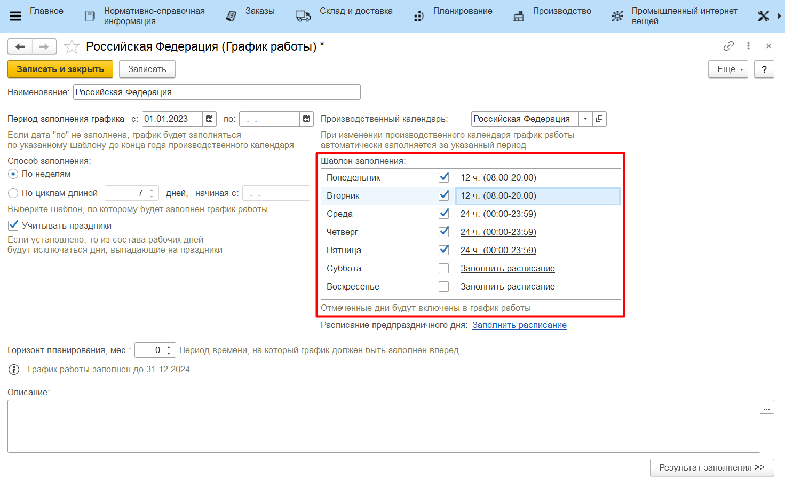
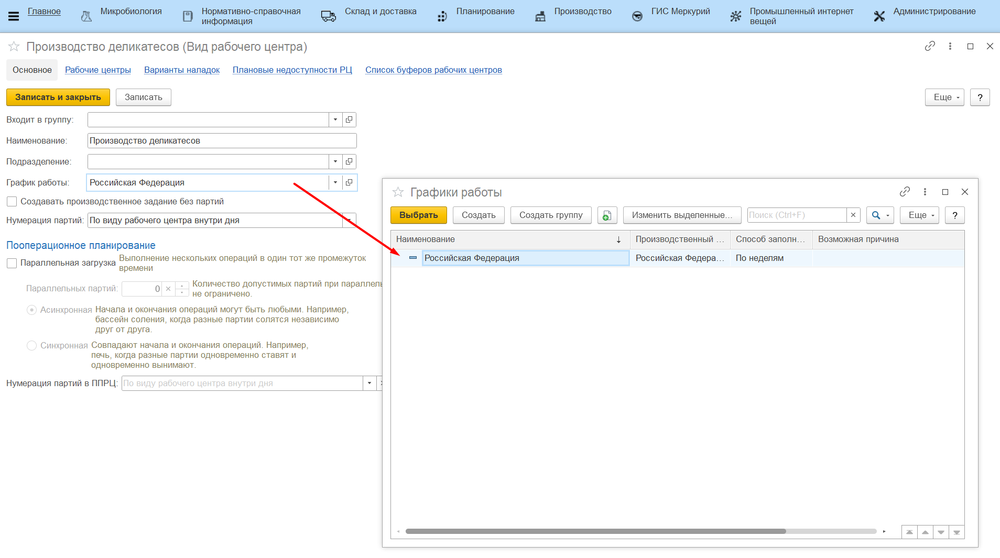

# График работы

Для того, чтобы планирование происходило с учетом актуальной информации о рабочем графике предприятия, необходимо заполнить соотстветствующие справочники. Это обязательный шаг во избежание ошибок при работе с **АРМ "Пооперационное планирование"**.

- Перейти в раздел Нормативно-справочная информация -> Компания -> Графики работы;
- Если график работы еще не создан, перейти к созданию нового. Если создан, выбрать существующий график;
- Перейти к полю *"Производственный календарь"* и выбрать "Российская Федерация";
- Открыть календарь "Российская Федерация" и нажать **"Заполнить по умолчанию"**.
- Нажать **"Записать и закрыть"**.

При необходимости можно заполнить график работы предприятия по дням недели (например, каждый день с 8 до 20 часов), тогда нерабочие часы не попадут в расписание при планировании.

Затем в каждом из Видов рабочих центров, которые участвуют в планировании, в поле *"График работы"* необходимо указать созданный график.

