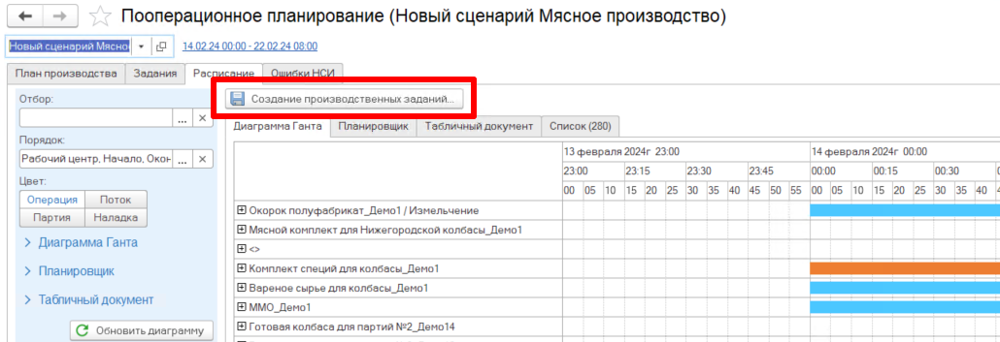
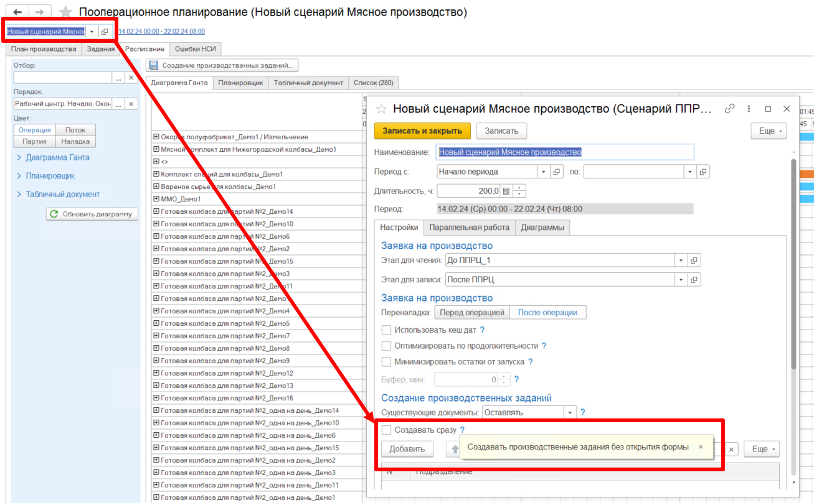
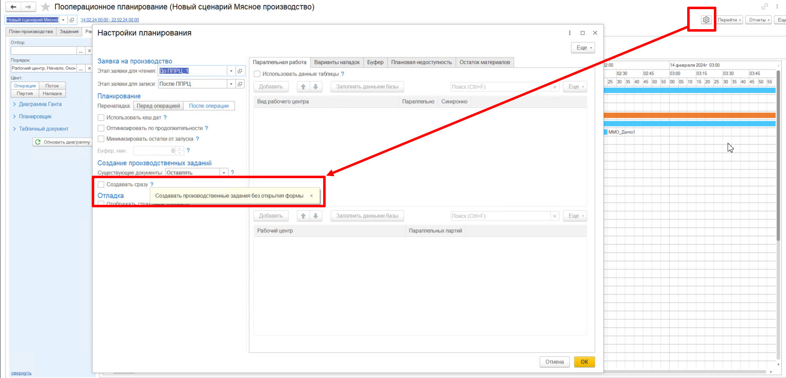
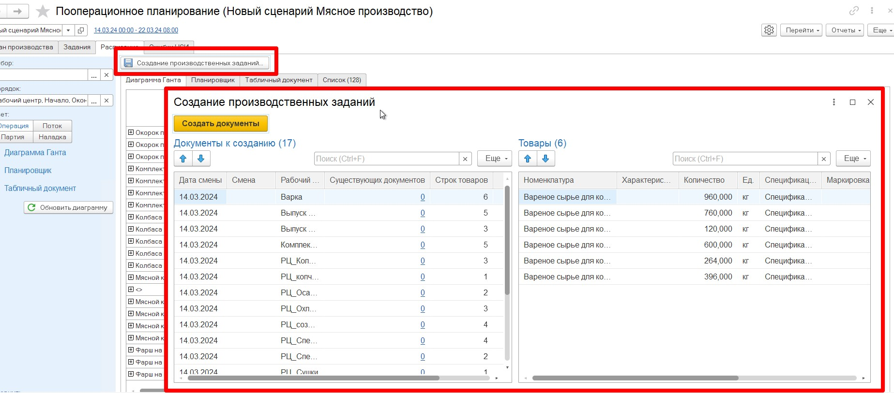

# Создание производственных заданий  

После того, как заявка распланирована, сформировано и согласовано расписание, остается завершить планирование и сформировать производственные задания(ПЗ) на каждый РЦ. Для этого на вкладке **Расписание** необходимо нажать кнопку **"Создание производственных заданий"**.  

  

При этом в АРМе ППРЦ есть возможность настроить варианты вывода и формирования производственных заданий.   

Например, при формировании ПЗ можно либо создать их сразу, либо сначала вывести на форму предпросмотра, перепроверить, убедиться, что все сформируется корректно, и только после этого подтвердить создание ПЗ.  

Для этого есть галочка `Создавать сразу`. Найти ее можно как в настройках АРМа, так и в сценарии планирования.  

### В сценарии

### В настройках  

  

Если ее включить, то при нажатии на кнопку **"Создание производственных заданий"**, ПЗ будут сформированы сразу, без предпросмотра.    
Если эта галочка выключена, то при нажатии на кнопку **"Создание производственных заданий"**, сначала будет открываться форма предпросмотра, на которой нужно подтвердить создание ПЗ.  
 
 
