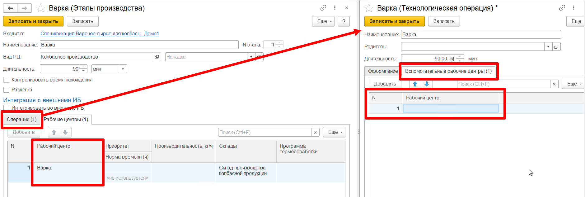
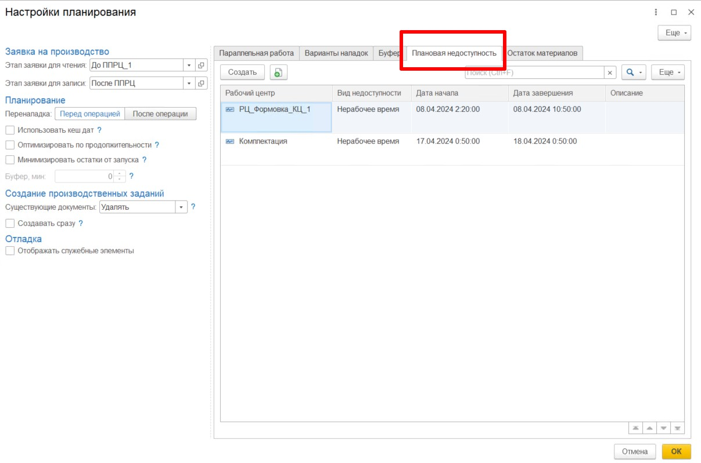
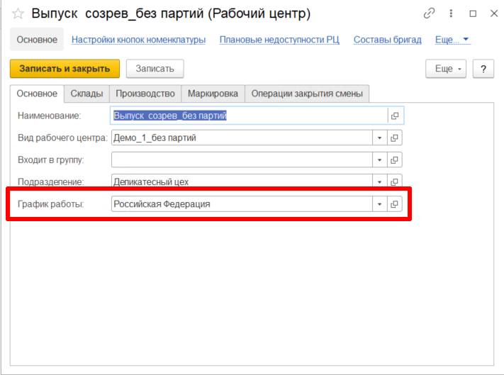
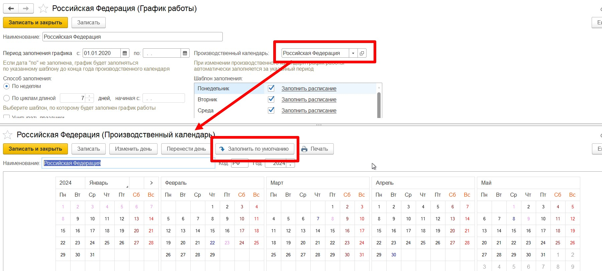
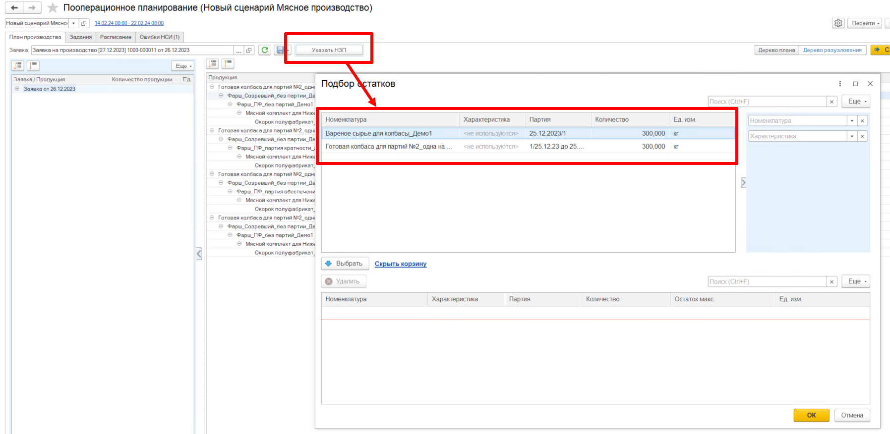

# Распространенные ошибки при планировании  

При работе в АРМе Планирования по рабочим центрам(ППРЦ) может возникать ряд ошибок, связанных с неправильной настройкой НСИ. В этом разделе приведены  основные, часто встречающиеся ошибки и варианты их решения.  

## Выход за интервал планирования 

При нажатии на кнопку **"Спланировать"** можно встретить следующую ошибку: Длительность операции [Этап:]:[Операция:]... больше выбранного интервала планирования.  

### Возможные решения 

- Необходимо попробовать увеличить интервал планирования, чтобы расписание текущей заявки точно влезало в этот интервал. Если ошибка уйдет, значит проблема именно в коротком интервале. В этом случае необходимо либо уменьшить заявку, либо увеличить интервал планирования.  

- Если решение №1 не помогло, тогда необходимо проверить, что в указанной операции на этапе, где произошло зацикливание, не стоит вспомогательный рабочий центр равный рабочему центру, который указан в этапе.  

  

## Нет подходящих РЦ  

В случае возникновения такой ошибки необходимо проверить следующее:  

- Убедиться, что все РЦ, которые используются в производстве всех позиций, указанных в заявке, доступны в выбранный интервал планирования.   

Доступность рабочего центра определяется либо графиком работы, либо ручной установкой плановой недоступности в настройках АРМа ППРЦ  

 

- Проверить, что в используемых РЦ установлен график работы.  

  

- Проверить календарь в установленном графике, в нем должны быть рабочие(черные) дни в выбранный интервал планирования. Если в нем все дни красные, то необходимо заполнить [календарь по умолчанию.](../Handbooks/WorkSchedule.md).  

 

## Нет остатков НЗП в форме выбора, хотя сами остатки есть  

!!! info "Важно" 
    На форму подбора остатков выводятся полуфабрикаты, находящиеся на складах рабочего центра их использования.  

Например, выпустили мясной комплект на складе Комплектации, дальше этот мясной комплект должен использоваться при выпуске фарша на складе фаршеприготовления. Если оставить мясной комплект на складе комплектации, то на форме подбора НЗП не получится увидеть наш комплект, а если переместить его на склад фаршеприготовления, то он появится на форме подбора НЗП.   

 

## Спецификация не найдена  

В случае возникновения ошибки о том, что не найдена спецификация, необходимо проверить следующее:   

- Нужно убедиться, что в системе заведены все спецификаци: на каждый производственный этап каждой позиции в заявке.

- Убедиться, что все необходимые спецификации являются действующими. 

- Проверить, что хотя бы одна спецификация на каждом этапе является основной, т.к. разузлование происходит только по основным спецификациям.  

Важные настройки ресурсных спецификаций описаны в разделе [**"Ресурсные спецификации"**](../Handbooks/ResourceSpecification.md)
