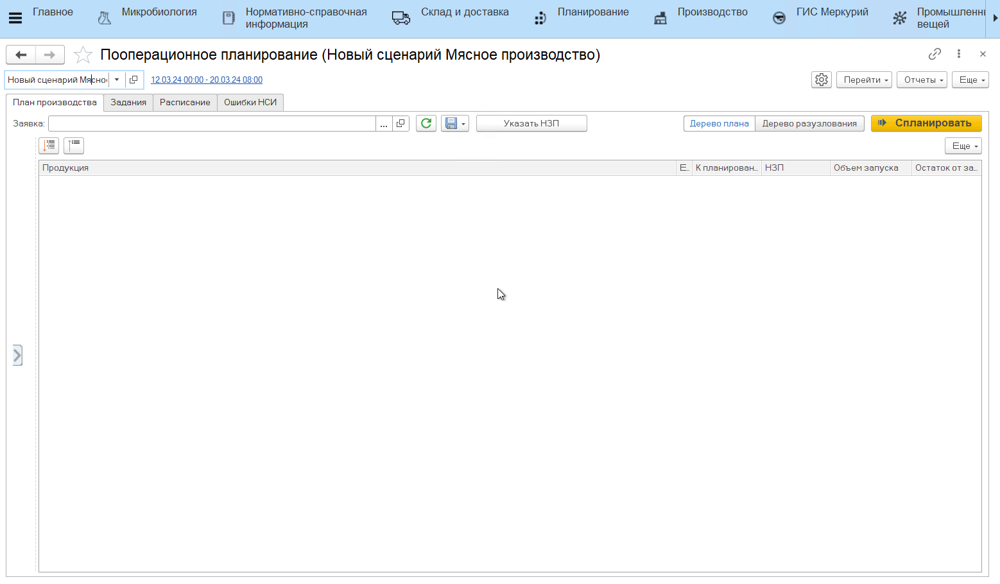
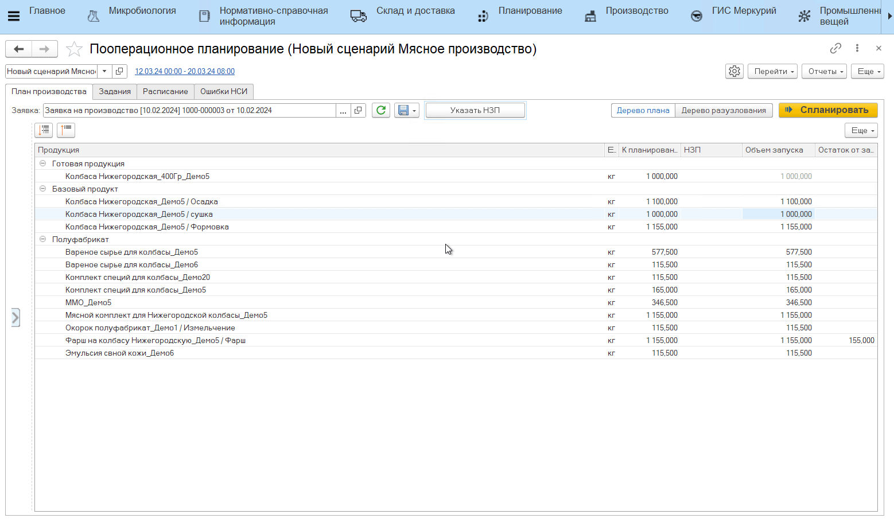
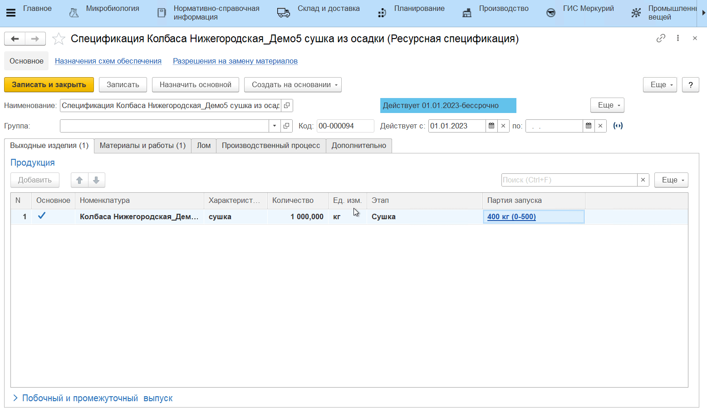
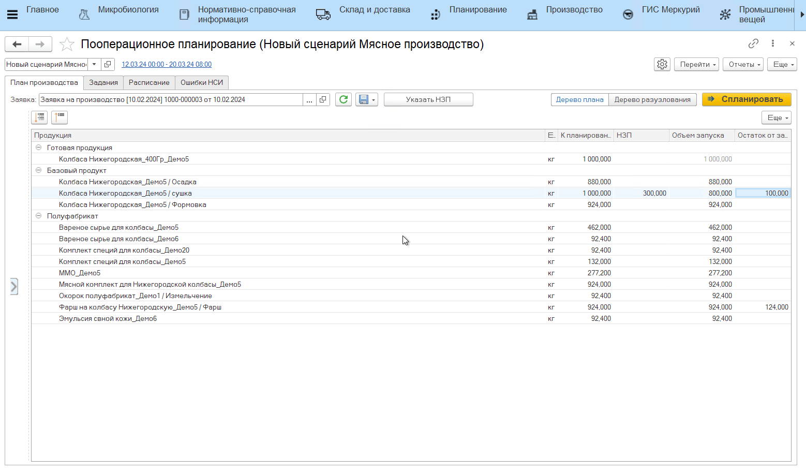

# Указание НЗП базового продукта

Помимо учета остака полуфабрикатов при планировании нового цикла производства, можно учесть остаток [базового продукта](../../Handbooks/Nomenclature.md). 

Для этого в **АРМе "Пооперационное планирование"**:

- прочитать документ **"Заявка на производство"**;
- нажать **"Указать НЗП"**;
- в открывшейся форме выбрать партию базового продукта, который нужно учесть при планировании и перенести в нижнюю табличную часть;
- указать количество базового продукта (если нужно учесть ровно столько) либо оставить максимальное количество - в таком случае в дереве плана будет "взято" столько НЗП, сколько достаточно для производства, а не весь указанный остаток;
- нажать **"Ок"**.

В итоге будет пересчитан объем запуска базового продукта:

- если указанный объем НЗП меньше, чем планируемый к производству объем базового продукта, то также пересчитается количество полуфабриката к планированию и его объем запуска;
- если указанный объем НЗП полностью покрывает необходимое к планированию количество базового продукта, то новые запуски полуфабриката не будут запланированы вообще. 

# Кратность запуска

Если для базового продукта настроена [кратность запуска](../../Handbooks/ResourceSpecification.md), то объем запуска будет пересчитан и с учетом НЗП, и с учетом сохранения кратности запуска. Также может появиться или измениться остаток от запуска базового продукта и может измениться количество "к планированию" полуфабриката, его объем запуска и остаток от запуска.

!!! info "Пример"
    Объем базового продукта в заявке = 1500 кг. Оптимальный объем запуска из спецификации = 1000 кг. При этом пользователь указывает НЗП базового продукта = 750 кг. Получается, с учетом НЗП по плану необходимо произвести еще 750 кг базового продукта, но т.к. оптимальный запуск = 1000 кг, то меньше 1000 кг произвести не получится. Будет выполнен запуск на 1000 кг и получится остаток от запуска, равный 250 кг. 
    При этом на базовый продукт нужно было произвести 2000 кг, но из-за сокращения объема производства базового продукта, сократится и запуск полуфабриката.

# Минимизация остатка

Если для базового продукта настроена кратность запуска и в настройках планирования (или в сценарии) включена настройка "Минимизировать остатки", то объем учтенного НЗП может измениться независимо от указанного пользователем количества (в меньшую сторону) ради того, чтобы сохранить оптимальный объем запуска и не появлялся новый остаток.

!!! info "Пример"
    Объем базового продукта в заявке = 1500 кг. Оптимальный объем запуска из спецификации = 1000 кг. При этом пользователь указывает НЗП базового продукта = 750 кг. Получается, с учетом НЗП по плану необходимо произвести еще 750 кг базового продукта, но т.к. оптимальный запуск = 1000 кг, то меньше 1000 кг произвести не получится и получится остаток от запуска, равный 250 кг. Минимизация остатка работает от обратного: чтобы остатка не было, нужно произвести 1000 кг, но тогда НЗП нужно взять меньше, поэтому в дереве плана количество НЗП будет равным 500 кг, а не 750 кг, как заявлено пользователем.
    При этом на базовый продукт нужно было произвести 2000 кг, но из-за сокращения объема производства базового продукта, сократится и запуск полуфабриката.

