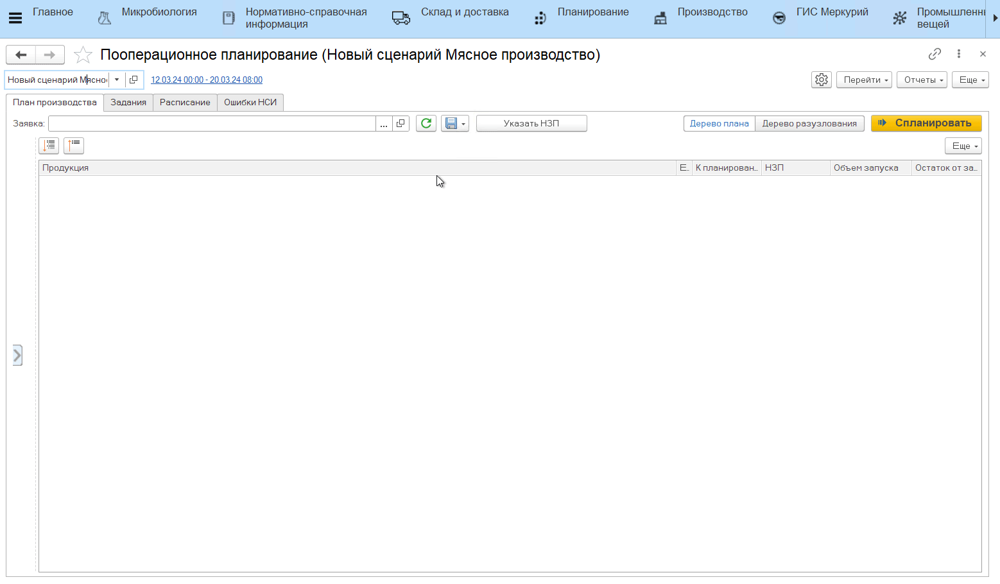
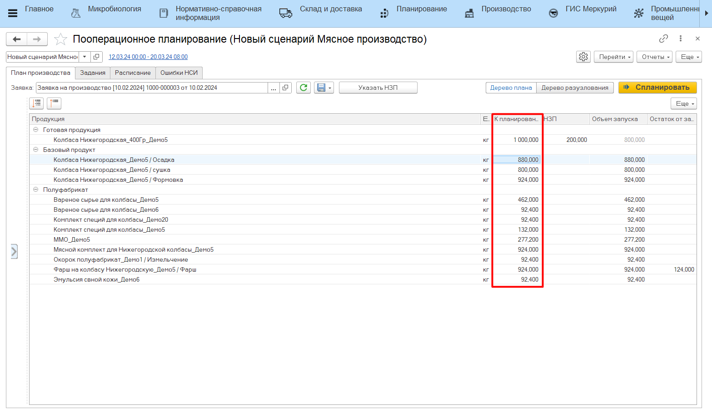

# Указание НЗП готовой продукции

Учет НЗП готовой продукции при планировании производства также возможен в системе (например, остатки немаркированной продукции). 

Для этого в **АРМе "Пооперационное планирование"**:

- прочитать документ **"Заявка на производство"**;
- нажать **"Указать НЗП"**;
- в открывшейся форме выбрать партию готового продукта, который нужно учесть при планировании и перенести в нижнюю табличную часть;
- указать количество готового продукта (если нужно учесть ровно столько) либо оставить максимальное количество - в таком случае в дереве плана будет "взято" столько НЗП, сколько достаточно для производства, а не весь указанный остаток;
- нажать **"Ок"**.

В итоге будет пересчитан объем запуска готовой продукции:
    

Eсли указанный объем НЗП меньше, чем планируемый к производству объем готовой продукции, то также пересчитается количество полуфабриката и базового продукта к планированию и их объемы запусков.

