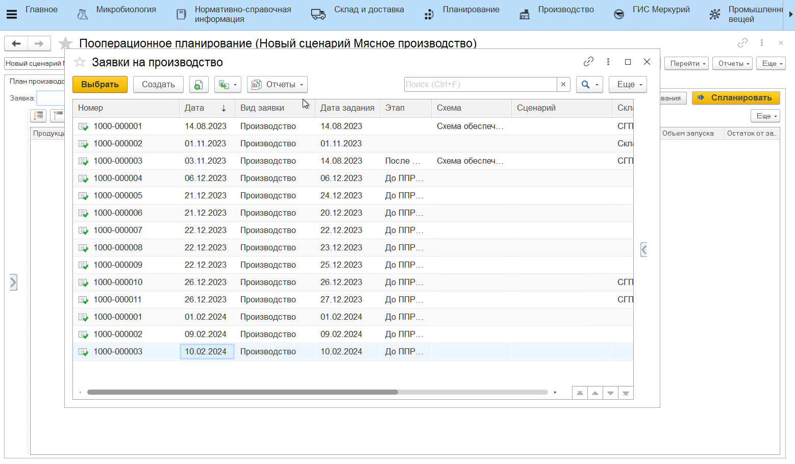
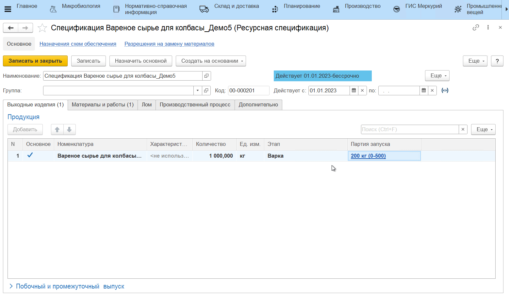
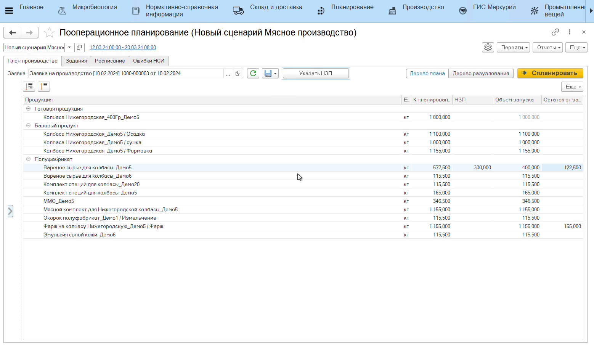

# Указание НЗП полуфабриката

При рассчете плана производства продукции могут учитываться уже имеющиеся на складах остатки полуфабрикатов. Например, для изготовления готовой продукции требуется произвести определенный объем полуфабриката, но какое-то его количество уже есть на складе от прошлого цикла производства. Этот остаток можно учесть при планировании нового цикла. 

Для этого в **АРМе "Пооперационное планирование"**:

- прочитать документ **"Заявка на производство"**;
- нажать **"Указать НЗП"**;
- в открывшейся форме выбрать партию полуфабриката, который нужно учесть при планировании и перенести в нижнюю табличную часть;
- указать количество полуфабриката (если нужно учесть ровно столько) либо оставить максимальное количество - в таком случае в дереве плана будет "взято" столько НЗП, сколько достаточно для производства, а не весь указанный остаток;
- нажать **"Ок"**.

В итоге будет пересчитан объем запуска полуфабриката.

# Кратность запуска

Если для полуфабриката настроена [кратность запуска](../../Handbooks/ResourceSpecification.md), то объем запуска будет пересчитан и с учетом НЗП, и с учетом сохранения кратности запуска. Также может появиться или измениться остаток от запуска.

!!! info "Пример"
    Объем полуфабриката в заявке = 1500 кг. Оптимальный объем запуска из спецификации = 1000 кг. При этом пользователь указывает НЗП полуфабриката = 750 кг. Получается, с учетом НЗП по плану необходимо произвести еще 750 кг полуфабриката, но т.к. оптимальный запуск = 1000 кг, то меньше 1000 кг произвести не получится. Таким образом, будет использовано 750 кг НЗП, будет выполнен запуск на 1000 кг, и получится остаток от запуска, равный 250 кг.

# Минимизация остатка

Если для полуфабриката настроена кратность запуска и в настройках планирования (или в сценарии) включена настройка "Минимизировать остатки", то объем учтенного НЗП может измениться независимо от указанного пользователем количества (в меньшую сторону) ради того, чтобы сохранить оптимальный объем запуска и не появлялся новый остаток.

!!! info "Пример"
    Объем полуфабриката в заявке = 1500 кг. Оптимальный объем запуска из спецификации = 1000 кг. При этом пользователь указывает НЗП полуфабриката = 750 кг. Получается, с учетом НЗП по плану необходимо произвести еще 750 кг полуфабриката, но т.к. оптимальный запуск = 1000 кг, то меньше 1000 кг произвести не получится и получится остаток от запуска, равный 250 кг. Минимизация остатка работает от обратного: чтобы остатка не было, нужно произвести 1000 кг, но тогда НЗП нужно взять меньше, поэтому в дереве плана количество НЗП будет равным 500 кг, а не 750 кг, как заявлено пользователем.

