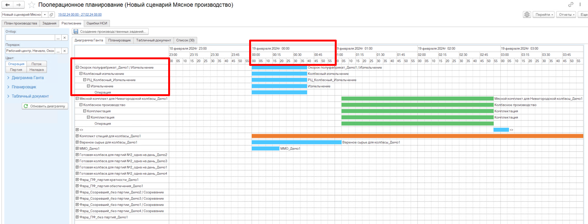
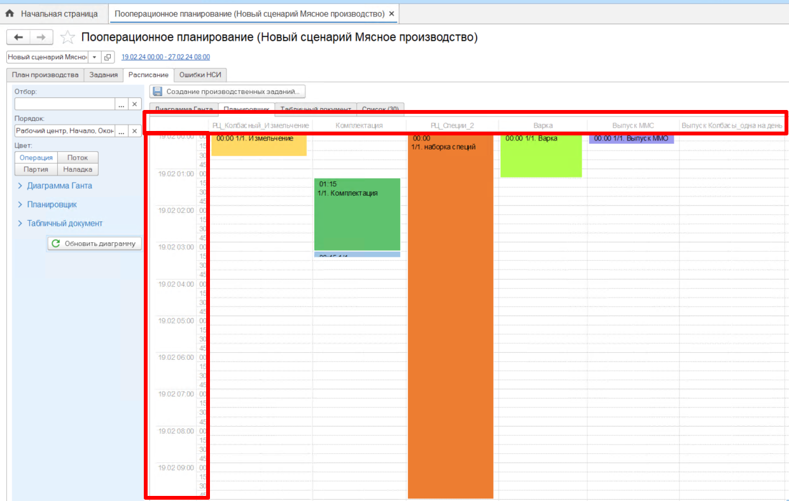
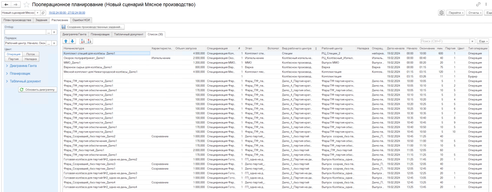

# Результаты планирования  

После планирования производства в АРМе ППРЦ формируется расписание производства, которое представлено в нескольких вариантах:  

- Диаграмма Ганта  
- Планировщик  
- Табличный документ  
- Список

## Диаграмма Ганта  

Диаграмма Ганта представляет собой визуальное оформление расписания производства, в строках которого представлено дерево Продукция/Вид РЦ/РЦ/Этап/Операция, в столбцах представлена дата с разбивкой по времени, кратностью 5 минут.  

  

## Планировщик 

Планировщик показывает загрузку рабочих центров по времени. В столбцах отображаются все рабочие центры, участвующие при производстве продукции, а в строках обозначается время, кратное 5 минутам. Тем самым по планировщику хорошо видно, какой РЦ в какое время занят.  

 

## Список  

Список - еще один вид представления расписания, в котором представлены все операции в разрезе каждого запуска всех продуктов на каждом этапе.  
В списке отображается информация, какую номенклатуру/характеристику, в каком объеме по какой спецификации, на каком этапе/ виде РЦ и РЦ выпускают, со скольки и до скольки выполняется та или иная операция, а также представлена длительность этой операции.  

 