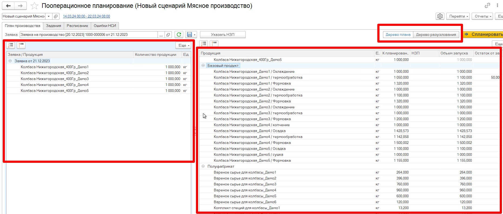
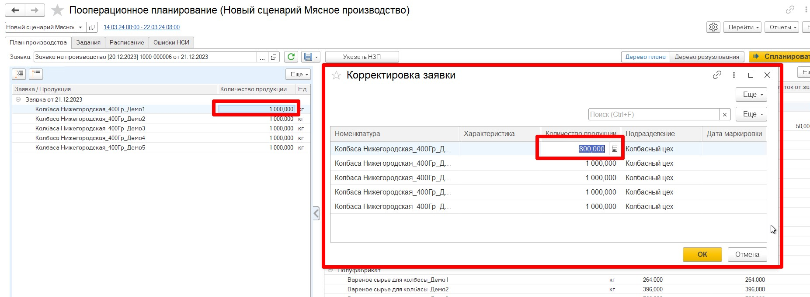
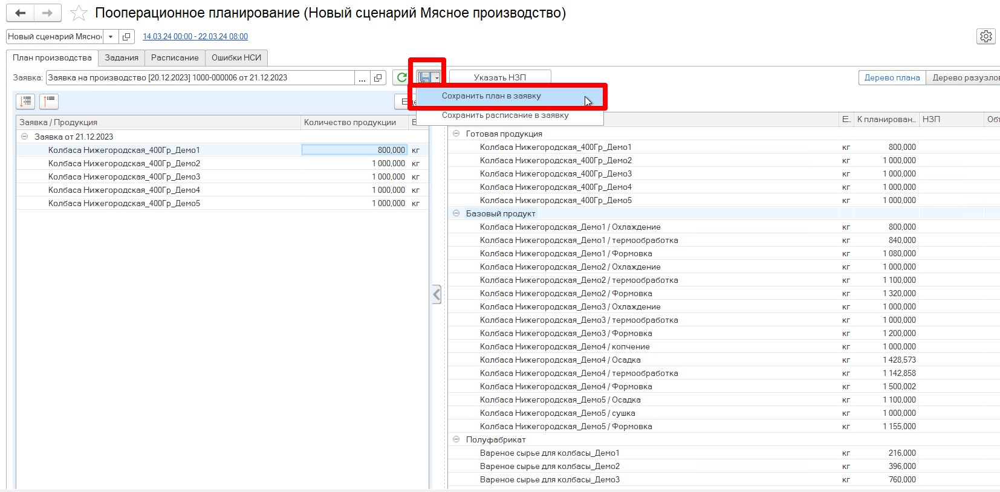

# Чтение заявки на производство  

После того, как выбран необходимый сценарий планирования и указаны все необходимые настройки, можно переходить к выбору заявки на производство, которую необходимо распланировать по рабочим центрам в виде производственных заданий. 

Для этого необходимо открыть список всех доступных заявок и выбрать необходимую заявку, которую нужно распланировать.  

В результате по данным из заявки в АРМе ППРЦ формируется три дерева:  

* `дерево по заявке` - в нем выводится информация о продукции и ее количестве, которое необходимо произвести по выбранной заявке.
* `дерево плана` - в нем, в разрезе типа номенклатуры (готовый продукт, базовый продукт и полуфабрикаты), выводится вся продукция, необходимая для обеспечения выбранной заявки. Т.е. в нем можно проанализировать, какое общее количество каждого материала необходимо для обеспечения выбранной завки
* `дерево разузлования` - в нем каждая продукция из заявки разузлована по переделам. Т.е. в нем можно проанализировать, что вся продукция из заявки успешно разузловалась до первого передела, а также можно посмотреть, сколько и какого материала необходимо для каждой продукции на каждом переделе ее производства.

  

После анализа количества продукции в заявке, оценки её выполнимости, у оператора есть возможность скорректировать количество в заявке.  

## Изменение количества в заявке   

Для того, чтобы изменить количество продукции в заявке, необходимо:

- на вкладке План производства в левой табличке выбрать продукцию, количество которой нужно отредактировать;
- дважды щелкнуть левой кнопкой мыши (ЛКМ) по полю **"количество"**;
- указать измененное количество. 

После того, как все необходимые изменения произведены, необходимо сохранить скорректированное количество продукции в заявку.    

 

## Сохранение в заявку  

Для сохранения количества в заявку нужно нажать кнопку **"Сохранить"**, выбрать вариант **"Сохранить план в заявку"**.  
В результате этих действий заявка перейдет в следующий этап (если предусмотрен) и в табличной части Продукция заполнится столбец с новым количеством. Если этапы в документе не предусмотрены, изменится объем продукции в столбце **"Количество"**, при этом старые значения будут затерты.    

  
