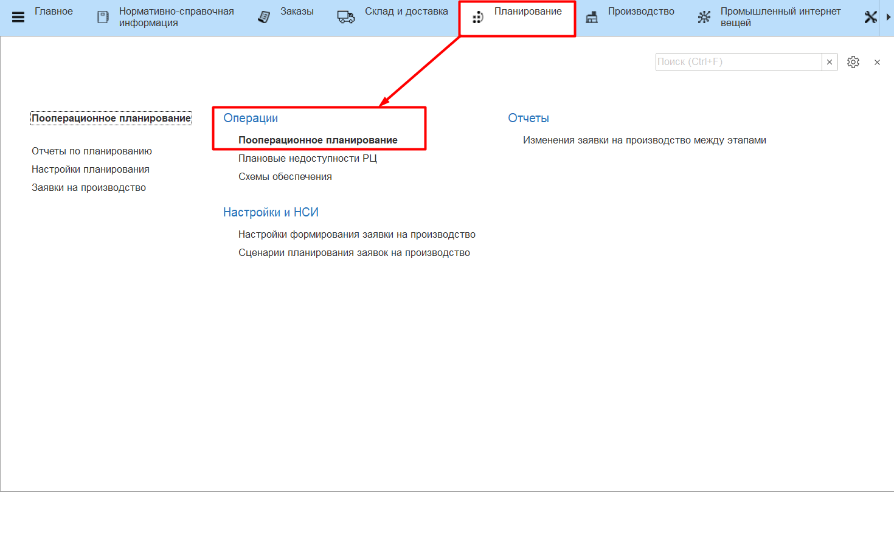
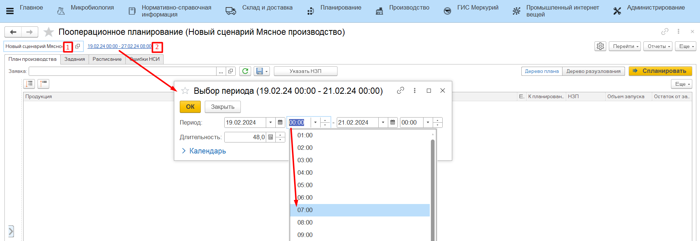
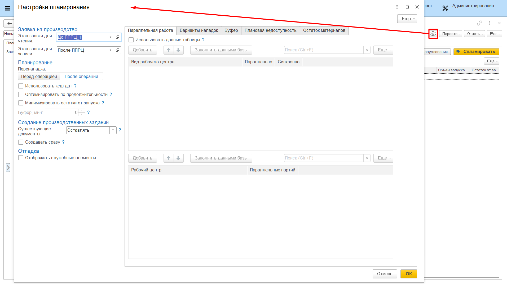
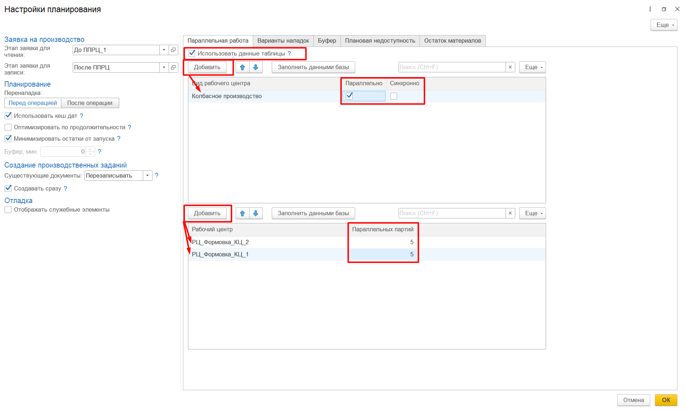
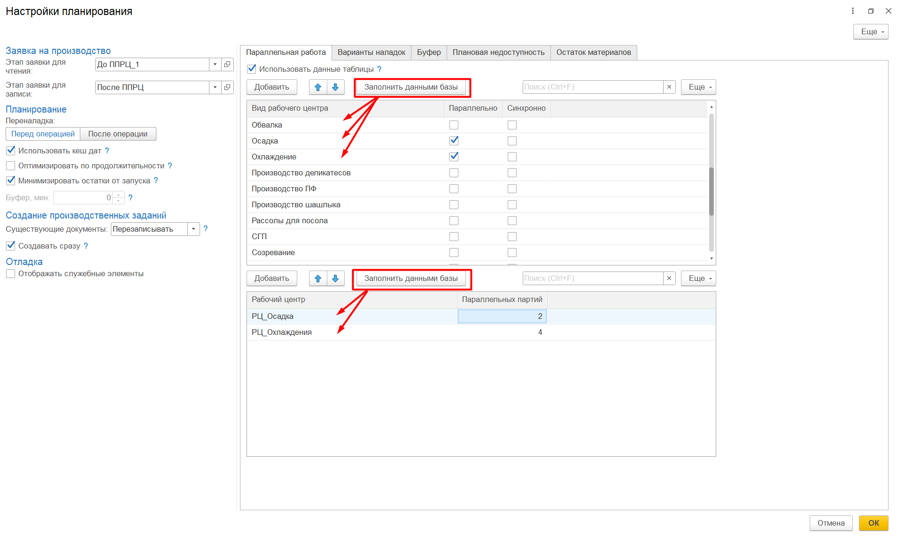
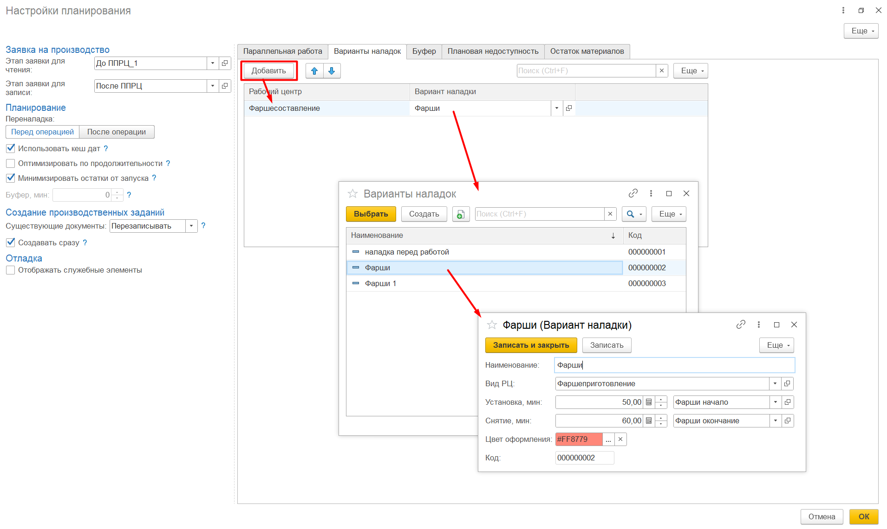
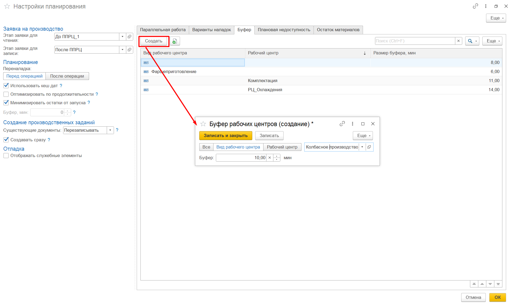
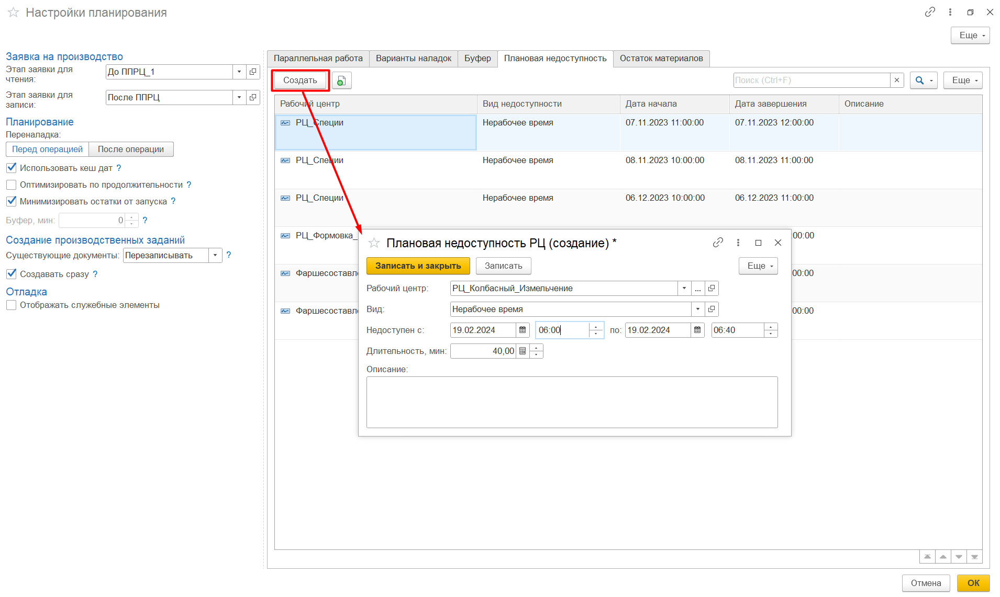

# Настройка АРМа "Пооперационное планирование"

**АРМ «Пооперационное планирование»** служит для распределения **"Заявки на производство"** по рабочим центрам и времени выпуска продукции, итоговым результатом является формирование документов **"Производственное задание"**.

**АРМ "Пооперационное планирование"** располагается в разделе Планирование -> Операции.

Прежде чем приступить к планированию, необходимо:

- выбрать [сценарий](../Handbooks/PPScenario.md), по которому ведется работа;
- указать период планирования - по умолчанию период заполняется из настроек сценария, но при необходимости его можно отредактировать с точностью до часов. Например, предприятие работает с 7 часов утра, а период планирования задан с 00:00 часов. Нет смысла рассматривать 7 нерабочих часов в расписании, поэтому период планирования можно подвинуть на 07:00. Так же можно поступить с окончанием периода;
- заполнить настройки планирования - по умолчанию настройки дублируют настройки из сценария ППРЦ, но сценарий - универсальный шаблон, а на практике ситуация на предприятии может меняться каждый день. Поэтому сценарий остается неизменным, но его можно скорректировать с помощью настроек.

В настройках указываются:

- этап для чтения;
- этап для записи;
- время переналадки (перед операцией / после операции);
- варианты планирования (использовать кеш дат, оптимизировать по продолжительности, минимизировать остатки);
- вариант записи документов **"Производственное задание"**;
- настройка отладки - открывает служебную вкладку **"Задания"**, где отображаются промежуточные результаты планирования. При возникновении ошибки или неточности рассчетов, администратор может обратиться к этим результатам для анализа проблемы. 

Подробнее об этих настройках написано в разделе ["Сценарии пооперационного планирования"](../Handbooks/PPScenario.md).

- Настройки параллельной работы [рабочих центров](../Handbooks/SettingWorkCenter.md) - если используются данные этой таблицы, то данные о параллельности из настроек вида рабочего центра и сценария игнорируются;
    - по умолчанию таблица заполнена значениями из сценария, которые можно отредактировать для текущего сеанса планирования, например, если на участке в день планирования не доступна параллельная работа;

    

    - по нажатию кнопки **"Заполнить данными базы"** таблица обновляется данными о параллельной работе по всем доступным в системе видам рабочих центров, эту информацию так же можно редактировать.

    

- Варианты наладок - таблица заполняется вариантами наладок из справочника **"Варианты наладок"**, которые перед началом планирования **уже** установлены на рабочих центрах:
    - если операция, которая начнется на рабочем центре, потребует установки другой наладки, в расписание будет добавлена операция переналадки с начальной наладки на нужную;
    - если операция, которая начнется на рабочем центре, проводится без специальной наладки, то в расписание будет добавлена операция снятия начальной наладки.

Вариант наладки для каждого этапа производства задается при создании [ресурсной спецификации](../Handbooks/ResourceSpecification.md).

- Буфер - это временной запас, который выделяется в планировании операций для учета возможных отклонений в сроках исполнения задач. Он предоставляет запас времени для учета непредвиденных ситуаций или изменений, чтобы сохранить план выполнения:
    - для всех операций - буфер будет устанавливаться в расписании после каждой операции;
    - для видов рабочих центров - буфер будет устанавливаться в расписании после каждой операции на каждом рабочем центре из указанного вида рабочих центров;
    - для рабочих центров - буфер будет устанавливаться в расписании после каждой операции на рабочем центре.

- Плановая недоступность - в расписание добавляется нерабочее время (или другой вид недоступности) для рабочего центра, планирование ведется с учетом указанных в табличной части недоступностей.

