# Краткое описание процесса расчета расписания  

Рассмотрим процесс формирования расписания на основании заявки с одной позицией. Нам необходимо произвести колбасу Нижегородскую 400гр. - 1100 кг. Соответственно, на входе имеем такую заявку  

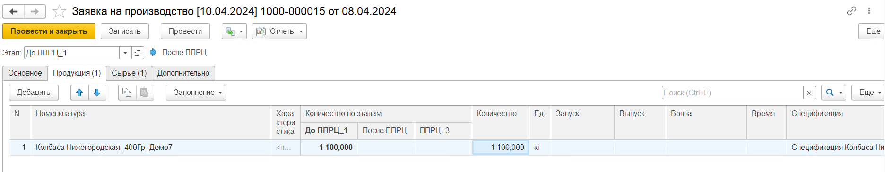  

Загружаем ее в АРМ ППРЦ  

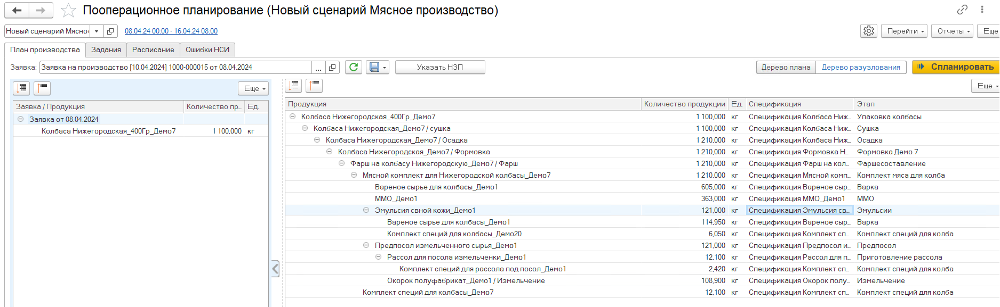   

Из дерева разузлования видно, что процесс производства данной продукции состоит из 16 переделов:  

- Упаковка; 

- Сушка;  

- Осадка;  

- Формовка;  

- Фаршеприготовление;  

- Комплектация;  

- Варка;  

- Выпуск ММО;  

- Выпуск комплекта специй;  

- Предпосол;  

- Приготовление рассола;  

- выпуск комплекта специй для рассола;  

- Измельчение;  

- Выпуск комплекта специй для фарша;  

В дереве плана представлено общее количество каждого полуфабриката, необходимого для удовлетворения заявки. Количество "К планированию" - это то количество полуфабриката, которое необходимо для удовлетворения заявки. "Объем запуска" - это то количество, которое по факту будет запланировано к производству. В некоторых случаях оно может быть больше количества "К планированию". Это может быть, например, в случаях привязки объема выпуска к оборудовнию и оптимальной партии зауска. 

Например, рассола необходимо всего 12.1 кг, но с учетом того, что вместимость рассольной станции 120 кг, то будет запланирован выпуск всех 120 кг, а 107,9кг останется от запуска.

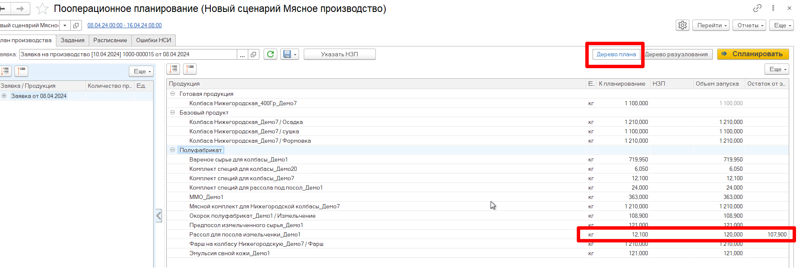   

Необходимо также предусмотреть, что специи собираются на другом участке, и в данном примере не нужно формировать задание на выпуск комплекта специй. Это будет делать мастер другого цеха(подразделения).

Для этого необходимо в виде рабочего центра указать подразделение - цех, к которому относится данный вид рабочего центра.

Для вида рабочего центра "Специи" необходимо указать подразделение -  "Участок специй", а для всех остальных видов рабочего центра, которые участвуют в производстве колбасы - "Колбасное производство". (Подробнее о настройках видов рабочих центров в разделе [**Настройки видов рабочих центров**](../Handbooks/SettingWorkCenter.md)) 

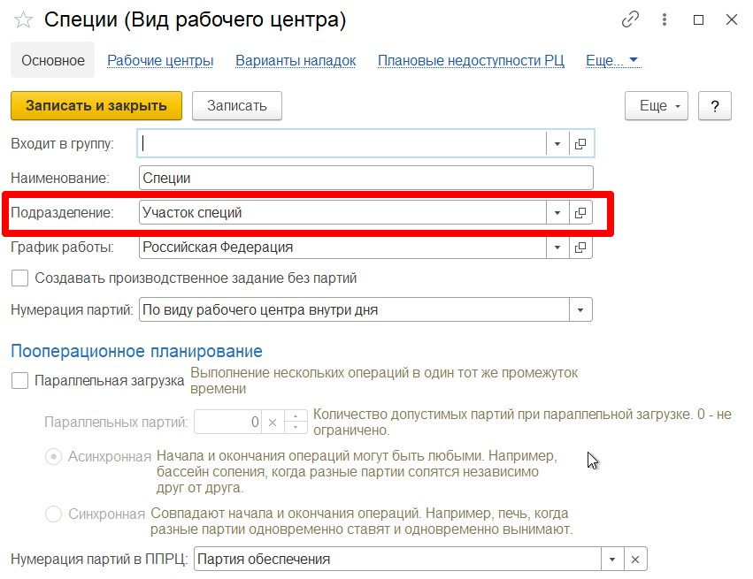  

Для того, чтобы ограничить разузлование только по подразделению "Колбасное производство", необходимо в сценарии планирования задать подразделение, которое нужно распланировать. (Подробнее о настройках сценария планирования в разделе  [**Сценарий планирования**](../Handbooks/PPScenario.md)) 

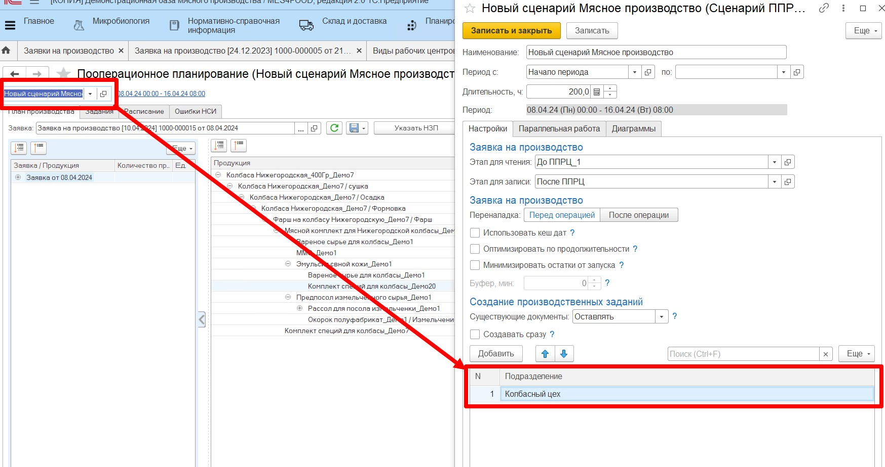   

Для того, чтобы ограничения вступили в силу необходимо либо перевыбрать заявку, либо ее перечитать, нажав на кнопку "Обновить". 

В Результате в дереве разузлования будут отражаться только те переделы, которые производятся на виде рабочего центра "Колбасное производство", а в дереве плана будет отображаться только та продукция, которая выпускается на выбранном цехе/подразделении.  

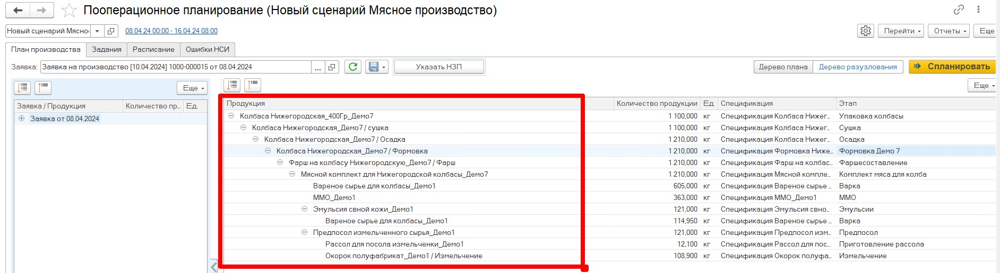   

При формировании задания необходимо учесть, что на складе формовки есть остатки фарша с прошлой смены, которые можно учесть при планировании нового задания на выпуск фарша.  
Для этого необходимо:  

- Нажать кнопку "Указать НЗП";  

- Выбрать партию материала, которую можно использовать для выпуска колбасы;  

- Указать количество используемого материала. Можно указать как все остатки, так и часть. На остатках 510 кг, предположим, что для данной заявки можно использовать только 410 кг.  

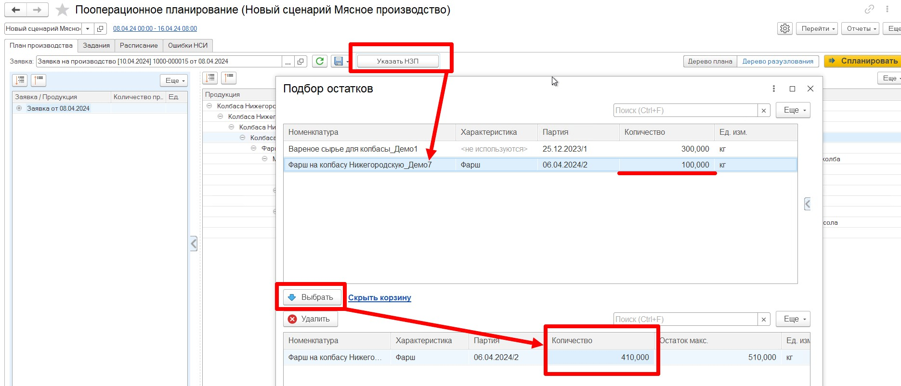   

В результате в дереве плана пересчитывается "объем запуска" для самого фарша, как "К планированию" - "НЗП", также пересчитывается необходимое количество всех материалов ниже по производственной цепочке: количество мясного комплекта и количество полуфабрикатов, из которых этот мясной комплект собирается: эмульсия, вареное сырье, ММО, предпосоленное сырье.

Расчет осуществляется по спецификации. Если раньше на 1210 кг фарша необходимо было 1210 кг мясного комплекта, а на него, в свою очередь:  

- вареного сырья 605 кг,   

- ММО - 363 кг,   

- эмульсии - 121 кг,  

- предпосоленного сырья - 121 кг.  

То сейчас, с учетом использованного НЗП фарша в объеме 410 кг, осталось произвести 800 кг фарша, 800 кг мясного комплекта, а для производства такого объема мясного комплекта:  

- вареного сырья 476 кг,   

- ММО - 240 кг,   

- эмульсии - 80 кг,  

- предпосоленного сырья - 80 кг.    

Количество рассола тоже пересчиталось. Теперь его необходимо всего 8 кг, но выпуск будет планироваться все равно на 120 кг, т.к. оптимальная партия в спецификации на выпуск рассола указана как 120 кг, равной объему рассольной станции. Остаток от запуска рассола будет равен 120 - 8 = 112 кг.  (Подробнее о НЗП в разделах [**НЗП готовой продукции**](NZP/NZP_gotovaya.md), [**НЗП базового продукта**](NZP/NZP_bazoviy.md), [**НЗП полуфабриката**](NZP/NZP_polufabrikat.md))

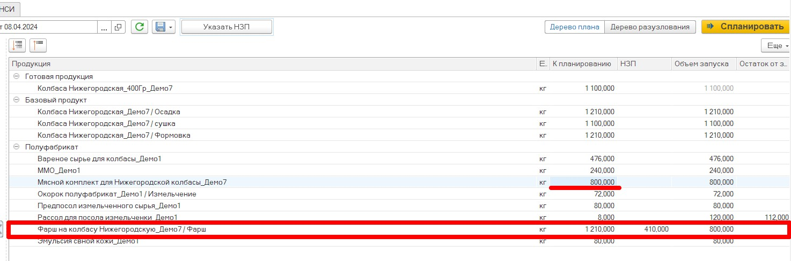  

Перед запуском планирования необходимо зафиксировать все первоначальные настройки производства:  

- Указать возможность параллельного запуска нескольких партий на одном РЦ;   

Зафиксировали, что для вида рабочего центра "Комплектация" будет параллельная загрузка некоторого рабочего центра. В таблице ниже необходимо указать, какой именно рабочий центр будет параллельно загружать партии, и сколько партий одновременно он сможет производить.  

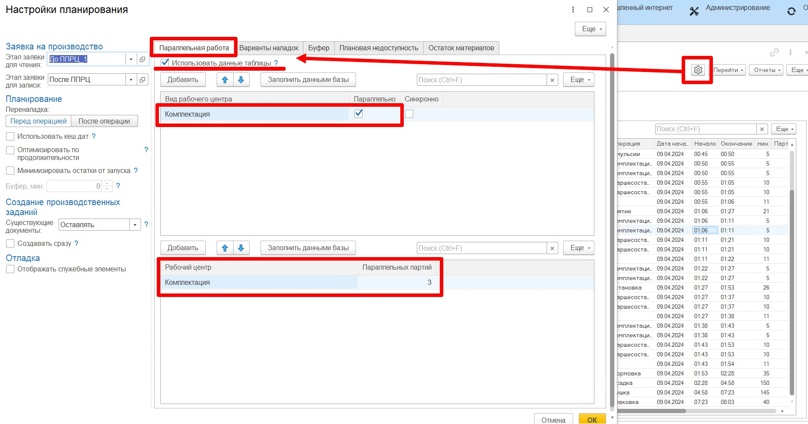

- Варианты наладок(например, снятие/установка насадок на формовочное оборудование);  

Тут задается наладка(насадка), которая установлена на оборудовании перед началом производства. Например, в предыдущую смену производили тонкие сосиски 25 мм. Необходимо задать эту информацию в АРМе, чтобы при планировании система заложила время на снятие старых насадок. (Подробнее о наладках в разделе [**"Ресурсные спецификации"**](../Handbooks/ResourceSpecification.md))

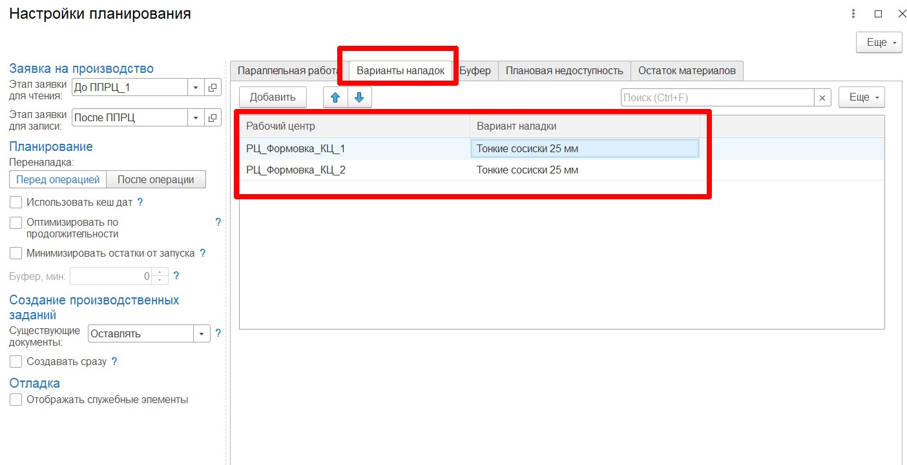

- Зафиксировать недоступность оборудования/РЦ;  

Необходимо указать рабочие центры, которые будут недоступны и время их недоступности для того, чтобы система не планировала их загрузку.  

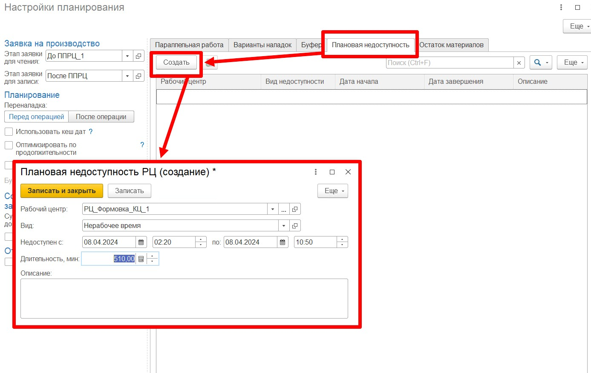

- Заложить буфер при необходимости. 

В системе есть возможность заложить буфер между операциями - время, которое добавляется в промежутках между запусками на одном рабочем центре. Его можно привязать как к конкретному рабочему центру, так и к виду рабочего центра.  (Подробнее о настройках АРМа ППРЦ в разделе [**Настройки АРМа ППРЦ**](Settings.md))

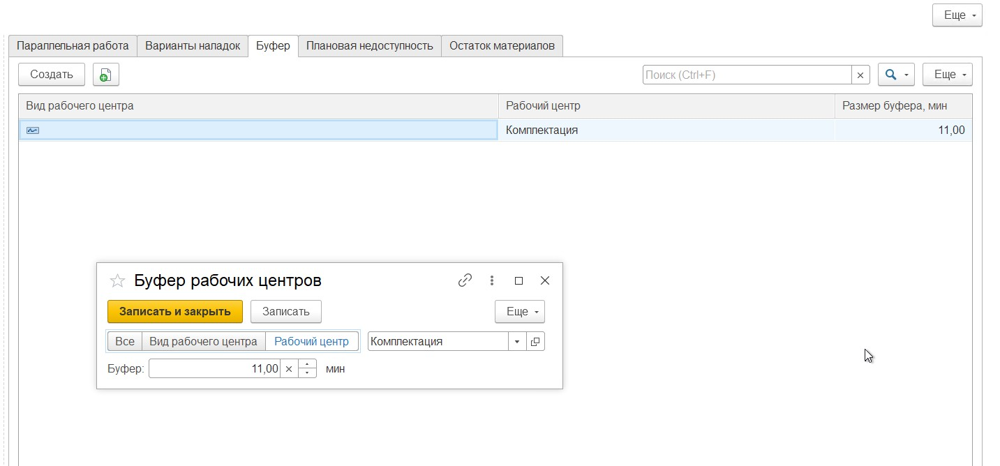

После того, как все начальные настройки указали, можно сформировать расписание. Для этого необходимо нажать кнопку "Спланировать".  

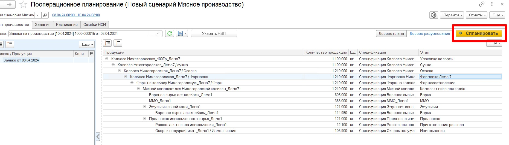

В результате сформируется расписание в виде диаграммы Ганта, которая показывает какая операция в какое время должна быть запущена, когда она закончится, когда начнется следующая операция. Одно деление времени = 5 мин.

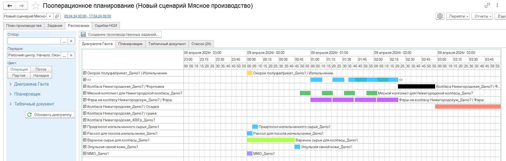

Временной интервал каждой операции можно окрасить в свой цвет. Для этого в справочнике "Технологическая операции" необходимо задать её цвет.  

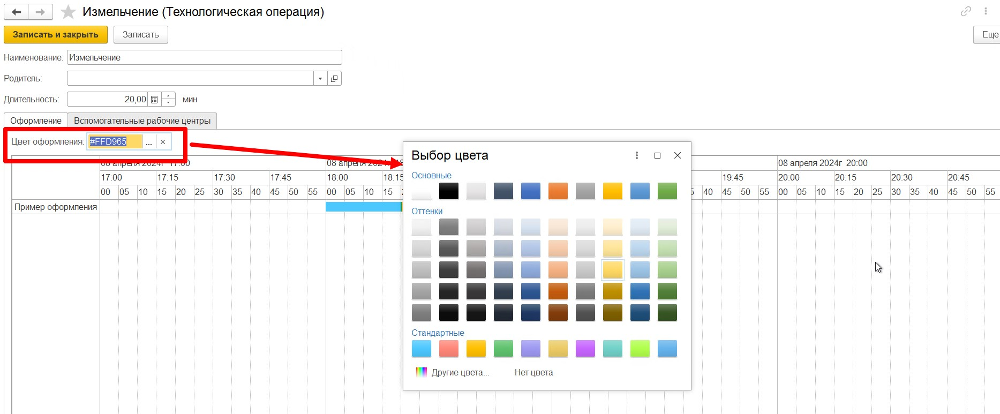  

На вкладке "Список" представлено расписание в виде списка операций. Для каждого выпускаемого полуфабриката можно увидеть какой операцией он выпускается, когда начинается/заканчивается операция, время ее выполнения и рабочий центр, на котором она выполняется.  
Например, операция производства вареного полуфабриката начинается в 00:00 - время старта планирования, длится эта операция 45 мин и заканчивается в 00:45. 

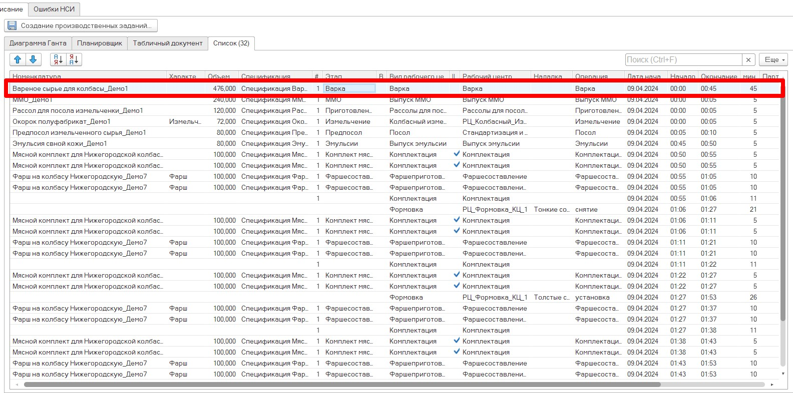

Как система определила, что 476 кг вареного полуфабриката будет изготавливаться 45 мин?  
В спецификации задается объем выпуска, в этапе задается время операции. Это время - нормативное время производства того объема, который указан в ТЧ "Выходные изделия" ресурсной спецификации. (Подробнее в разделе [**Ресурсные спецификации**](../Handbooks/ResourceSpecification.md))   

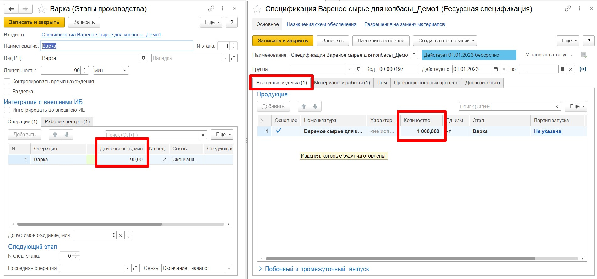  

В нашем случае 1000 кг будет производится 90 мин, значит 476 кг будет производится 476/1000*90 = 42,84 мин. Округляем до 45 мин.(кратность временного интервала = 5 мин.) 

В настройках была задана параллельность для вида рабочего центра "Комплектация", система это учитывает и в расписании видно, что мясные комплекты запускаются одновременно по несколько замесов.  

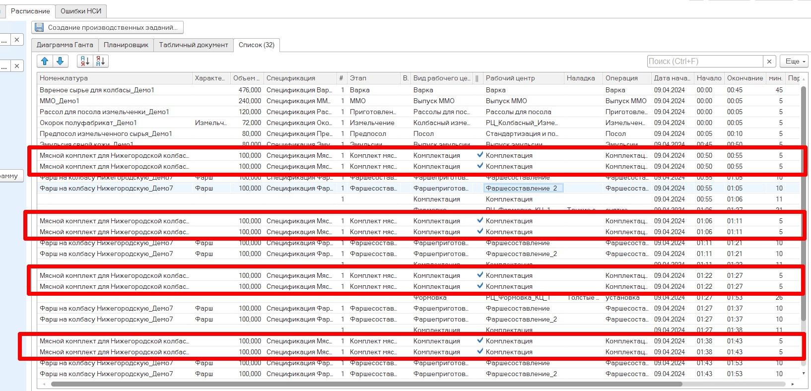   

Можно также заметить, что весь объем необходимого фарша разбит на несколько запусков по 100 кг, и мясной комплект, в свою очередь, тоже разбит на несколько замесов. Такая разбивка связана с настройкой варианта формирования партии, которая задается в виде рабочего центра. (Подробнее в разделе [**Настройка видов рабочих центров**](../Handbooks/SettingWorkCenter.md)) 

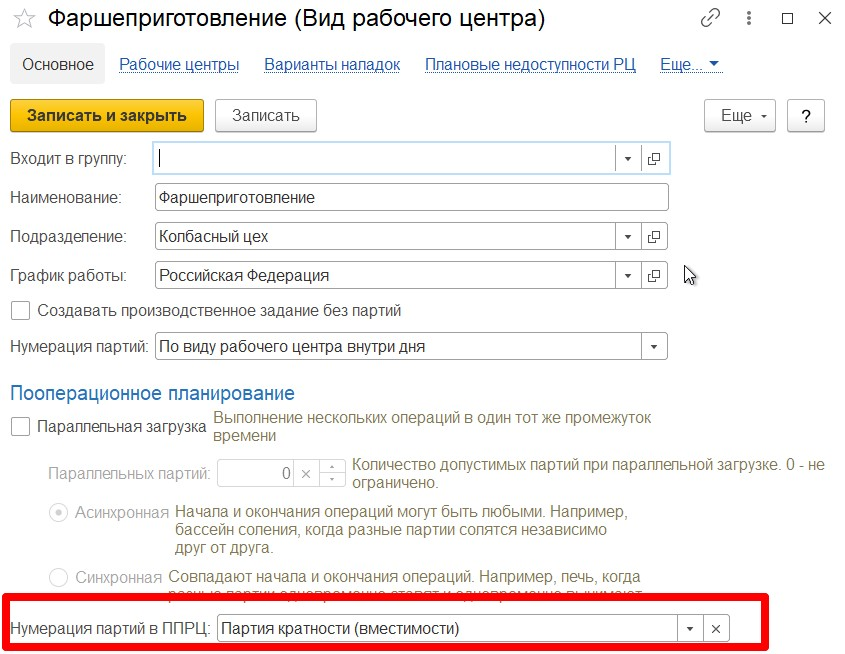

Для фарша задан вариант: "Партия кратности". В этом случае общий объем необходимого полуфабриката разбивается на замесы, равные оптимальной партии. Оптимальная партия настраивается в ресурсной спецификации. (Подробнее в разделе [**Ресурсные спецификации**](../Handbooks/ResourceSpecification.md))   

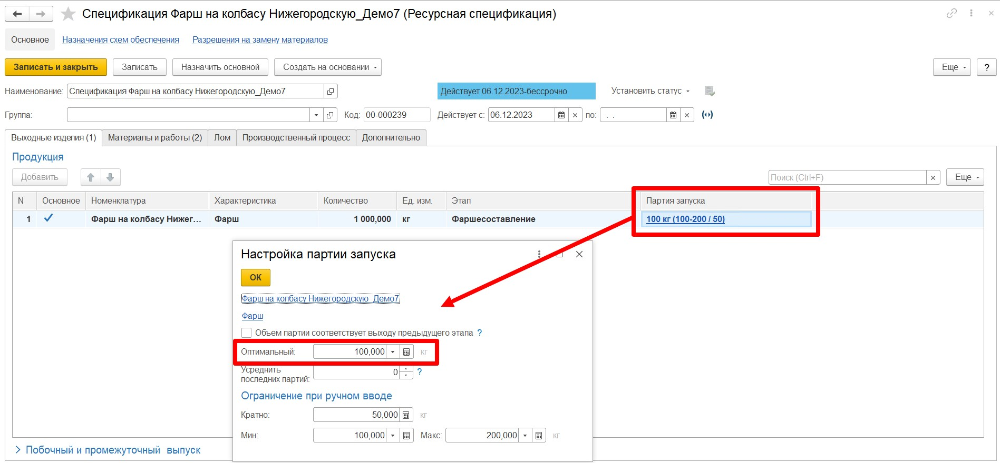

Общий объем необходимого фарша = 800 кг. Объем оптимальной партии = 100 кг. В итоге получаем 8 запусков по 100 кг.

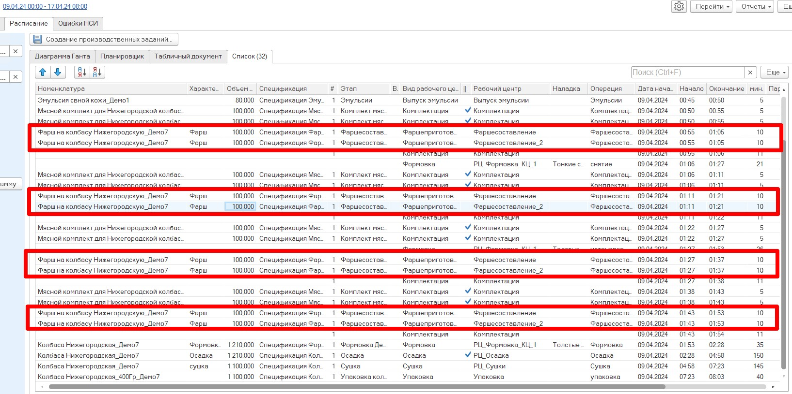  

Вариант формирования партии для мясных комплектов = "Партия обеспечения". В этом случае весь объем необходимого мясного комплекта разбивается под каждый замес фарша(следующего этапа). В результате выпуск мясного комплекта так же разбивается на 8 запусков.Объем каждого запуска равен объему, необходимому для выпуска одного запуска фарша.  

Например, для формовки, осадки и сушки вариант формирования партии = "Без партии". В этом случае весь объем планируется одним запуском. В производственном задании будет одна строчка без партии.  
Для упаковки вариант формирования партии = "Одна партия на день". В этом случае весь объем планируется одним запуском, в производственном задании будет записана одна строка с заполненной партией.  

Так как для формовочного оборудования была задана начальная наладка, и в этапе формовки задана необходимая наладка для выпуска сформованного продукта, то в расписании было заложено время на снятие старой наладки и установку новой наладки. Только после этого идет операция формовки колбасы.  

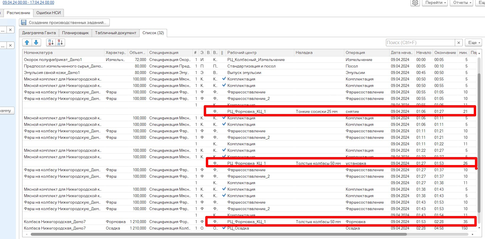   

По кнопке "Создание производственных заданий" сформируется несколько документов с заполненными вкладками "Задание" и "Расписание" - на каждый рабочий центр свой документ. (Подробнее в разделе [**Создание производственных заданий**](CreateWorkTasks.md))

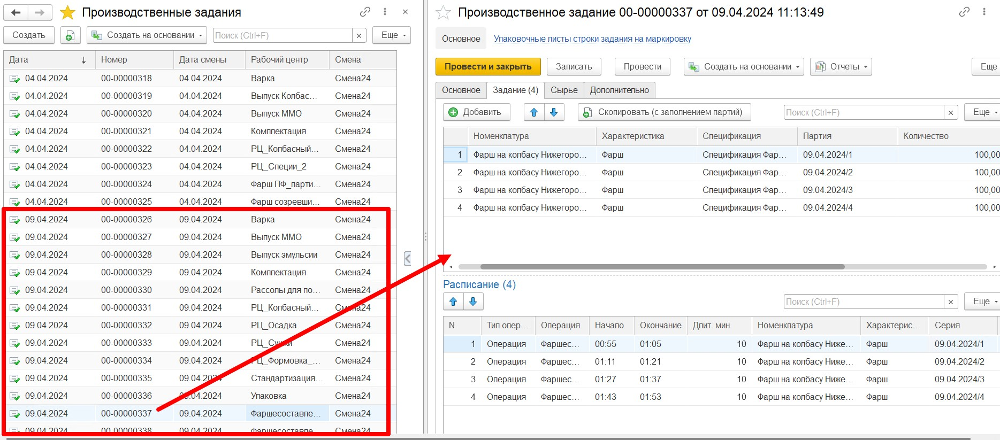

