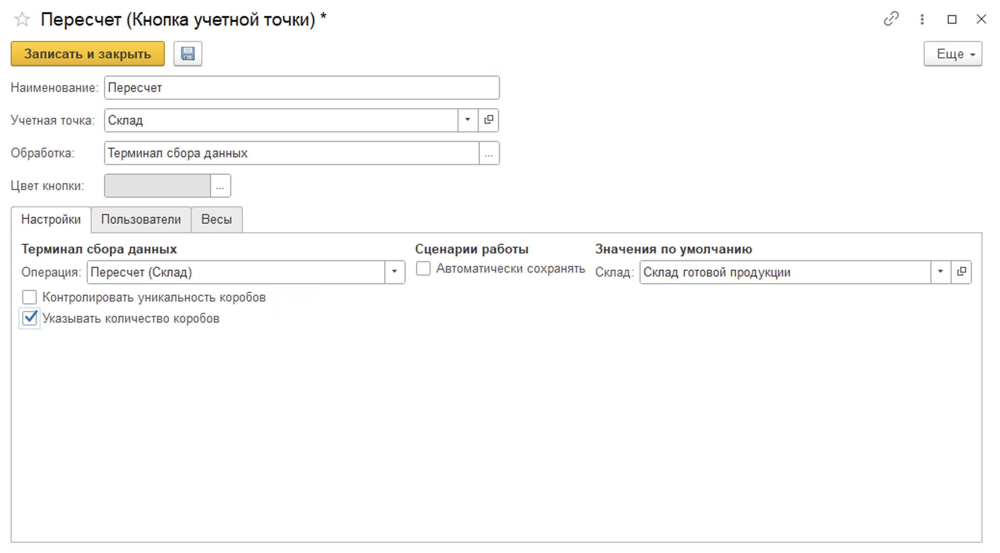

# Создание и настройки кнопки "Пересчет"

Кнопка **"Пересчет"** используется только на складах с адресной системой хранения. С помощью этой кнопки создается документ **"Пересчет"**, который используется в инвентаризации для отражения фактического количества товаров на складе.

При создании кнопки учетной точки **"Пересчет"** указываются:

- Наименование;
- Учетная точка;
- Обработка - Терминал сбора данных;
- Цвет кнопки в МУТ.

На вкладке **"Настройки"** заполняются:

- Операция - Пересчет (Склад);
- Склад.

Так же настраиваются проверки:

- Контроль уникальности коробов - дополнительная проверка на отсутствие или наличие идентификатора уникальности короба (21) для штрихкодов типа GS1-128;
- Указывать количество коробов - данная настройка позволит указывать количество коробов к отбору после сканирования кода GS1-128.

 

На вкладке **"Пользователи"** можно настраивать индивидуальные права доступа.

