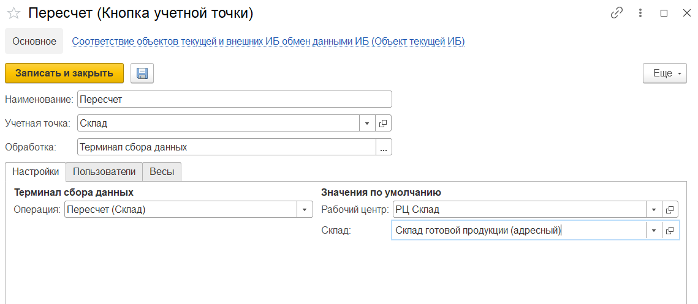

# Создание и настройки кнопки "Пересчет"

Кнопка **"Пересчет"** используется только на складах с адресной системой хранения. С помощью этой кнопки создается документ **"Пересчет"**, который используется в инвентаризации для отражения фактического количества товаров на складе.

При создании кнопки учетной точки **"Пересчет"** указываются:

- Наименование
- Учетная точка
- Обработка -Терминал сбора данных

На вкладке **"Настройки"** заполняются:

- Операция - Пересчет (Склад)
- Рабочий центр
- Склад

 

На вкладке **"Пользователи"** можно настраивать индивидуальные права доступа.

