# Инвентаризация

Инвентаризация имущества на складе – это мероприятие в ходе которого проверяется фактическое наличие материально-производственных запасов. Для проведения инвентаризации в системе используется документы **"Пересчет"** и **"Инвентаризация"**, **"Оприходование товаров"** и **"Списание товаров"**.

Документ **"Пересчет"** - предназначен для отражения фактического количества товаров на складе.
Документ **"Инвентаризация"** - предназначен для сравнения количества товаров на складе по учету и количества товаров на складе по факту.

## Пересчет на ТСД

На первом этапе необходимо провести подсчет остатков продукции на складе и занести эти данные в документ **"Пересчет"**, который расположен в разделе **"Склад и доставка"** в подсистеме **"Складская логистика"**.

На адресом складе с использованием ТСД пересчет производится непосредственно на ТСД с помощью кнопки **"Пересчет"**.

После открытия формы обработки **"Меню учетных точек"** заполняем поля:

- Дата
- Смена
- Учетная точка

На форме обработки появятся кнопки выбранной учетной точки, выбираем кнопку **"Пересчет"**.

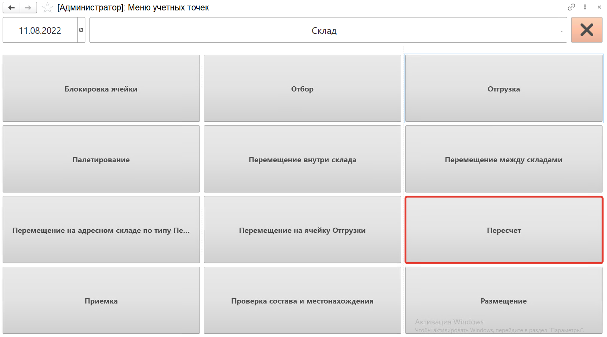

Сканируем ячейку для пересчета, нажимаем на кнопку **"V"**.

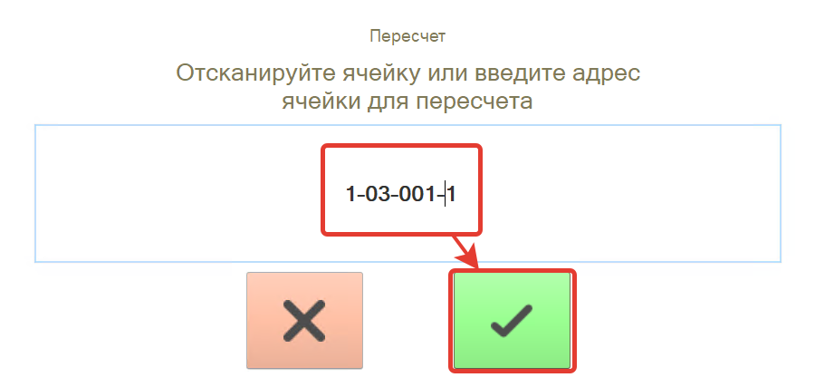

Далее сканируем штрихкоды коробов продукции, которая находится на складе в этой ячейке, номенклатура появится на форме.

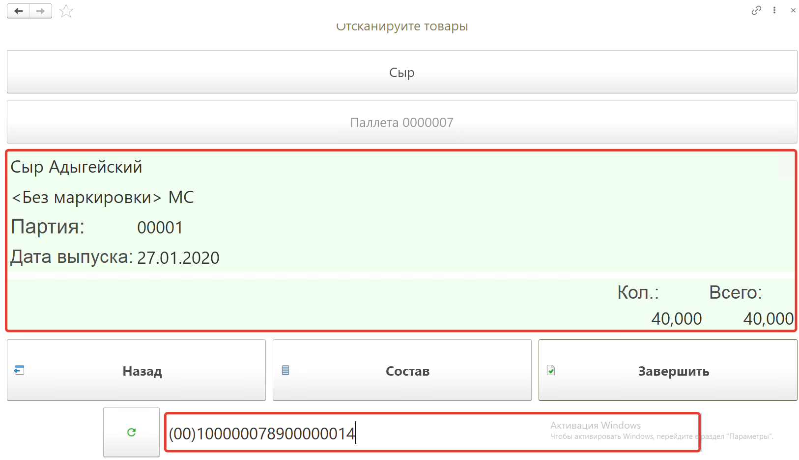

Посмотреть состав отсканированной номенклатуры можно по кнопке **"Состав"**. На форме появится список номенклатуры, можно удалить строку с помощью кнопки **"Удалить строку"**.

Для перехода к следующей ячейке или завершения работы по пересчету нажимаем кнопку **"Завершить"**.

После снова откроется форма ввода ячейки. Вводим ее адрес и затем короба номенклатуры в этой ячейки.

После пересчета во всех ячейках на форме ввода ячейки нажимаем кнопку **"Х"**.

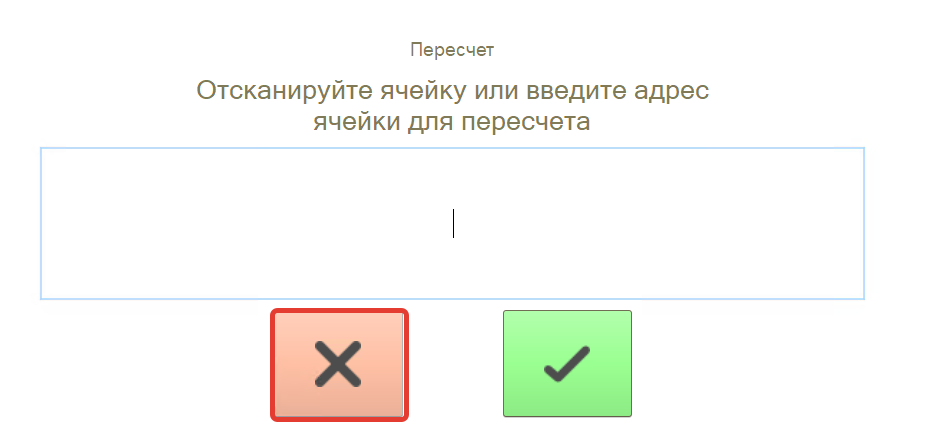

В результате будет создан документ **"Пересчет"**.

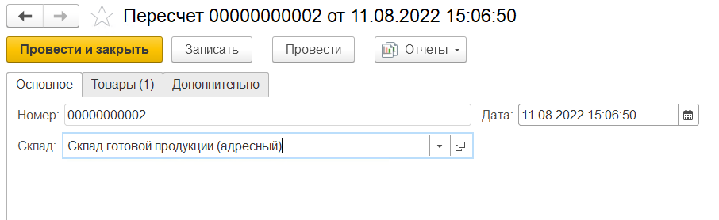

Мы умышленно создаем отклонения от текущих остатков по учету, предполагая, что на складе произошли ошибки при фактическом движении товаров.

Для реализации нашего примера будем считать, что в  ячейках хранится следующее количество товара:

- Ячейка "101-001-2" Сыр Сулугуни характеристика "Ашан", упаковка 0,5кг 20 шт
- Ячейка "2-01-001-3" Сыр Сулугуни характеристика "Ашан", упаковка 0,5кг 2 шт
- Ячейка "2-01-001-3" Сыр Адыгейский характеристика "Ашан", упаковка 0,5кг 3 шт

Для каждой ячейки необходимо создать упаковочные листы и использовать их при пересчете.

## Создание документа "Инвентаризация"

Документ **"Инвентаризация"**  расположен в разделе **"Склад и доставка"** в подсистеме **"Складская логистика"**.

При создании документа указываются:

На вкладке **"Основное"**:

- Статус
- Номер - заполняется автоматически
- Дата
- Склад

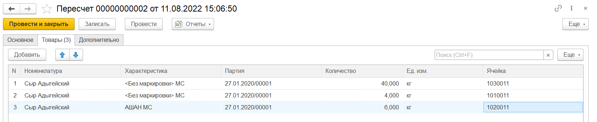

На вкладке **"Товары"** нажатием кнопки **"Заполнить по учету"** откроется форма выбора **"Складские ячейки"**. Выбираем ячейки и нажимаем на кнопку **"Перенести в документ"**.

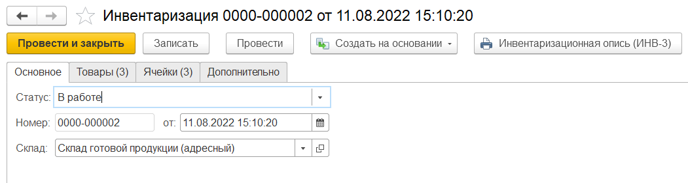

Табличная часть будет заполнена товарами, которые имеются на складе по документации.

Далее нажимаем на кнопку **"Заполнить по пересчету"**, откроется форма выбора документов **"Пересчет"**, выбираем на ней нужный документ. В результате в табличной части заполнится поле **"Количество факт"** :

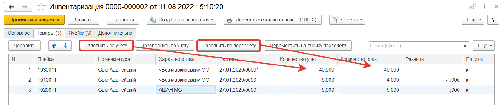

Затем для склада с адресным хранением надо нажать на кнопку **"Переместить на ячейку пересчета"**. Количество по учету в ячейках станет равным количеству по факту, а вся разница будет записана на ячейку пересчета.

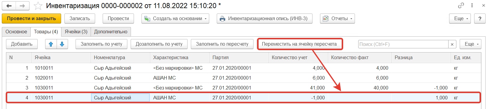

Для документа **"Инвентаризация"** используется печатная форма: **"Инвентаризационная опись (ИНВ-3)"**

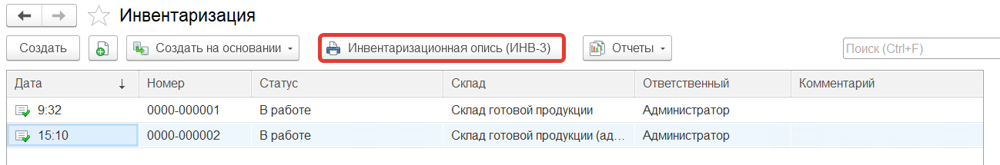

На основании проведенной **Инвентаризация** создаются документы:

- **"Оприходование товаров"** - в случае, когда разница между учетным и фактическим количеством товаров со знаком плюс (т.е. товар на складе имеется, а в документах это не отражено).

    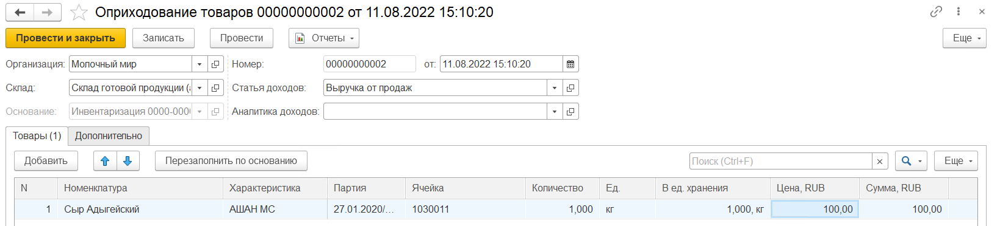

- **"Списание товаров"** - в случае, когда разница между учетным и фактическим количеством товаров имеет знак минус (т.е. на складе нет данного товара, а по документам он имеется).

    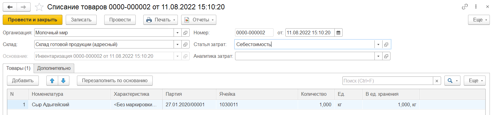

Также для адресного склада, где ведется учет по тарам, доступно формирование следующих документов:

- **"Комплектация тары"** - в случае, когда изменился состав тары (по товарам и/или по составу дополнительной тары). Формируются документы по всему перечню тары на вкладке **"Тары"**. Тары, которые по учету находятся на другом складе, но по факту были обнаружены и просканированы на складе инвентаризации, также перемещаются этим документом.

    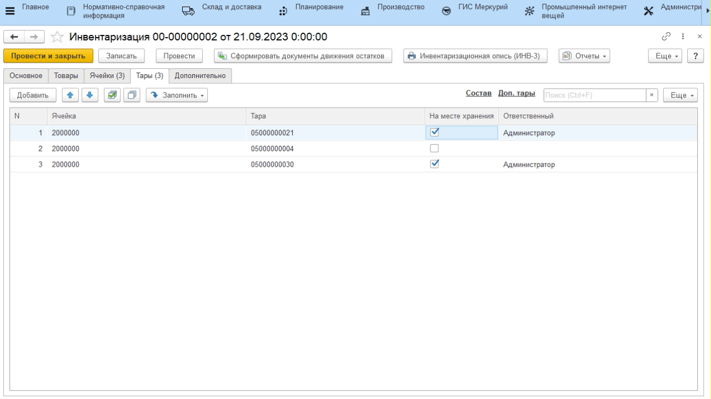

- **"Перемещения тар"** - в случае, когда по учету тара находится на складе, а по факту нет. Создается документ **"Распоряжение на перемещение"**, тары, для которых не стоит галочка "на месте хранения", отправляются на склад пересчета. 

    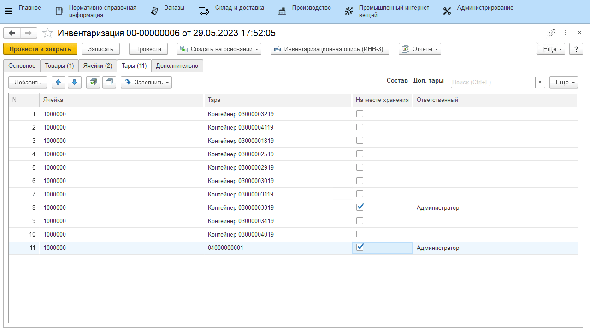
