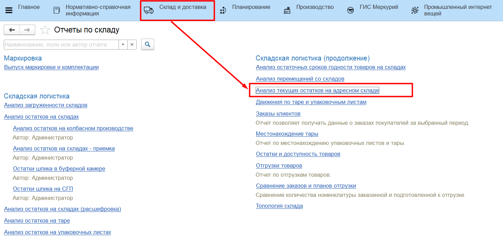
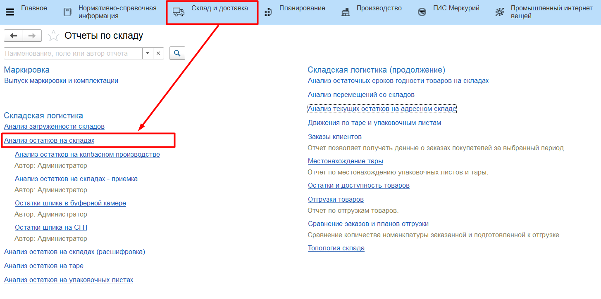
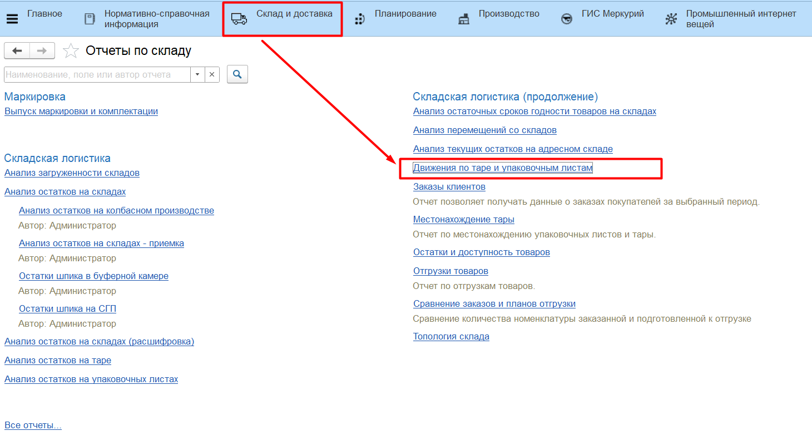
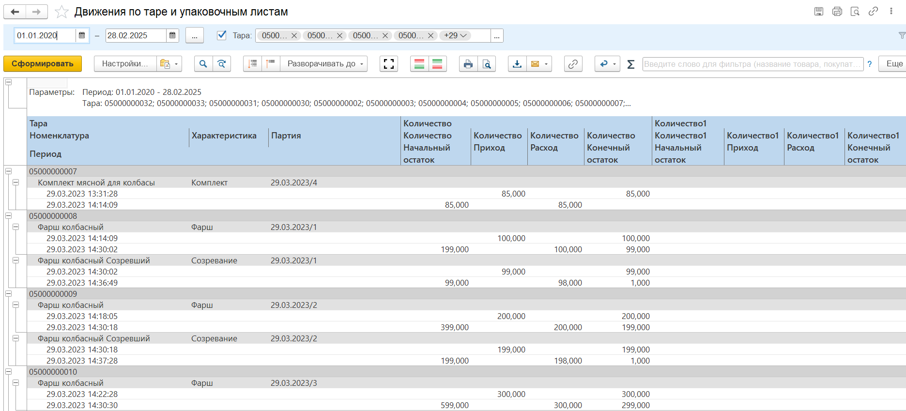

# Отчеты

Для анализа ситуации на складе предусмотрен отчет **"Анализ текущих остатков на адресном склад"**. Он расположен в разделе **"Склад и доставка"** в подсистеме **"Аналитика"** - **"Отчеты"**.

Данный отчет показывает текущие остатки товаров на складе в разрезе Номенклатуры, Характеристики и Партии.

Для анализа движения товаров на складе предусмотрен отчет **"Анализ остатков на складах"**. Он расположен в разделе **"Склад и доставка"** в подсистеме **"Аналитика"** - **"Отчеты"**.

Данный отчет показывает движение товаров на складе в разрезе Склада, Ячейки, Номенклатуры, Характеристики и Партии.

Для анализа движения товаров на складе в разрезе тар и паллет предусмотрен отчет **"Движения на таре и упаковочных листах"**. Он расположен в разделе **"Склад и доставка"** в подсистеме **"Аналитика"** - **"Отчеты"**:

Отчет показывает изменения в составе тары/паллеты: начальный остаток на момент движения, приход, расход, конечный остаток.

Расшифровка отчета показывает, какими именно документами было сделано движение состава:

