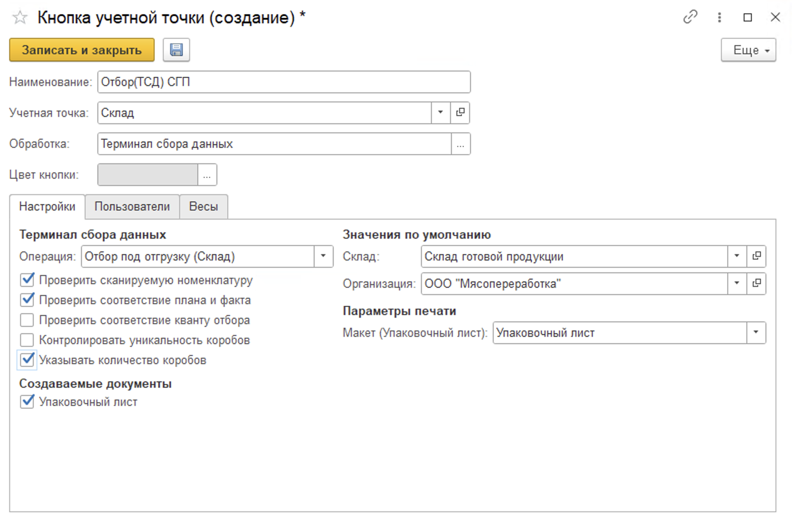
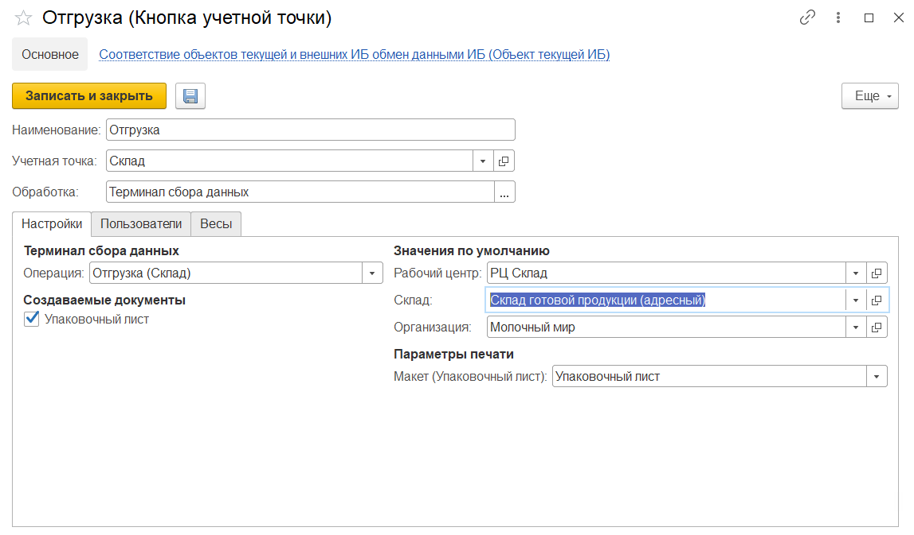

# Создание и настройка кнопок "Отбор под отгрузку" и "Отгрузка"

## Отбор под отгрузку

Кнопка **"Отбор под отгрузку"** используется только на складах с адресной системой хранения. Используется при перемещении продукции в ячейку отгрузки под план отгрузки.

При создании кнопки учетной точки **"Отбор под отгрузку"** указываются:

- Наименование
- Учетная точка
- Обработка -Терминал сбора данных

На вкладке **"Настройки"** заполняются:

- Операция - Отбор (Склад)
- Рабочий центр
- Склад
- Возможность создания упаковочного листа, в случае создания заполняются поля организация и макет для печати

Так же настраиваются проверки:

- Проверка сканируемой номенклатуру (проверка соответствия заявленной и сканируемой номенклатуры)
- Проверка соответствия плана и факта

## Отгрузка

Кнопка **"Отгрузка"** используется для отгрузки со склада готовой продукции.

При создании кнопки учетной точки "Отгрузка" указываются:

- Наименование
- Учетная точка
- Обработка -Терминал сбора данных

На вкладке **"Настройки"** заполняются:

- Операция - Отгрузка (Склад)
- Рабочий центр
- Склад
- Возможность создания упаковочного листа, в случае создания заполняются поля организация и макет для печати

На вкладке **"Пользователи"** можно настраивать индивидуальные права доступа.