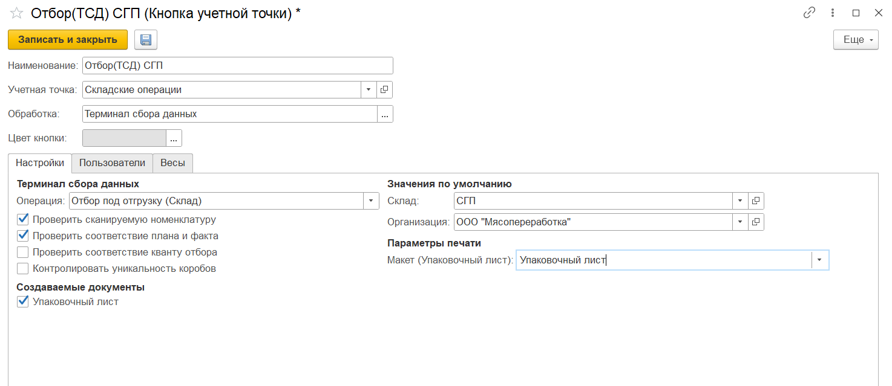

# Создание и настройка кнопок "Отбор под отгрузку" и "Отгрузка"

## Отбор под отгрузку

Кнопка **"Отбор под отгрузку"** используется только на складах с адресной системой хранения. Используется при перемещении продукции в ячейку отгрузки под план отгрузки.

При создании кнопки учетной точки **"Отбор под отгрузку"** указываются:

- Наименование;
- Учетная точка;
- Обработка - Терминал сбора данных;

На вкладке **"Настройки"** заполняются:

- Операция - Отбор под отгрузку (Склад);
- Рабочий центр;
- Склад;
- Возможность создания упаковочного листа, в случае создания заполняются поля организация и макет для печати. В зависимости от этого параметра будет формироваться разный набор документов при отборе;
- Организация и макет для печати.

Так же настраиваются проверки:

- Проверка сканируемой номенклатуру (проверка соответствия плановой и сканируемой номенклатуры);
- Проверка соответствия плана и факта (по количеству);
- Контроль уникальности коробов - дополнительная проверка на отсутствие или наличие идентификатора уникальности короба (21) для штрихкодов типа GS1-128; 

## Отгрузка

Кнопка **"Отгрузка"** используется для отгрузки со склада готовой продукции.

При создании кнопки учетной точки "Отгрузка" указываются:

- Наименование;
- Учетная точка;
- Обработка - Терминал сбора данных;

На вкладке **"Настройки"** заполняются:

- Операция - Отгрузка (Склад);
- Склад;
- Возможность создания упаковочного листа, в случае создания заполняются поля организация и макет для печати (может использоваться на складах без адресной системы хранения, когда есть необходимость собирать паллет сразу при отгрузке; для адресного склада такой необходимости нет).

На вкладке **"Пользователи"** можно настраивать индивидуальные права доступа.