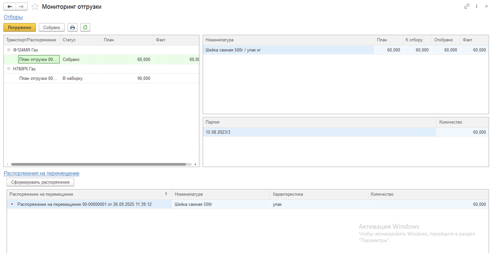
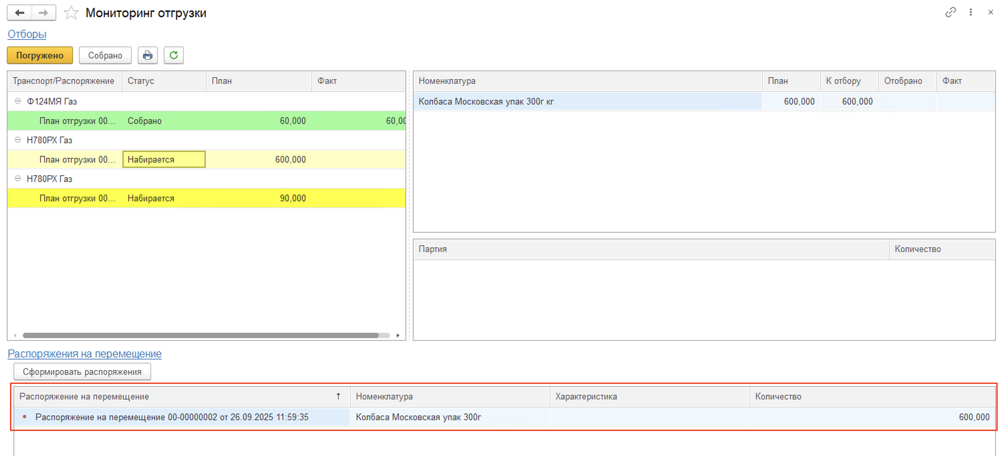

# Отгрузка готовой продукции

Отгрузка продукции на адресном склад осуществляется в четыре этапа:

1. Создание документов **"Заказ клиента"**, **"План отгрузки"**, **"Задание на доставку"**;
2. Создание документа **"Распоряжение на перемещение"** с типом "Отбор";
3. Отбор под отгрузку на ТСД;
4. Отгрузка готовой продукции на ТСД;

## Создание документов "Заказ клиента", "План отгрузки", "Задание на доставку"

### Заказ клиента

Цепочка отгрузки готовой продукции начинается с формирования документа **"Заказ клиента"**, который оформляет менеджер по доставкам.

На вкладке "Основное" заполняется информация о покупателе.

На вкладке "Товары" указывается:

- Номенклатура, характеристика, партия;
- Упаковка, количество упаковок;
- Единица хранения, количество в единицах хранения;
- Цена за единицу и стоимость;
- Склад отгрузки;

### План отгрузки

На основании документа **"Заказ клиента"** создается документ **"План отгрузки"**.

На вкладке "Основное" указывается:

- Статус - для начала работы с отгрузкой указывается статус "В наборку";
- Дата отгрузки;
- Склад отгрузки;
- Требуется доставка - определяет необходимость создания документа **"Задание на доставку"**. Если "истина", то доставка будет осуществляться силами собственной организации. 

Вкладка "Товары" автоматически заполняется позициями из заказа клиента. Партии при этом можно указать как сразу в документе "План отгрузки", так и оставить выбор партий комплектовщикам с терминалами сбора данных.

### Задание на доставку

На основании документа **"План отгрузки"** создается документ **"Задание на доставку"**.

На вкладке "Основное" обязательно указывается склад отгрузки и транспортное средство, статус - "К погрузке".

## Создание документа "Распоряжение на перемещение" с типом "Отбор"

Для отслеживания и изменения статусов отгрузок товара со склада используется обработка **"Мониторинг отгрузки"**, которая расположена в разделе **"Склад и доставка"** в подсистеме **"Складская логистика"**.

После открытия обработки заполняются или изменяются следующие поля в верхней части рабочей области в разделе **"Отборы"**:

- Период;
- Склад отгрузки;

На форме слева выводятся созданные ранее в системе менеджером по доставке документы **"Задание на доставку"**.

Для того, чтобы перевести **"План отгрузки"** в статус **"Набирается"** необходимо распечатать **"План отгрузки"** и передать его на склад. В системе документ переходит в статус **"Набирается"** после нажатия кнопки **"Печать"**.

На форме обработки также предусмотрена возможность создания **"Распоряжения на перемещение"** по типу "Отбор", чтобы можно было переместить товар в ячейку отгрузки. Для перехода к форме обработки **"Формирование распоряжений на перемещение по Отбору"** в обработке **"Мониторинг отгрузки"** достаточно нажать на кнопку **"Сформировать распоряжения"**.

После открытия формы **"Формирование распоряжений на перемещение по Отбору"** необходимо заполнить поля **"Склад"** и решить - нужно ли разделять распоряжения на перемещение по ячейкам (то есть если товар размещен в разных ячейках, то для каждой такой ячейки сформируется свое распоряжение на перемещение), а затем нажать на кнопку **"Заполнить"**. 

После нажатия на кнопку в таблице нижней части формы появится список перемещаемой номенклатуры и информация о том между какими ячейками происходит перемещение.

Далее надо нажать на кнопку **"Создать документы"**, сформируется распоряжение на перемещение с типом **отбор** у которого будет заполнена вкладка **"План"** и будет установлен статус **"К выполнению"**.

Вернувшись на форму обработки **"Мониторинг отгрузки"**, в нижней части можно увидеть какие распоряжения на перемещение были созданы.

## Отбор под отгрузку на ТСД

Для проведения отбора нужно:

- Зайти в **"Меню учетных точек"**, указать смену и дату смены;
- Зайти в кнопку **"Отгрузка"**.

В открывшейся форме по нажатию кнопки **"Обновить"** будут выведены документы **"План отгрузки"**. В списке при помощи кнопок **"Вверх"** и **"Вниз"** нужно перейти к плану отгрузки, по которому будет проводиться отбор под отгрузку, и нажать кнопку **"Выбрать"**. Документ "План отгрузки" также можно "выбрать" сканированием штрихкода, размещенного на печатном документе плана отгрузки. 

Последующий сценарий работы зависит от того, по какой схеме проводится наборка на складе:

1. Активный отбор - отбор по коробам с составлением новых паллет. Подходит для случая, когда осуществляется наборка сборной паллеты под заказ клиента. Карщик берет пустую паллету, на которую из каждой ячейки помещает короба, взятые с лежащих в ячейке паллет;
2. Паллетный отбор - отбор целыми паллетами. Не требует создания новой паллеты, отбор ведется по уже готовым паллетам.

### Активный отбор

Для проведения активного отбора необходимо, чтобы в [настройках кнопки учетной точки](../Otgruzka/NastroikaKnopkiOtgruzka.md) было **включено** создание новых упаковочных листов.

После выбора плана отгрузки открывается форма плана отбора. В табличной части указаны позиции и ячейки, в которых они находятся, а также плановые количества. План отбора собирается по документам "Распоряжение на перемещение", созданным под план отгрузки.

Далее необходимо:

- Нажать **"Создать паллет"**. Таким образом в системе создается новый упаковочный лист, на который будут помещаться короба;
- Сканировать ячейку из которой будет перемещен товар.

 

- Cканировать штрихкод паллеты, с которой будут снимать короба перемещаемой продукции;
- Сканировать штрихкоды коробов, которые помещаются на новую паллету.

По нажатию кнопки **"План/факт"** на форме появится таблица отгружаемой номенклатуры по плану и по факту.

Для завершения работы с ячейкой нажать кнопку **"Завершить"**.

В документе **"Распоряжение на перемещение"** будет заполнена вкладка **"Факт"**, однако документ не будет переведен в статус "Выполнено" и можно продолжить работать с ним. Для продолжения работы нужно отсканировать следующую ячейку из плана отбора (если есть). При этом не обязательно заканчивать наборку паллета - пока не нажата кнопка **"Завершить паллет"**, будет вестись наборка уже начатого. Чтобы завершить паллет и начать новый, нужно нажать **"Завершить паллет"** и **"Создать паллет**".

Когда закончен отбор по всем ячейкам и паллеты набраны, на форме плана отбора нужно нажать **"Завершить"**.

В документе **"Распоряжение на перемещение"** будет заполнена вкладка **"Факт"** и документ будет переведен в статус "Выполнено".

!!! info "Примечание"

    Текущая схема учета остатков на упаковочных листах предусматривает создание новых упаковочных листов при отборе под отгрузку, но не подразумевает актуализацию остатков на упаковочных листах, с которых отобрали короба. Для ведения актуальных остатков на упаковочных листах рекомендуется перейти к использованию [детального учета по упаковочным листам](../../LocationOfContainers/LocationPackageLists.md).

### Паллетный отбор

Для проведения паллетного отбора необходимо, чтобы в [настройках кнопки учетной точки](../Otgruzka/NastroikaKnopkiOtgruzka.md) было отключено создание новых упаковочных листов.

Далее необходимо:

- Сканировать ячейку из которой будет перемещен товар;
- Cканировать штрихкоды паллет, которые отбирают под отгрузку;

 

По нажатию кнопки **"План/факт"** на форме появится таблица отгружаемой номенклатуры по плану и по факту. Для завершения работы с ячейкой нажать кнопку **"Завершить"**.

 

В документе **"Распоряжение на перемещение"** будет заполнена вкладка **"Факт"**, однако документ не будет переведен в статус "Выполнено" и можно продолжить работать с ним. Для продолжения работы нужно отсканировать следующую ячейку из плана отбора (если есть). Когда закончен отбор по всем ячейкам, на форме плана отбора нужно нажать **"Завершить"**.

В документе **"Распоряжение на перемещение"** будет заполнена вкладка **"Факт"** и документ будет переведен в статус "Выполнено".

После фактической сборки продукции на складе необходимо перевести документ **"План отгрузки"** в статус **"Собрано"**

## Отгрузка готовой продукции на ТСД

Для проведения отгрузки нужно:

- Зайти в **"Меню учетных точек"**, указать смену и дату смены;
- Зайти в кнопку **"Отгрузка"**.

В открывшейся форме по нажатию кнопки **"Обновить"** будут выведены документы **"План отгрузки"**. В списке при помощи кнопок **"Вверх"** и **"Вниз"** нужно перейти к плану отгрузки, по которому будет проводиться отгрузка, и нажать кнопку **"Выбрать"**. Документ "План отгрузки" также можно "выбрать" сканированием штрихкода, размещенного на печатном документе плана отгрузки. 

В открывшейся форме нужно отсканировать штрихкоды собранных под план отгрузки паллет. Номенклатура появится на форме. 

По кнопке **"План/факт"** на форме отображается таблица отгружаемой номенклатуры по плану и по факту.

Если отсканирован паллет, который не числится в списке собранных под план отгрузки (не указан в табличной части документа "Распоряжение на перемещение", связанного с планом отгрузки), то пользователь получит ошибку.

Для завершения работы по отгрузке нужно нажать кнопку **"Завершить"**.

В результате будет заполнен документ **"Распоряжение на отгрузку"**.

После завершения отгрузки документ **"План отгрузки"** нужно перевести в статус **"Погружено"**. 

