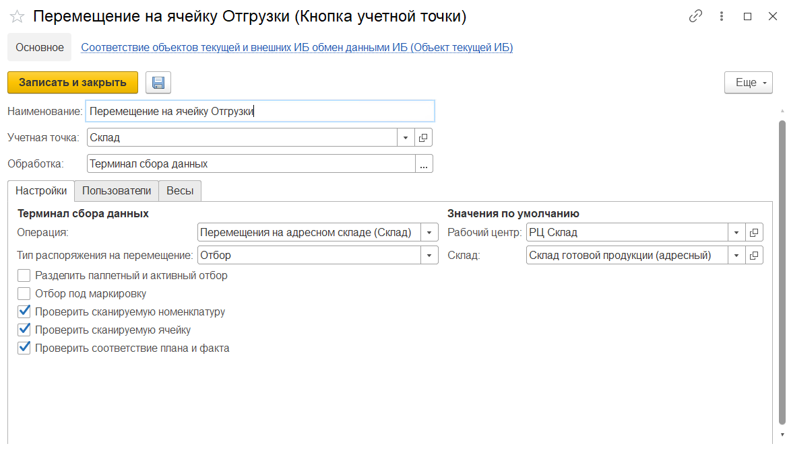
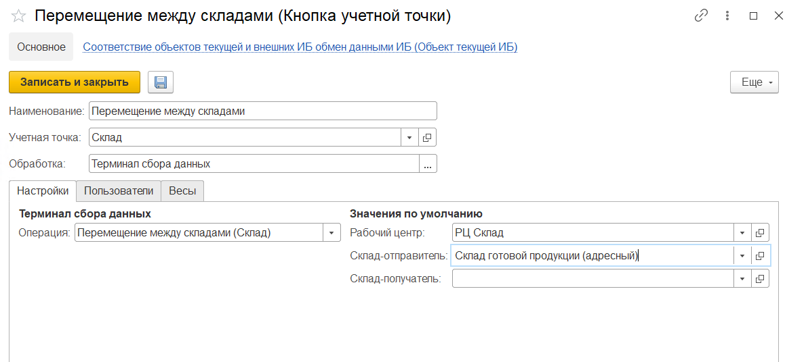

# Создание и настройка кнопки "Перемещение на ячейку Отгрузки" и "Перемещение м/д складами"

<h2> Создание и настройка кнопки "Перемещение на ячейку Отгрузки" </h2>

Кнопка **"Перемещение на ячейку Отгрузки"** используется только на складах с адресной системой хранения. Применяется для перемещения продукции в ячейку отгрузки.

При создании кнопки учетной точки **"Перемещение на ячейку Отгрузки"** указываются:

- Наименование
- Учетная точка
- Обработка -Терминал сбора данных

На вкладке **"Настройки"** заполняются:

- Операция - Перемещения на адресном складе (Склад)
- Тип распоряжения на перемещение - Отбор
- Рабочий центр
- Склад

Так же настраиваются проверки:

- Проверка сканируемой номенклатуру (проверка соответствия заявленной и сканируемой номенклатуры)
- Проверка сканируемой ячейки (проверка ячейки из которой перемещаем на соответствие ячейки из Задания на перемещение)
- Проверка соответствия плана и факта

На вкладке **"Пользователи"** можно настроить индивидуальные права доступа.

<h2> Создание и настройка кнопки "Перемещение м/д складами" </h2>

Кнопка **"Перемещение между складами"** используется для перемещения готовой продукции со склада на другой склад.

При создании кнопки учетной точки **"Перемещение м/д складами"** указываются:

- Наименование
- Учетная точка
- Терминал сбора данных

На вкладке **"Настройки"** заполняются:

- Операция - Перемещение между складами (Склад)
- Рабочий центр
- Склад-отправитель
- Склад-получатель - если указан, перемещение будет осуществляться только на этот склад, для перемещения на другой склад необходимо будет создать отдельную кнопку

На вкладке **"Пользователи"** можно настраивать индивидуальные права доступа.

