# Перемещение по заказу на перемещение (ТСД)

Для отражения передачи со склада сырья на склад производства необходимо:

- Открыть **"Меню учетных точек"**, выбрать дату смены, смену и рабочий центр;
- Нажать кнопку **"Перемещение по заказам на перемещение (ТСД)"**.

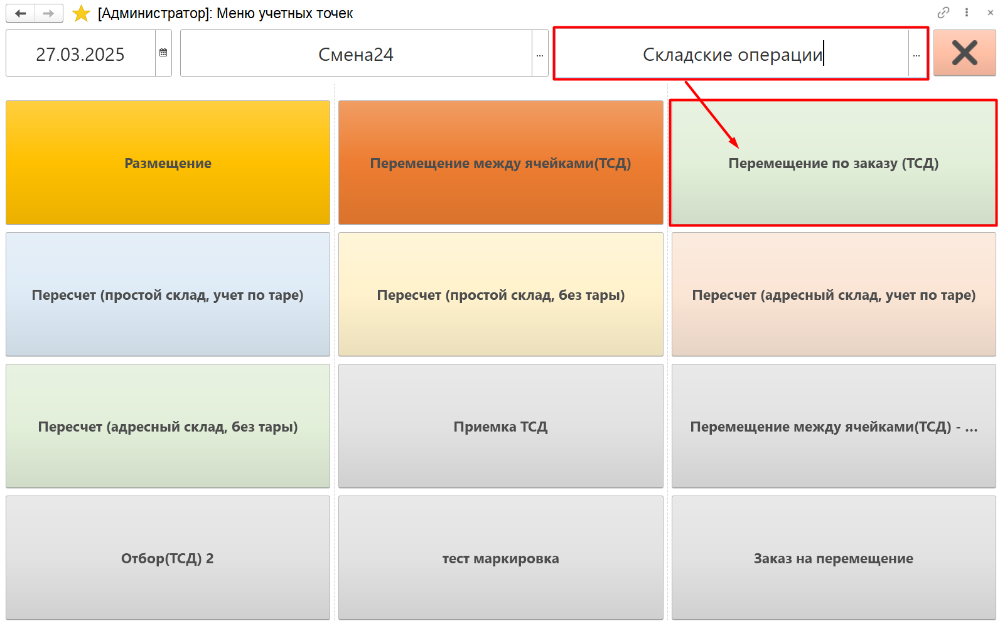

В открывшейся форме склад-отправитель и склад-получатель заполнены складами по умолчанию из [настроек кнопки учетной точки](SettingAccountingPointOrderTSD.md). Выбор можно изменить. 

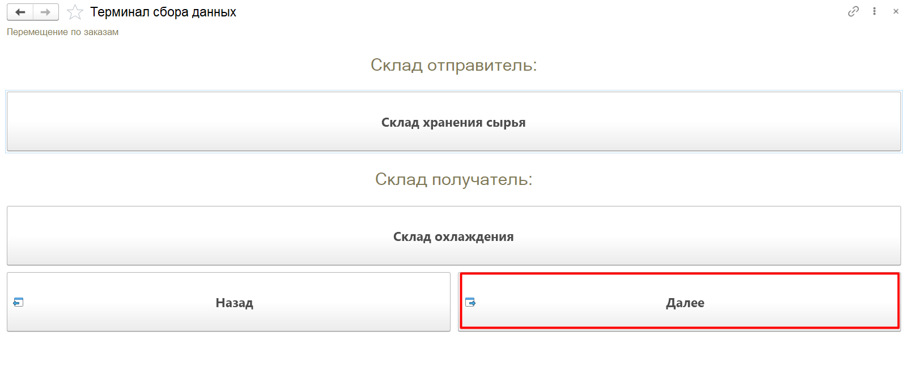

Для перехода к следующей форме нажать **"Далее"**. В табличной части будет выведен список номенклатур, которые необходимо переместить к указанной дате смены, а также плановое количество к перемещению. Если часть сырья уже была перемещена, то будут так же указаны "факт" и "остаток". 

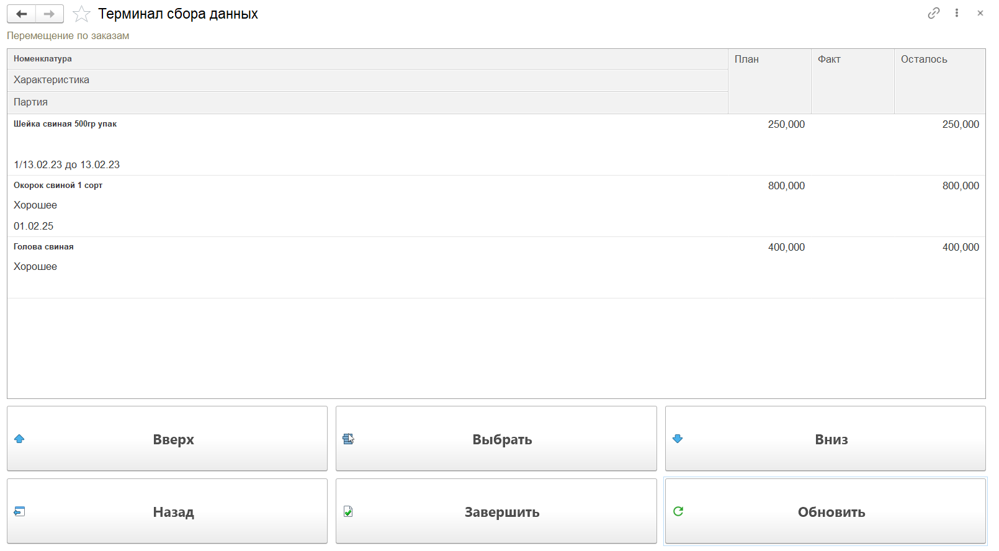

Номенклатуру можно выбрать вручную по кнопке **"Выбрать"** или сканированием упаковочного листа. При сканировании упаковочного листа выбирается подходящая по номенклатуре/партии строка задания. Если в **"Заказе на перемещение"** не указана партия номенклатуры, то по такой строке задания может быть перемещена любая партия.

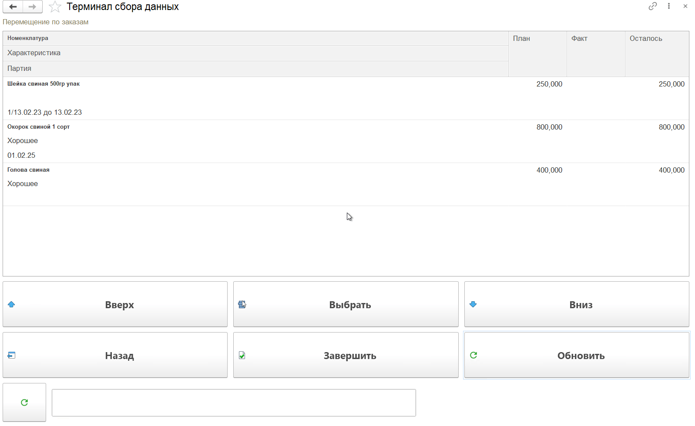

На форме сканирования видно план-факт по выбранной номенклатуре, вес текущего сканирования. 

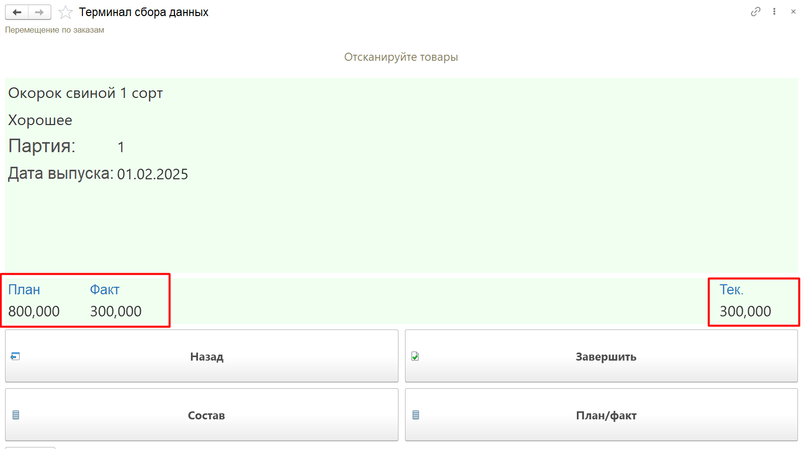

По кнопке **"Состав"** можно посмотреть информацию о текущем сканировании и при ошибочном сканировании удалить строку:

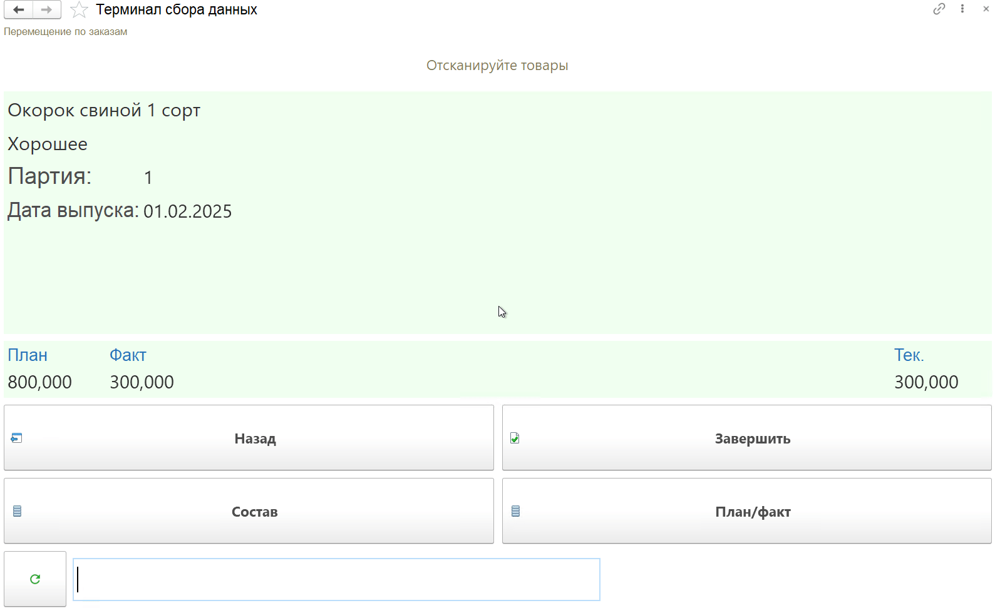

Продолжить сканирование выбранной номенклатуры можно сразу на форме сканирования:

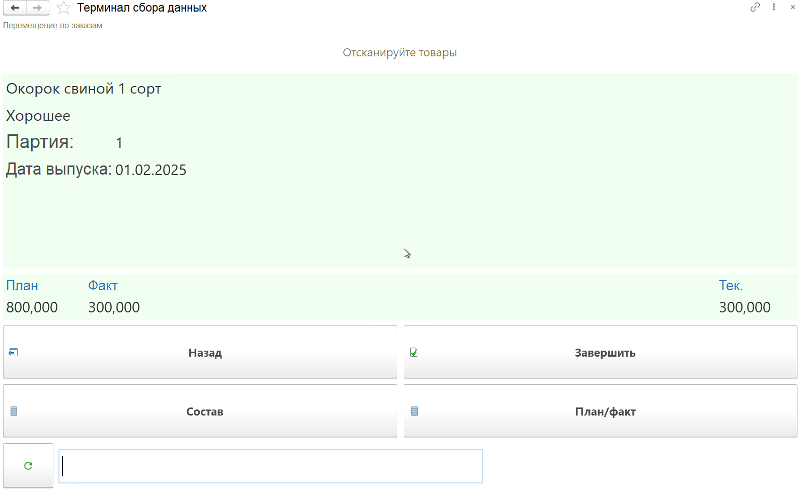

Посмотреть план-факт по выбранной строке заказа можно по кнопке **"План/факт"**:

Когда все паллеты просканированы и готовы к перемещению, необходимо нажать кнопку **"Завершить"**. Будет сформирован документ **"Распоряжение на перемещение"** в статусе "Выполнено", а строка заказа отмечена завершенной:

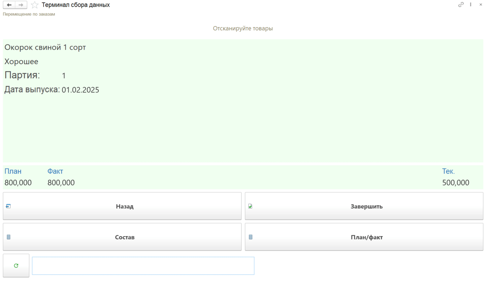
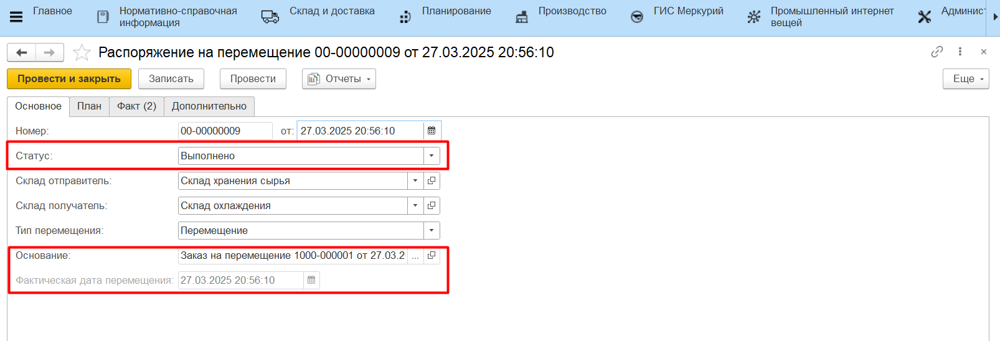
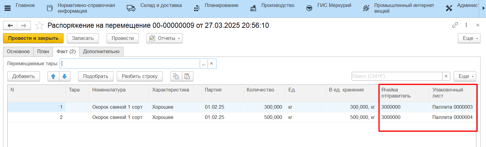

Чтобы отметить выполненными строки заказа, факт в которых не покрывает план, на основной форме нужно выбрать строку заказа и нажать кнопку **"Завершить"**:

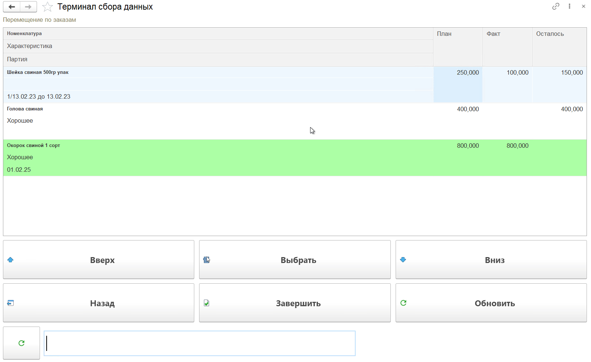

