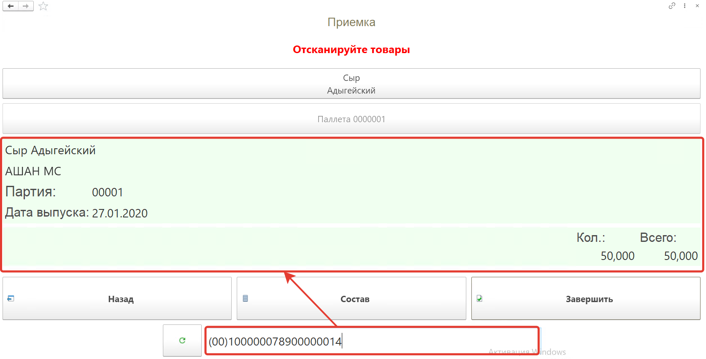
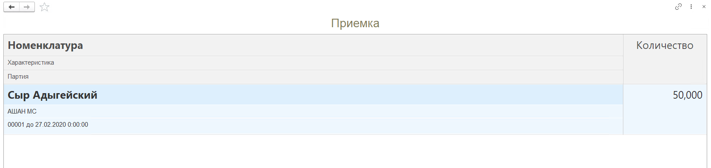
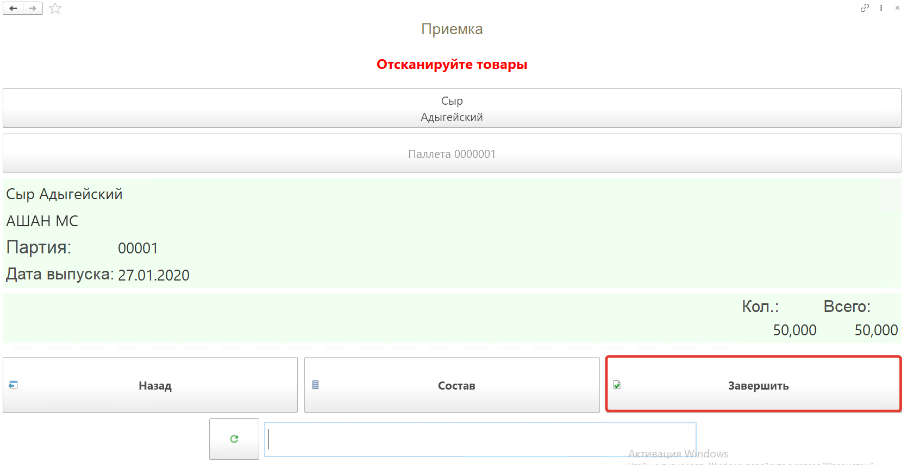
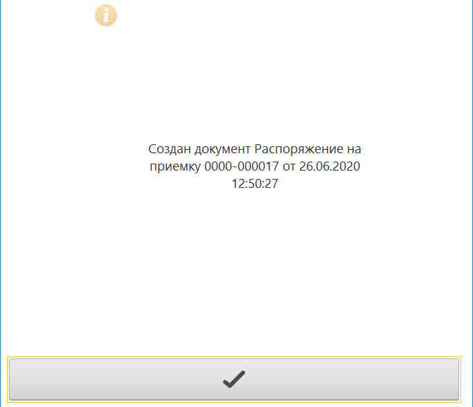
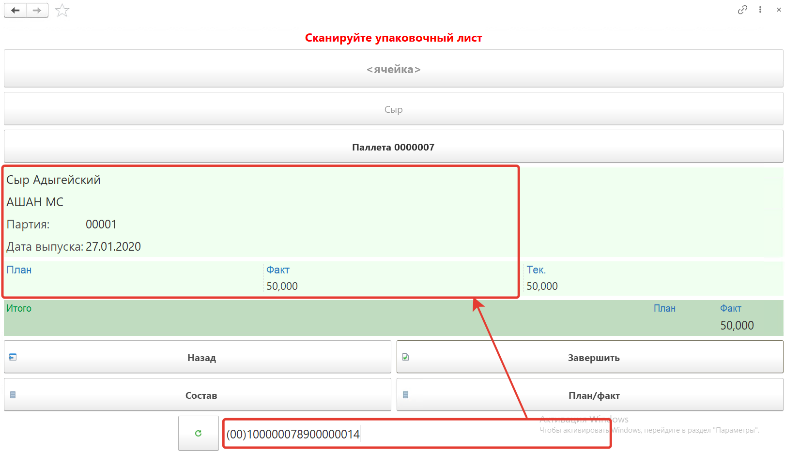
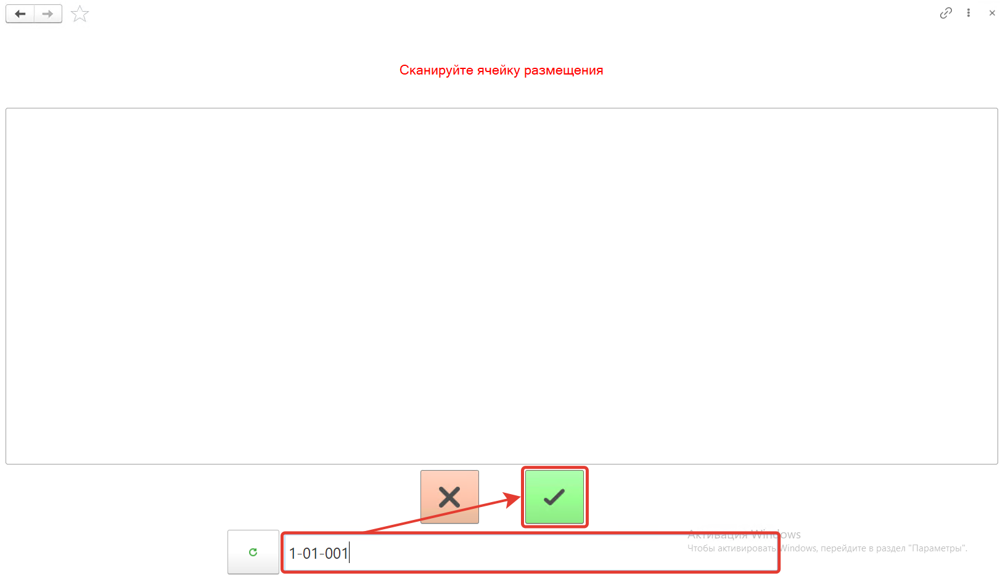
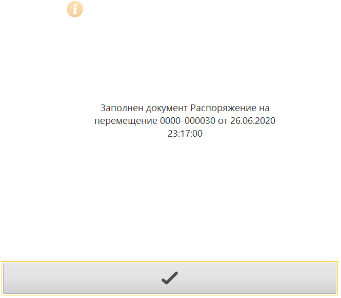
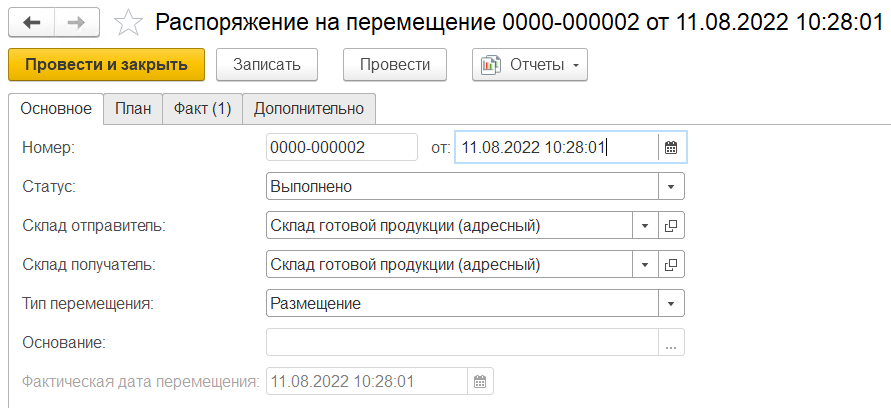
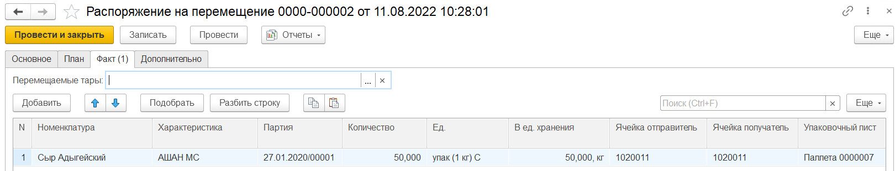

# Приемка готовой продукции на ТСД

Приемка продукции на адресный склад осуществляется в два этапа:

1. Приемка производится в ячейку приемки
2. После перемещается с ячейки приемки в основную зону хранения на складе

<h2> Приемка в ячейку приемки </h2>

Кнопка **"Приемка"** используется для приема на склад готовой продукции.

После открытия формы обработки **"Меню учетных точек"** заполняем поля:

- Дата
- Смена
- Учетная точка
- Сканируем штрихкод сотрудника, если были установлены Индивидуальные права доступа

На форме обработки появятся кнопки выбранной учетной точки, выбираем кнопку **"Приемка"**.

Далее сканируем штрихкод короба поступившей на склад продукции, номенклатура появится на форме.

Посмотреть состав отсканированной номенклатуры можно по кнопке **"Состав"**.

На форме появится список номенклатуры, можно удалить строку с помощью кнопки **"Удалить строку"**.

Для завершения работы по приемке нажимаем кнопку **"Завершить"**.

В результате будет создан документ **"Распоряжение на приемку"**. 

В документе **"Распоряжение на приемку"** в табличной части **"Товары"** мы видим, что приемка на склад автоматически совершается в **ячейку приемки**, заданную в карточке склада.

<h2> Размещение на складе </h2>

Кнопка **"Размещение"** используется только на складах с адресной системой хранения. Применяется для перемещения продукции из ячейки приемки.

После открытия формы обработки **"Меню учетных точек"** заполняем поля:

- Дата
- Смена
- Учетная точка

На форме обработки появятся кнопки выбранной учетной точки, выбираем кнопку **"Размещение"**.

На открывшейся форме после нажатия кнопки **"Обновить"**, будут выведены **"Распоряжения на перемещения"** с типом **"Размещение"** в статусе **"К выполнению"**. В списке при помощи кнопок **"Вверх"** и **"Вниз"** переходим к распоряжению по которому будем делать перемещение, нажимаем кнопку **"Выбрать"**. С помощью кнопки **"Создать"** можно создавать новые распоряжения на перемещение.

Нажимаем кнопку **"Создать"**

В открывшемся окне **сканируем штрихкод** перемещаемого короба, номенклатура появится на форме. Появится количество отгружаемого товара по плану и по факту. В случае создания нового распоряжения поле "План" будет пустое.

При нажатии кнопки **"План/факт"** на форме появится таблица перемещаемой номенклатуры.

Для завершения перемещения нажимаем кнопку **"Завершить"**.

Далее **сканируем ячейку размещения**.

В  **"Распоряжении на перемещение"** заполнится вкладка **"Факт"** и документ будет переведен в статус **"Выполнено"**.

Документ **"Распоряжение на перемещение"**:

