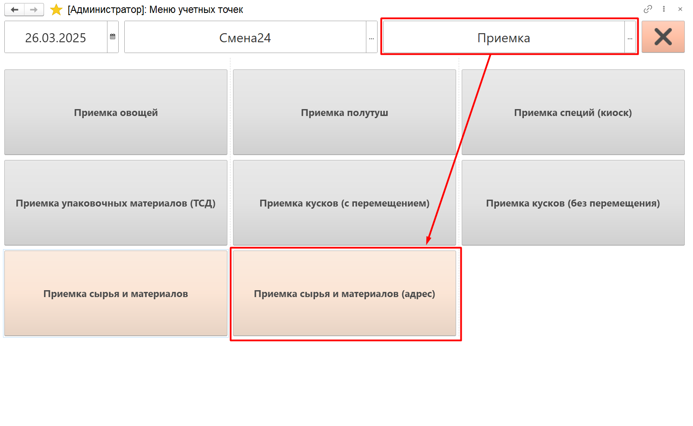
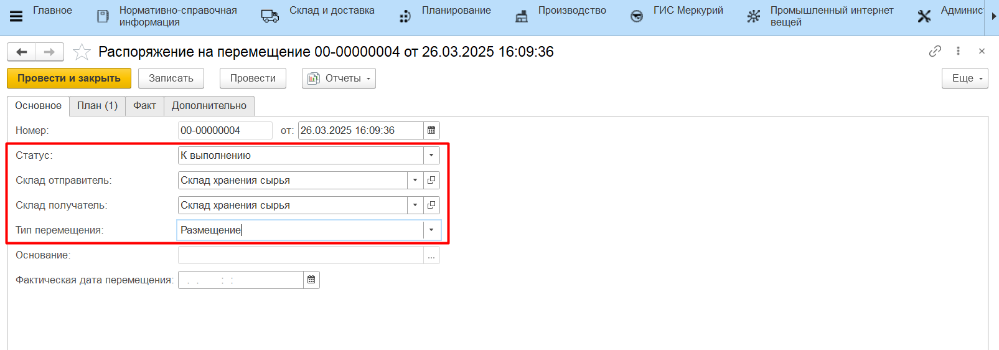
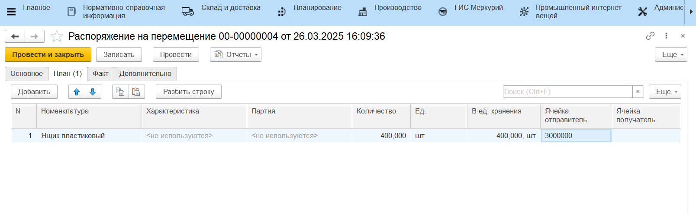

# Приемка сырья и материалов по накладным на ТСД

Приемка перечисленной продукции проводится оператором на ТСД по созданному документу [планового поступления](./CreatePlanOfAccept.md).

Для этого необходимо:

- Зайти в **"Меню учетных точек"**;
- Указать дату планового поступления, смену и рабочий участок, на котором проводится приемка;
- Зайти в кнопку **"Приемка сырья и материалов"**, настроенную для адресного склада;

Далее приемка на ТСД для адресного склада проводится аналогично [приемке на простом складе](../../SimpleWarehouse/PriemkaMaterials/PriemkaTSD.md). 

В [настройках учетной точки](SettingsKUT.md) было включено формирование размещения, поэтому дополнительно на каждую принятую позицию после приемки будет сформировано **"Распоряжение на перемещение"** с типом *"Размещение"*:

