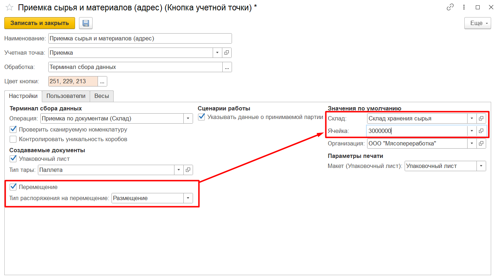
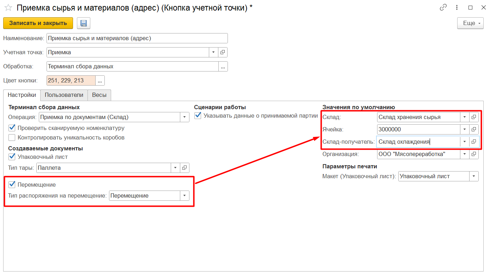
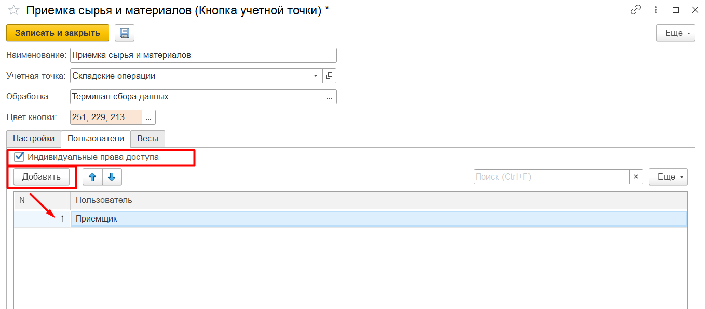

# Создание и настройка кнопки "Приемка сырья и материалов"

Кнопка **"Приемка сырья и материалов"** используется для приема на склад поступлений от поставщика.

При создании кнопки учетной точки указываются:

- Наименование;
- Учетная точка;
- Обработка - Терминал сбора данных.

На вкладке **"Настройки"** заполняются:

- Операция - Приемка по документам (Склад);
- Опция *"Проверять сканируемую номенклатуру"* - если включена, запрещает приемку номенклатуры, отличной от плановой;
- Опция *"Указывать данные о принимаемой партии"* - если включена, дает возможность при приемке вносить заявленные данные о партии поставщика (заявленное количество, дата выпуска, номер партии, срок годности);
- Возможность создания упаковочного листа - если  включена, заполняются поля "Организация" и "Макет для печати", по итогу приемки формируются новые упаковочные листы на каждую паллету.
- Возможность создания документа **"Распоряжение на перемещение"**:
    - Размещение - если выбрана, по итогу приемки для каждой принятой паллеты будет сформирован документ **"Распоряжение на перемещение"** с типом *"Размещение"*:
        - Склад приемки - адресный склад, на который ведется приемка;
        - Ячейка приемки - ограничивает список документов к приемке (по соответствию склада/ячейки в кнопке и в документе **"Поступления товаров и услуг"**);

        

    - Перемещение - если выбрана, по итогу приемки для каждой принятой паллеты будет сформирован документ **"Распоряжение на перемещение"** с типом *"Перемещение"*:
        - Склад приемки - адресный склад, на который ведется приемка;
        - Ячейка приемки - ограничивает список документов к приемке (по соответствию склада/ячейки в кнопке и в документе **"Поступления товаров и услуг"**), также будет являться ячейкой-отправителем для последующего перемещения;
        - Склад-получатель - может быть как адресным, так и простым;
        - Ячейка-получатель - ячейка, куда оформляется план перемещения, если склад-получатель адресный. Может быть не заполнена.

        

На вкладке **"Пользователи"** можно настроить индивидуальные права доступа на данную команду.

