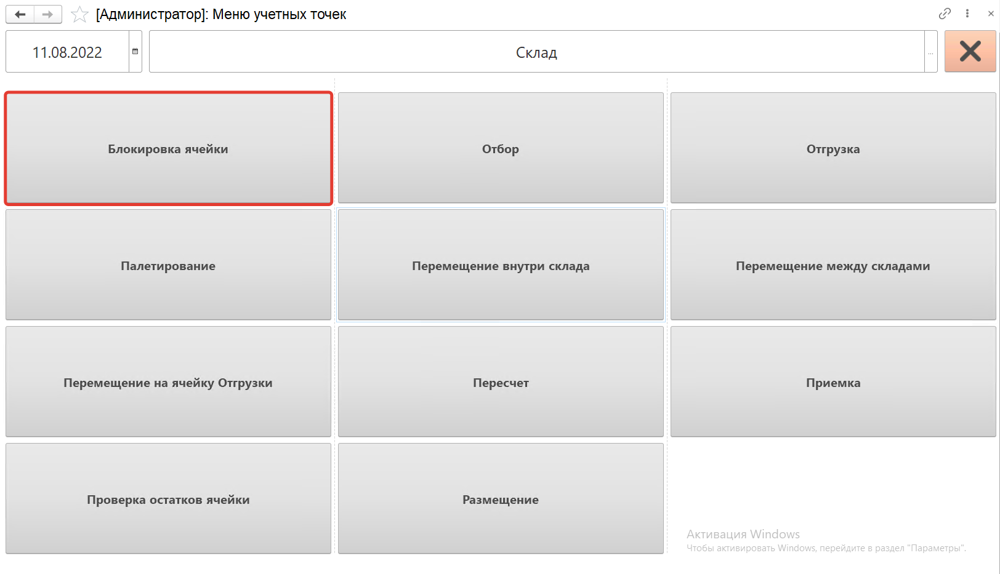
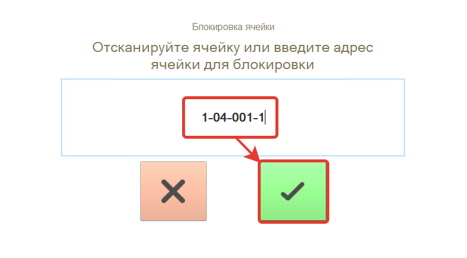
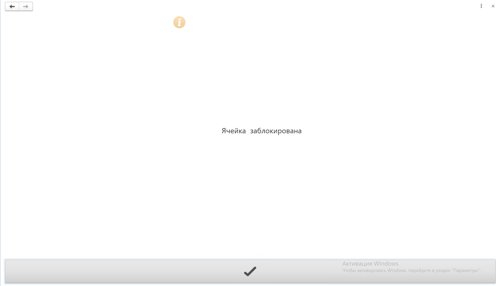

# Блокировка ячейки

Кнопка **"Блокировка ячейки"** используется только на складах с адресной системой хранения. Применяется для блокировки ячейки.

После открытия формы обработки **"Меню учетных точек"** заполняем поля:

- Дата
- Смена
- Учетная точка
 
На форме обработки появятся кнопки выбранной учетной точки, выбираем кнопку **"Блокировка ячейки"**.
 

 
Сканируем ячейку для блокировки, нажимаем на кнопку .
 

 
В результате ячейка будет заблокирована, нажимаем на кнопку .
 
