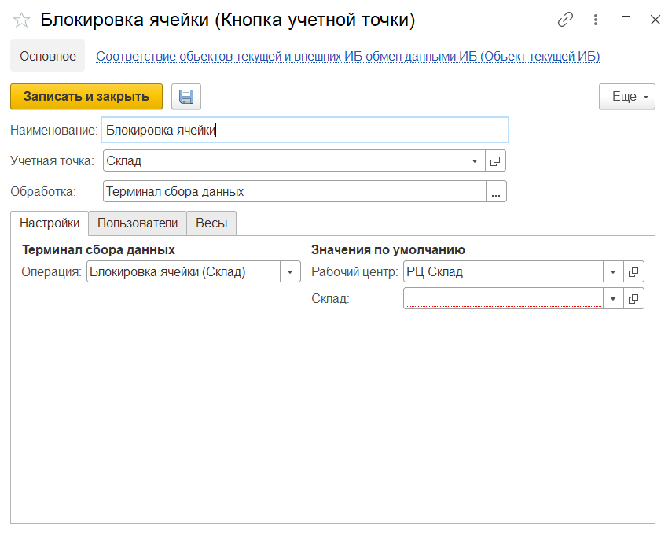

# Создание и настройка кнопки "Блокировка ячейки"

Кнопка **"Блокировка ячейки"** используется только на складах с адресной системой хранения. Применяется для блокировки ячейки.
 
При создании кнопки учетной точки **"Блокировка ячейки"** указываются:

- Наименование
- Учетная точка
- Обработка -Терминал сбора данных
 
На вкладке **"Настройки"** заполняются:

- Операция - Блокировка ячейки (Склад)
- Рабочий центр
- Склад
 

 
На вкладке **"Пользователи"** можно настраивать индивидуальные права доступа.