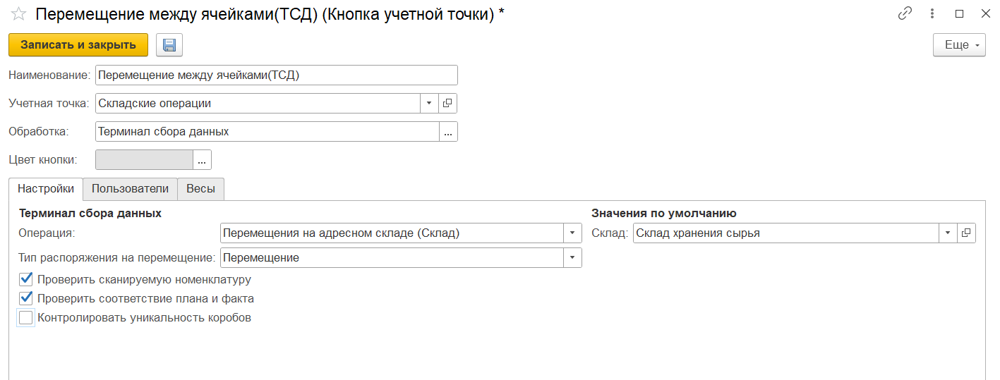
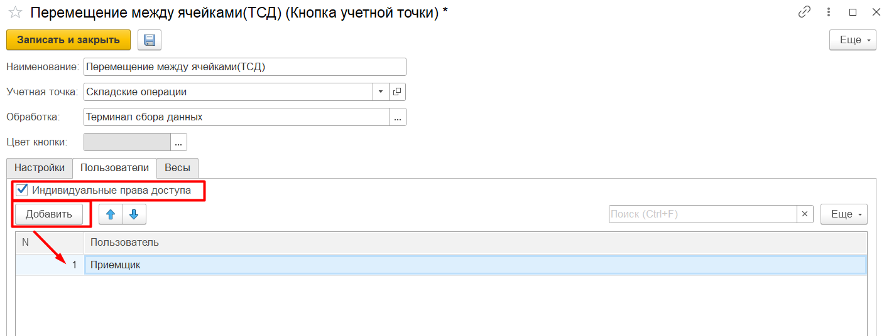

# Создание и настройка кнопки "Перемещение внутри склада"

Кнопки **"Размещение"** и **"Перемещение между ячейками"** используются только на складах с адресной системой хранения. 

При создании кнопки учетной точки указываются:

- Наименование;
- Учетная точка;
- Обработка - Терминал сбора данных;

На вкладке **"Настройки"** заполняются:

- Операция - Перемещения на адресном складе (Склад);
- Тип распоряжения на перемещение - Перемещение или Размещение - в зависимости от параметра будет происходить отбор документов **"Распоряжение на перемещение"** к выполнению;
- Рабочий центр;
- Склад;

Также настраиваются проверки:

- Проверка сканируемой номенклатуру (проверка соответствия заявленной и сканируемой номенклатуры);
- Проверка соответствия плана и факта (по количеству);
- Контроль уникальности коробов - если включен, ведется проверка сканируемых штрихкодов коробов на уникальность. 

На вкладке **"Пользователи"** можно настраивать индивидуальные права доступа.

 