# Перемещение между ячейками на ТСД

Кнопка **"Перемещение между ячейками"** используется только на складах с адресной системой хранения. Применяется для перемещения продукции между произвольными ячейками хранения.

После открытия формы обработки **"Меню учетных точек"** заполняем поля:

- Дата;
- Смена;
- Учетная точка;

На форме обработки появятся кнопки выбранной учетной точки, выбираем кнопку **"Перемещение между ячейками"**.

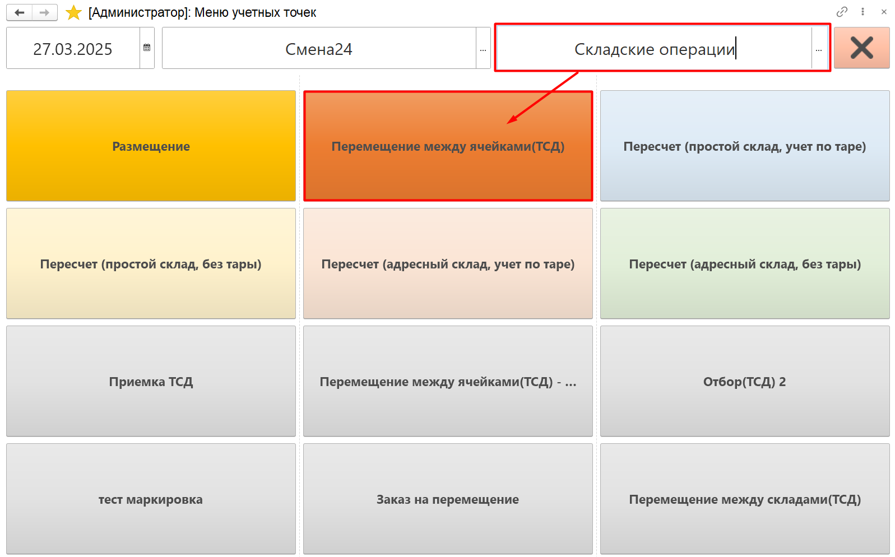

В открывшейся форме будут выведены позиции номенклатуры, которые нужно переместить. Список собирается по всем документам **"Распоряжения на перемещения"** с типом **"Перемещение"** в статусе **"К выполнению"** и складом-отправителем, соответствующим складу в [настройках кнопки учетной точки](NastroikaKnopokPerem.md). 

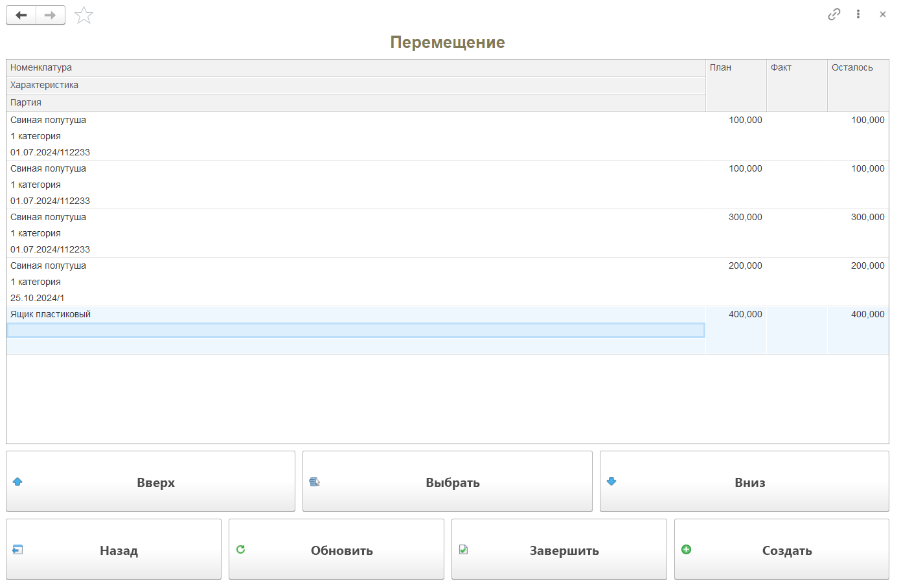

Далее для отражения перемещения нужно:

- Отсканировать перемещаемый упаковочный лист;
- Автоматически осуществится переход на форму сканирования для выбранной позиции;
- На форме указать ячейку-отправитель, из которой перемещается продукция;

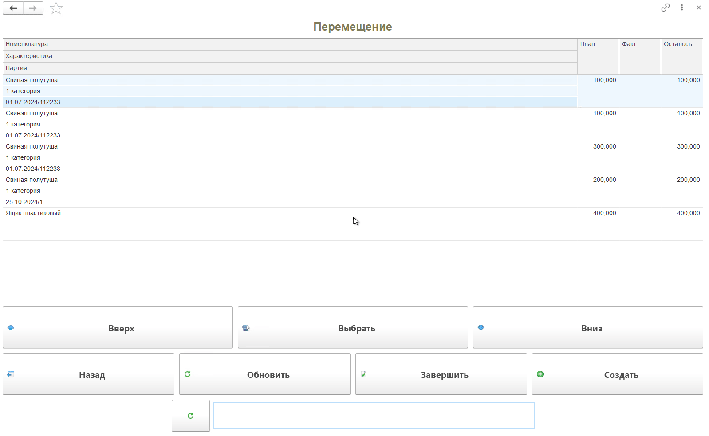

На форме сканирования видно план-факт по выбранной номенклатуре, вес текущего сканирования. 

По кнопке **"Состав"** можно посмотреть информацию о текущем сканировании и при ошибочном сканировании удалить строку:

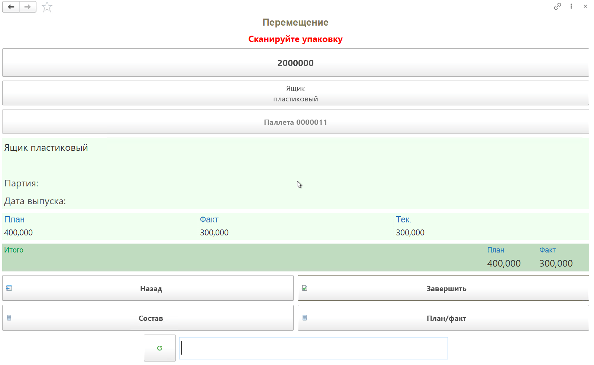

Когда отсканирован верный упаковочный лист:

- Нажать **"Завершить"**.
- В открывшейся форме указать ячейку-получатель продукции;
- Если настроены приоритеты размещения на складе, ячейка будет предложена согласно правилам. 

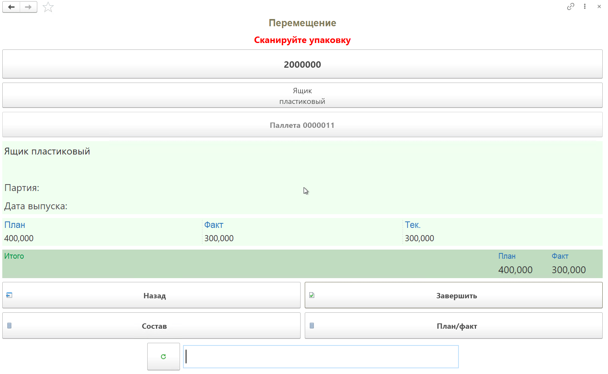

!!! info "Примечание"

    Система не предлагает ячейку, если правила не настроены, если ячейка заблокирована или не найдена подходящая по правилам ячейка.

!!! info "Важно"

    Если настроены правила размещения, важно отражать перемещение по одной паллете за раз, чтобы приоритеты размещения учитывали вес и габариты каждой паллеты в отдельности при размещении.
    
Автоматически после завершения перемещения будет осуществлен переход на основную форму. На форме видно отклонение по план-факту в таблице. Для того, чтобы завершить работу с распоряжением, нужно нажать кнопку **"Завершить"**. При этом система подскажет, сколько осталось выполнить по распоряжению.

Чтобы вернуться к выполнению перемещения, нажать **"Х"**. Тогда система установит отбор по строкам документа **"Распоряжения на перемещение"**, чтобы продолжить работу только с ним. Кнопка **"Обновить"** сбрасывает отбор.

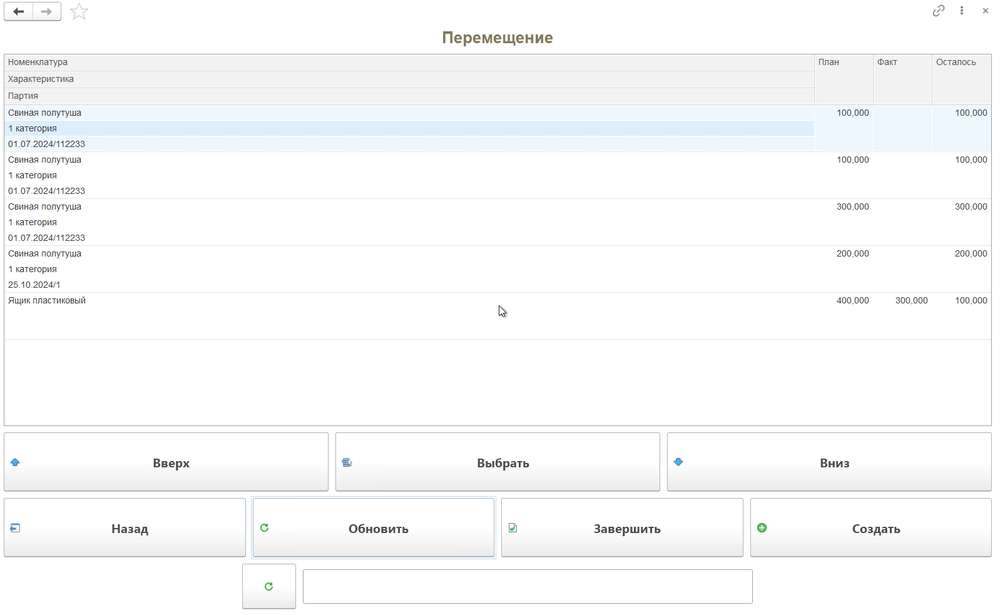

Чтобы закончить выполнение перемещения, нажать **"V"**. Тогда документ **"Распоряжение на перемещение"** будет заполнен, переведен в статус **"Выполнено"** и уйдет из списка.

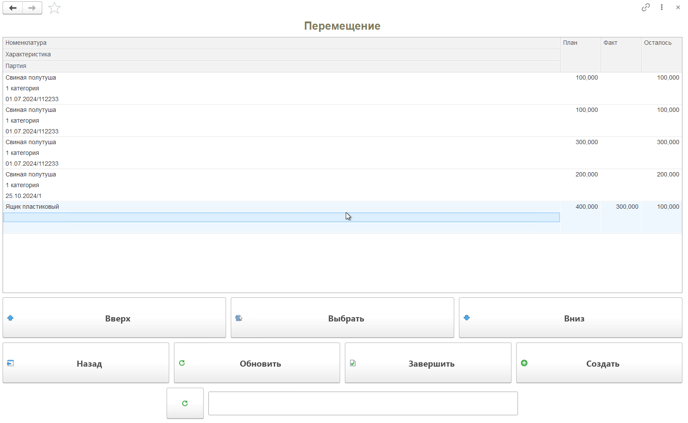
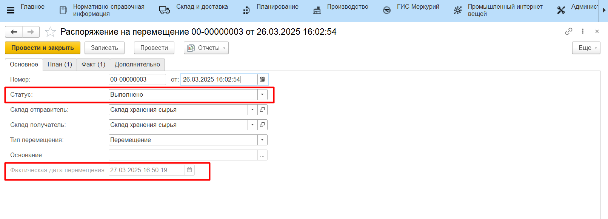
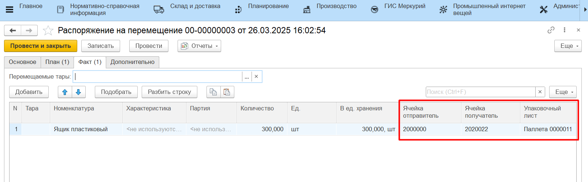

Если на основной форме присутствует несколько строк одной и той же продукции, то при сканировании упаковочного листа, который подходит под все строки, назначится отбор, далее строку нужно выбрать вручную.

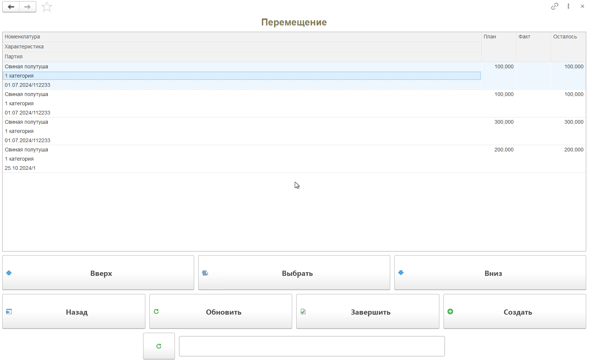

Для перемещения без планового **"Распоряжения на перемещение"** доступна кнопка **"Создать"**, она создаст новое **"Распоряжение на перемещение"**, работа с ним ведется аналогично сценарию, описанному выше. 

Сканирование упаковочных листов может осуществляться также на форме сканирования после создания нового документа **"Распоряжение на перемещение"** или при выборе строки задания вручную по кнопке **"Выбрать**".

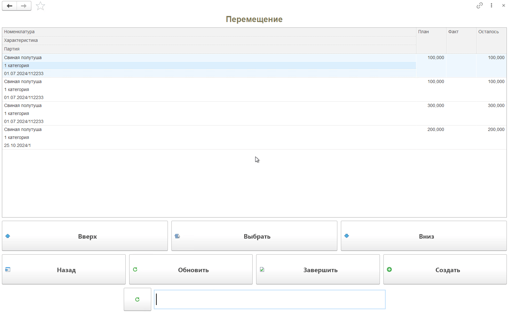