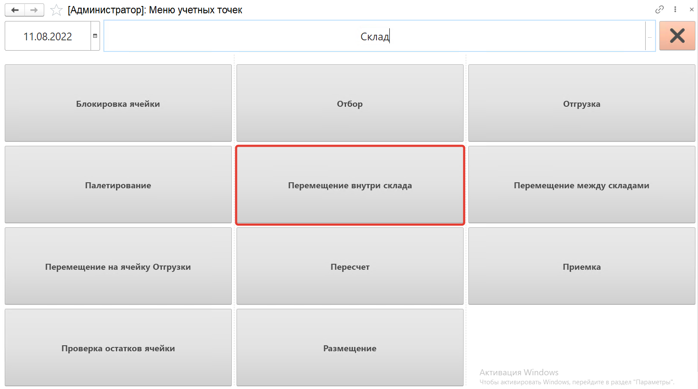
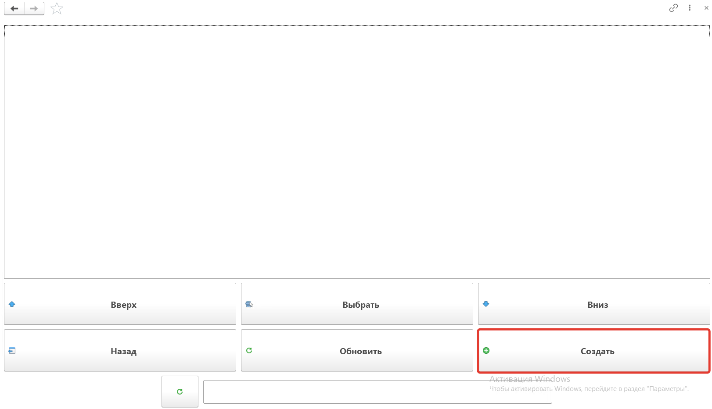
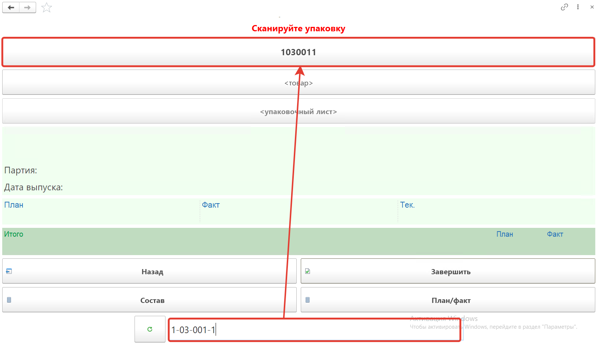
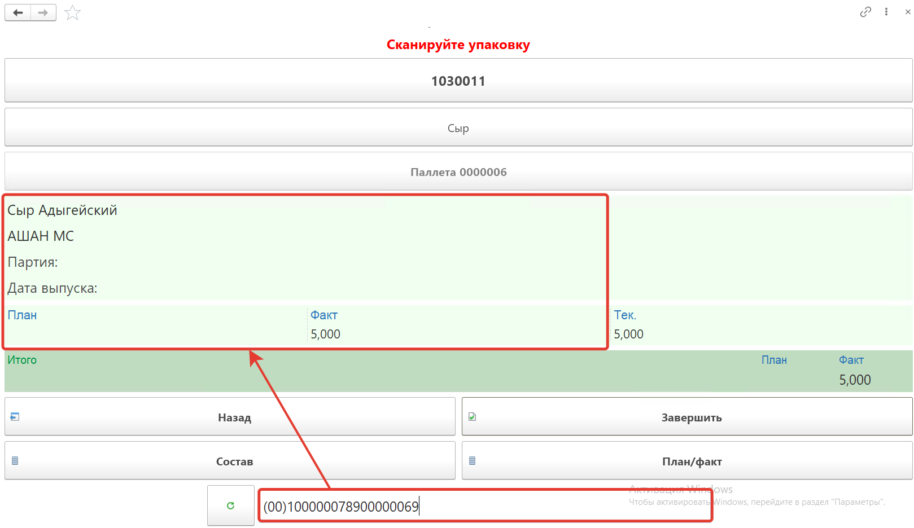
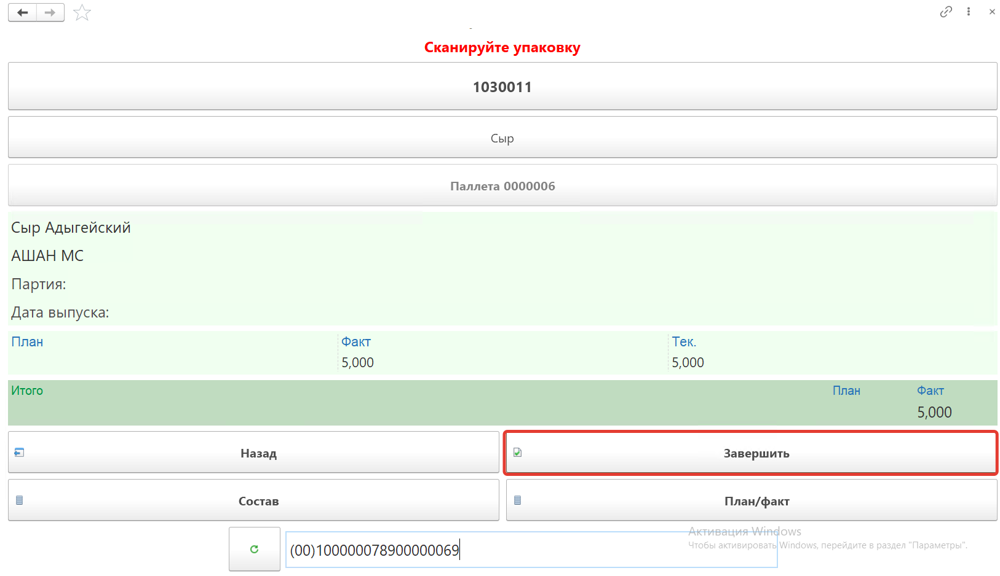
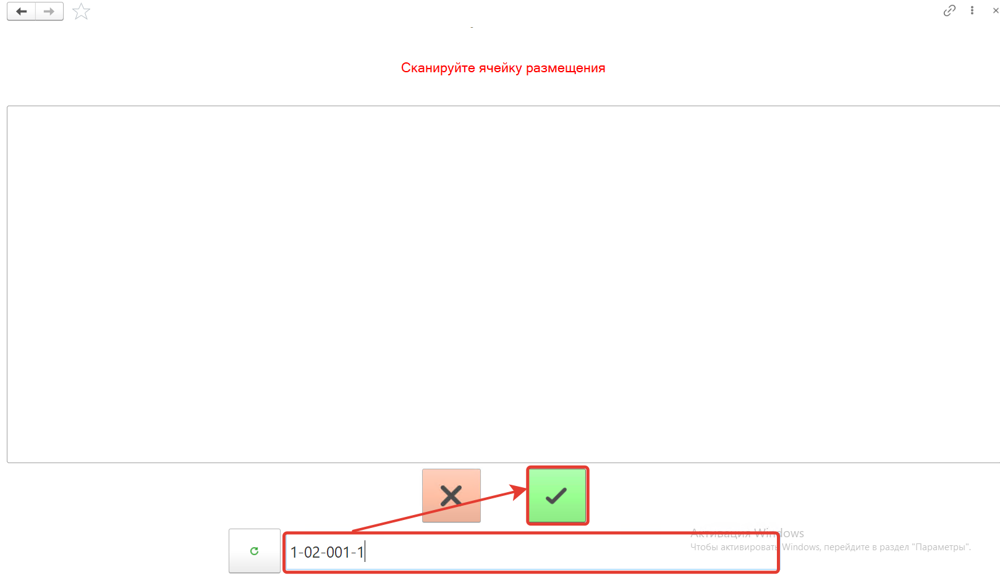
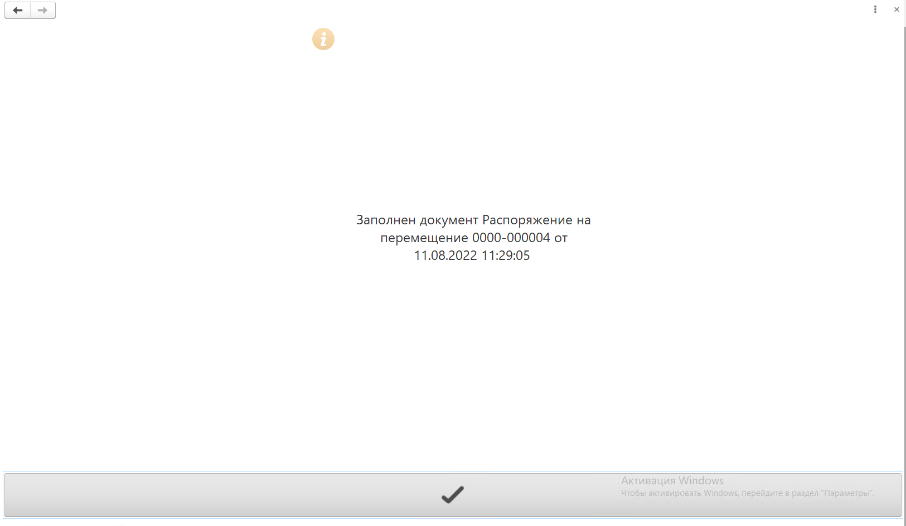
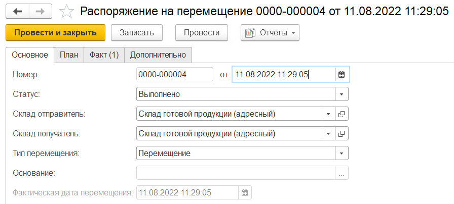
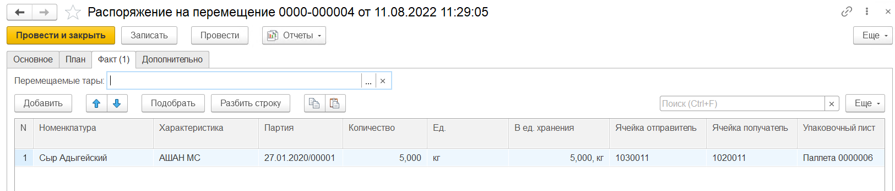

# Перемещение внутри склада на ТСД

Кнопка **"Перемещение внутри склада"** используется только на складах с адресной системой хранения. Применяется для перемещения продукции между произвольными ячейками.

После открытия формы обработки **"Меню учетных точек"** заполняем поля:

- Дата
- Смена
- Учетная точка

На форме обработки появятся кнопки выбранной учетной точки, выбираем кнопку **"Перемещение внутри склада"**.

На открывшейся форме при нажатии кнопки **"Обновить"**, будут выведены **"Распоряжения на перемещения"** с типом **"Перемещение"** в статусе **"К выполнению"**. В списке при помощи кнопок **"Вверх"** и **"Вниз"** переходим к распоряжению по которому будем делать перемещение, нажимаем кнопку **"Выбрать"**. С помощью кнопки **"Создать"** можно создавать новые распоряжения на перемещение.

Создадим новое **"Распоряжение на перемещение"**

Сканируем ячейку из которой перемещаем номенклатуру.

Далее сканируем штрихкод перемещаемого короба, номенклатура появится на форме. Появится количество отгружаемого товара по плану и по факту. Предварительно необходимо создать упаковочный лист для перемещаемой продукции.

По кнопке **"План/факт"** можно посмотреть таблицу перемещаемой номенклатуры.

Для завершения перемещения нажимаем кнопку **"Завершить"**.

И вводим номер ячейки в которую перемещаем продукцию.

В результате будет заполнен или создан документ **"Распоряжение на перемещение"**. 

Документ будет переведен в статус **"Выполнено"**.

И будет заполнен список товаров на вкладке **"Факт"**.

