# Формирование приоритетов размещения/перемещения в ячейки

Правила и приоритеты размещения номенклатуры задаются только для складов с адресной системой хранения.

### Настройка склада

Использование адресной системы хранения включается в справочнике **"Склады"** в подсистеме **"Нормативно-справочная информация"**.

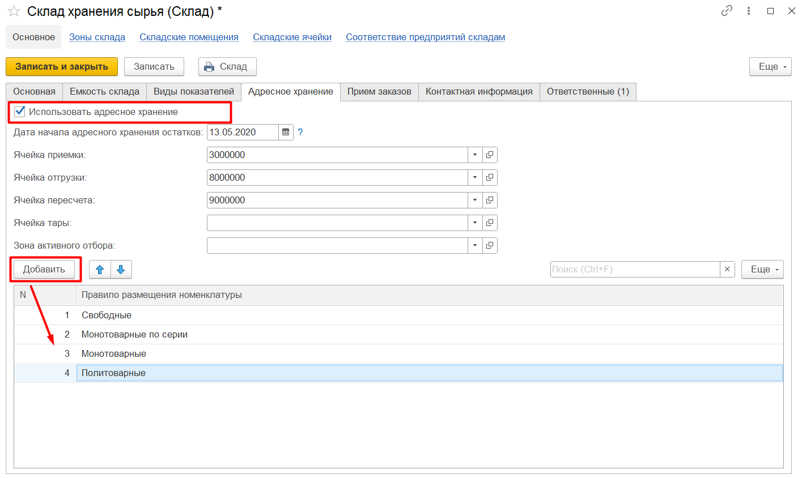

На этой вкладке также задаются приоритеты размещения номеклатуры по ячейкам склада. Например, на скриншоте:

- 1 приоритет: *свободные ячейки* - значит, при размещении всегда будет в первую очередь подбираться свободная ячейка;
- 2 приоритет: *монотоварные по серии* - если не найдена свободная ячейка, будет подбираться ячейка, где уже лежит номенклатура той же серии;
- 3 приоритет: *монотоварные* - если не найдена монотоварная по серии ячейка, будет подбираться ячейка, где уже лежит такая номенклатура любой серии;
- 4 приоритет: *политоварные* - если не найдены другие подходящие ячейки, будет подбираться любая ячейка, независимо от номенклатуры и серии, которая там лежит.

Порядок и выбор приоритетов можно задавать самостоятельно по кнопкам **"Добавить"** и **"Вверх"**/**"Вниз"**.

### Настройка ячейки

Чтобы ограничения работали, для складских ячеек также должен быть задан типоразмер и правило, по которому в ячейку размещается номенклатура. Для этого нужно перейти в справочник **"Складские ячейки"**, выбрать ячейку склада и перейти к полю **"Типоразмер"**:

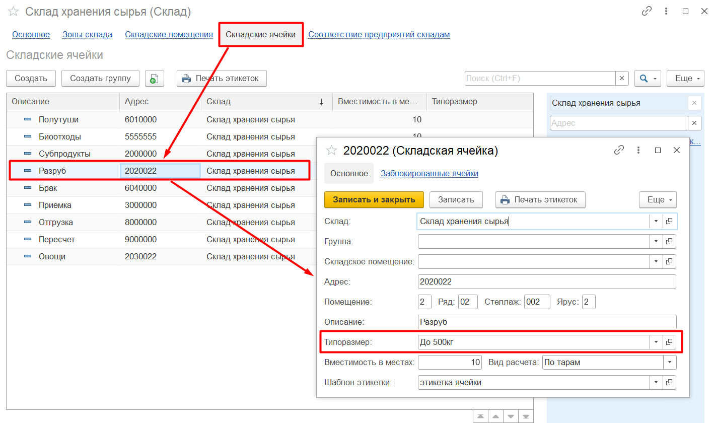

При создании типоразмера указывается правило, по которому в ячейку размещается номенклатура (например, ячейка может быть только монотоварной по серии), и ограничения по габаритам (например, не больше 500 кг, тогда при размещении в ячейку нельзя будет поместить паллету весом 600 кг).

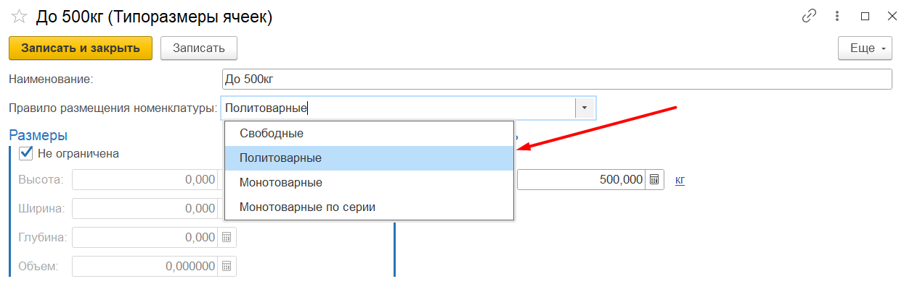
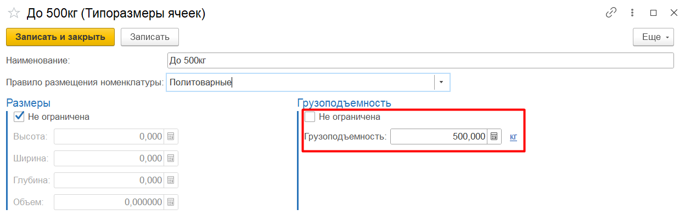

Аналогично типоразмер ячеек можно задать на этапе [генерации топологии склада](../../../../CommonInformation/WarehouseTopologyGeneration.md):

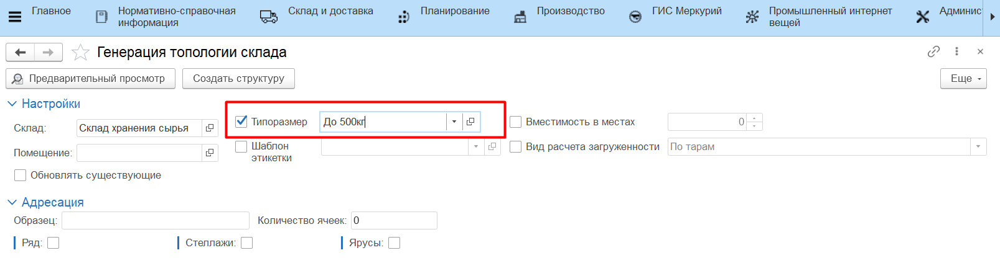

### Формирование приоритетов размещения

Приоритеты размещений задаются для операций перемещения из ячейки приемки в ячейки хранения (размещение) и для перемещения между ячейками хранения. Обработка находится в подсистеме **"Склад и доставка"** - **"Формирование приоритетов размещения"**:

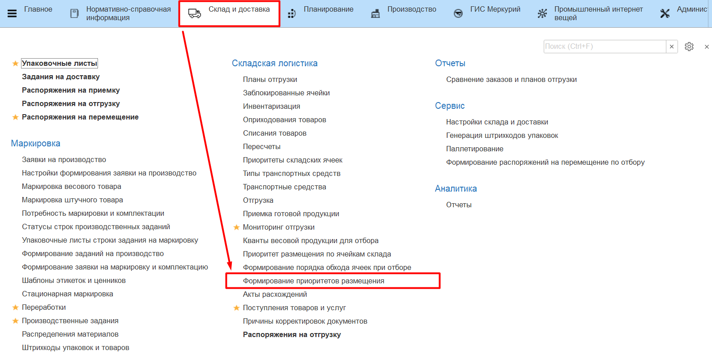

Для настройки приоритетов нужно выбрать склад и вид отображения: по ячейкам или по номенклатурам. 

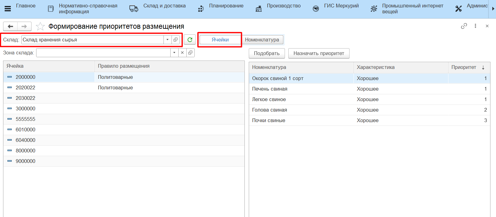

Если выбран вид *"Ячейки"*, то в левую таблицу выводятся вся топология склада и правила размещения, заданные для этих ячеек. В правую таблицу подтягиваются уже заданные номенклатуры, которые могут помещаться в ячейку, и приоритеты их размещения:

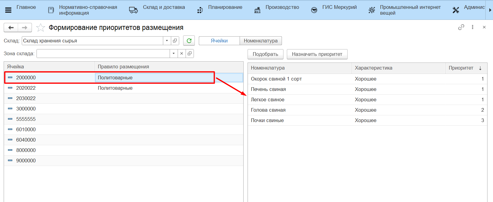

Для добавления списка номенклатур, которые могут помещаться в ячейку, нужно выбрать ячейку и нажать **"Подобрать"**. Затем через форму подбора номенклатур заполнить список:

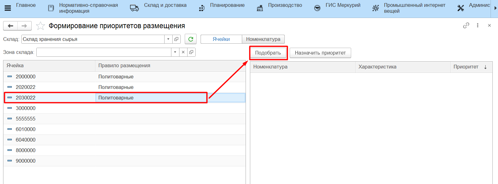

После подбора номенклатур система сразу предложит установить приоритет:

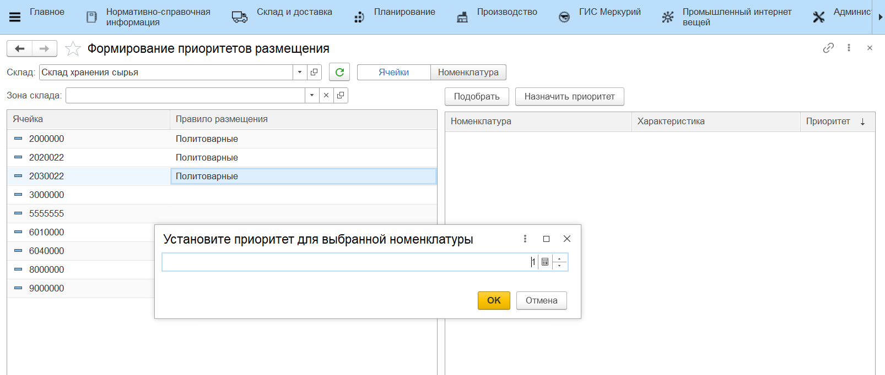

После нажатия кнопки **"ОК"** номенклатура с соответствующим приоритетом будет перенесена в таблицу справа. Приоритет можно редактировать вручную.

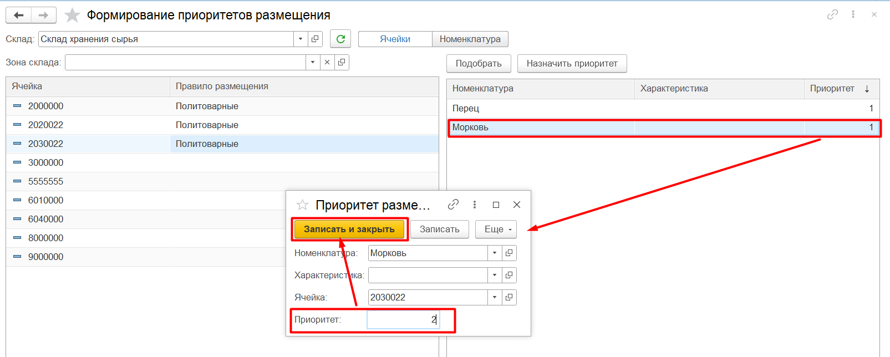

Если выбран вид отображения *"Номенклатура"*, то по кнопке **"Заполнить по регистру"** левая таблица будет заполнена уже сохраненными значениями. В правой таблице отображается ячейка, в которую может размещаться номенклатура, и приоритет размещения.

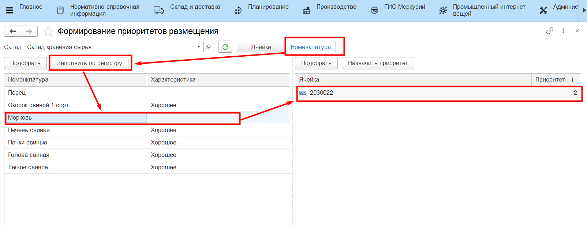

Для добавления новых записей можно воспользоваться кнопками **"Подобрать"** и **"Назначить приоритет"**.